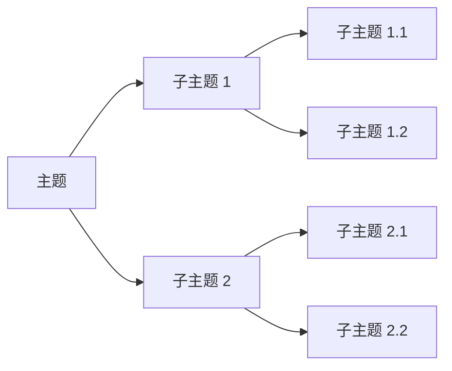
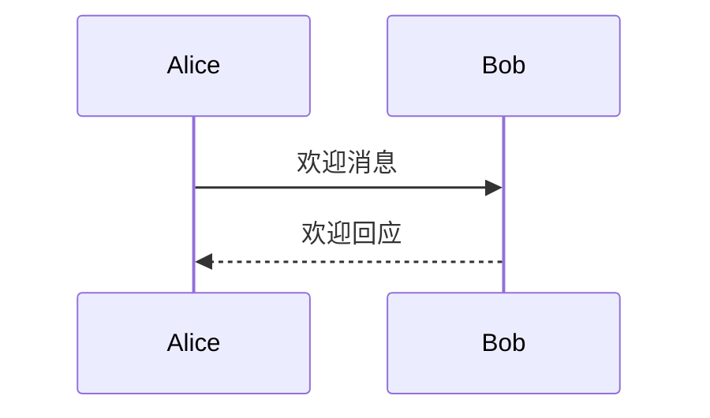
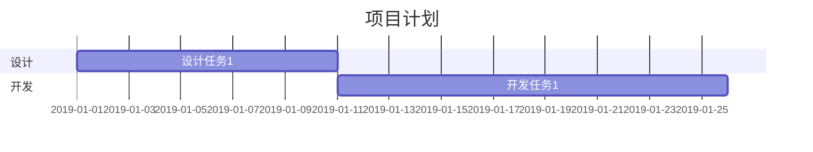
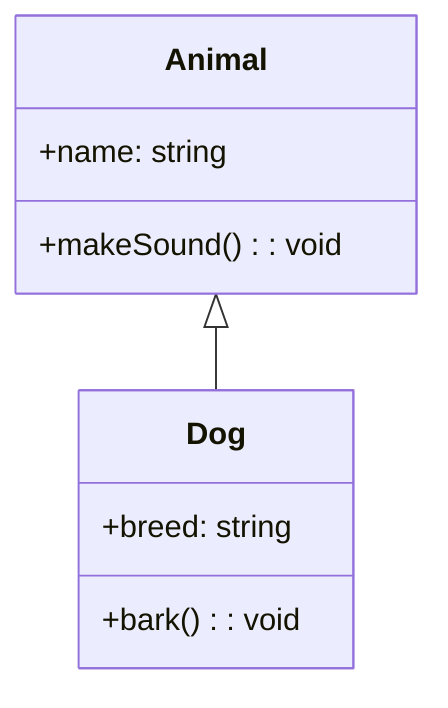
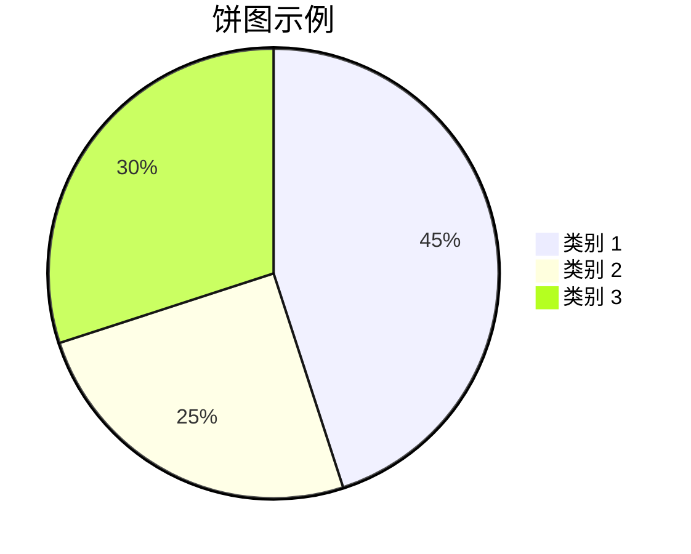
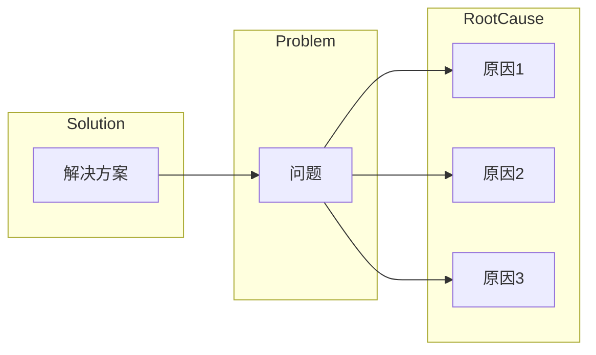
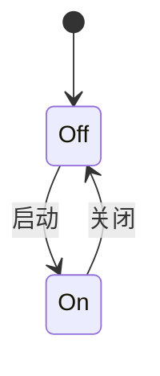
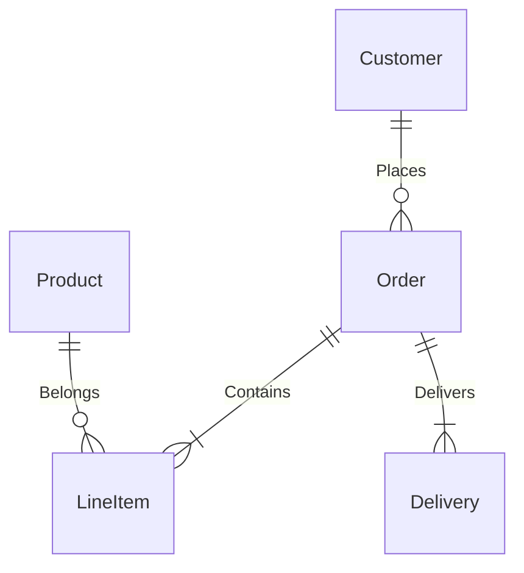

以下是关于Markdown中Mermaid语法的详细总结，已经写成Markdown文档：

# Mermaid语法总结

Mermaid是一种在Markdown文档中绘制各种图表的标记语言，包括流程图、序列图、甘特图、类图等。以下是Mermaid的常见语法元素和示例。

## 思维导图

## 流程图（Flowchart）

- 使用 `graph` 定义流程图类型。
- 用字母或词汇表示图表元素。
- 使用 `-->` 来表示连接。

## 序列图（Sequence Diagram）

- 使用 `sequenceDiagram` 定义序列图。
- 使用 `->>` 和 `-->>` 表示消息的传递方向。

## 甘特图（Gantt Chart）

- 使用 `gantt` 定义甘特图。
- 使用 `dateFormat` 来指定日期格式。
- 利用 `section` 定义不同的项目阶段。
- 指定任务的名称、开始日期和持续时间。

## 类图（Class Diagram）

- 使用 `classDiagram` 定义类图。
- 使用 `class` 定义类，包括属性和方法。
- 使用 `<|--` 表示继承关系。

当使用Mermaid语法在Markdown中创建图表时，除了上述提到的流程图、序列图、甘特图和类图之外，还有其他类型的图表可以创建，包括饼图、鱼骨图、状态图、ER图等。下面是一些示例以及它们的基本语法：

## 饼图（Pie Chart）

饼图用于表示数据的分布比例。

- 使用 `pie` 定义饼图。
- `title` 用于设置饼图的标题。
- 列出各个类别及其对应的数值。

## 鱼骨图（Fishbone Diagram）

鱼骨图也称为石鱼图，用于分析问题的根本原因。

- 使用 `graph LR` 定义鱼骨图。
- 使用 `subgraph` 定义不同的部分。
- 将问题与根本原因和解决方案连接起来。

## 状态图（State Diagram）

状态图用于表示对象在不同状态之间的转换。

- 使用 `stateDiagram` 定义状态图。
- 使用 `[*]` 表示初始状态。
- 使用箭头表示状态之间的转换。

## ER图（Entity-Relationship Diagram）

ER图用于表示实体之间的关系。

- 使用 `erDiagram` 定义ER图。
- 使用 `entity` 定义实体，列出实体属性。
- 使用 `--` 表示实体属性，`o{` 表示关系。

