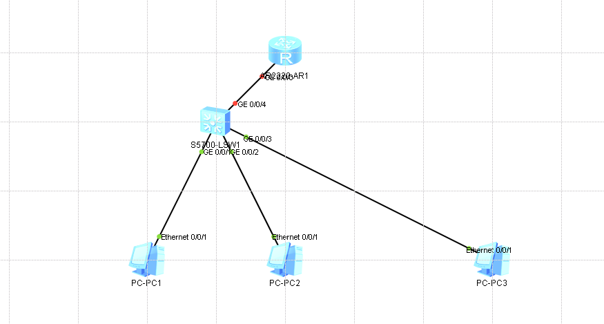

## 网络拓扑



### 基于接口的 DHCP 配置

```bash
[Huawei]dhcp enable # 启用DHCP服务在系统视图下
Info: The operation may take a few seconds. Please wait for a moment.done.
[Huawei]int G
[Huawei]int GigabitEthernet 0/0/0
[Huawei-GigabitEthernet0/0/0]ip add
[Huawei-GigabitEthernet0/0/0]ip address 192.168.1.1 24
[Huawei-GigabitEthernet0/0/0]dhcp sele
[Huawei-GigabitEthernet0/0/0]dhcp select inter
[Huawei-GigabitEthernet0/0/0]dhcp select interface # 选择接口
[Huawei-GigabitEthernet0/0/0]

  Please check whether system data has been changed, and save data in time

  Configuration console time out, please press any key to log on

```
