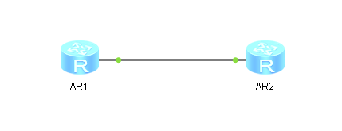

## 自动补全

**输出三个字母然后按 TAB 会自动补全命令，这样就不用输入完整的命令了。**

```bash
ip add
ip address
```

## 配置 IP 地址



```bash
<Huawei>
Apr 16 2024 03:33:48-08:00 Huawei %%01IFPDT/4/IF_STATE(l)[0]:Interface GigabitEt
hernet0/0/0 has turned into UP state.
<Huawei>sys # 三角括号表示用户视图，方括号表示系统视图
Enter system view, return user view with Ctrl+Z.
[Huawei]   # 方括号表示系统视图
[Huawei]int
[Huawei]interface G
[Huawei]interface GigabitEthernet 0/0/0 # 进入接口视图
[Huawei-GigabitEthernet0/0/0]ip ad
[Huawei-GigabitEthernet0/0/0]ip address 192.168.1.1 # 这里需要输入子网掩码 子网掩码位数或者子网掩码地址
                                                    ^
Error:Incomplete command found at '^' position.
[Huawei-GigabitEthernet0/0/0]ip address 192.168.1.1 255.255.255.0
[Huawei-GigabitEthernet0/0/0]
Apr 16 2024 03:38:37-08:00 Huawei %%01IFNET/4/LINK_STATE(l)[1]:The line protocol
 IP on the interface GigabitEthernet0/0/0 has entered the UP state.
[Huawei]ping 192.168.1.2 # 这里是测试连通性
  PING 192.168.1.2: 56  data bytes, press CTRL_C to break
    Reply from 192.168.1.2: bytes=56 Sequence=1 ttl=255 time=860 ms
    Reply from 192.168.1.2: bytes=56 Sequence=2 ttl=255 time=130 ms
    Reply from 192.168.1.2: bytes=56 Sequence=3 ttl=255 time=70 ms
    Reply from 192.168.1.2: bytes=56 Sequence=4 ttl=255 time=50 ms
    Reply from 192.168.1.2: bytes=56 Sequence=5 ttl=255 time=70 ms

  --- 192.168.1.2 ping statistics ---
    5 packet(s) transmitted
    5 packet(s) received
    0.00% packet loss
    round-trip min/avg/max = 50/236/860 ms

[Huawei]quit # 从系统视图返回用户视图
<Huawei>save
  The current configuration will be written to the device.
  Are you sure to continue? (y/n)[n]:y
  It will take several minutes to save configuration file, please wait..........
......
  Configuration file had been saved successfully
  Note: The configuration file will take effect after being activated

```

`quit` 从系统视图返回用户视图

`return` 从任意视图返回用户视图

`sys` 从用户视图进入系统视图
