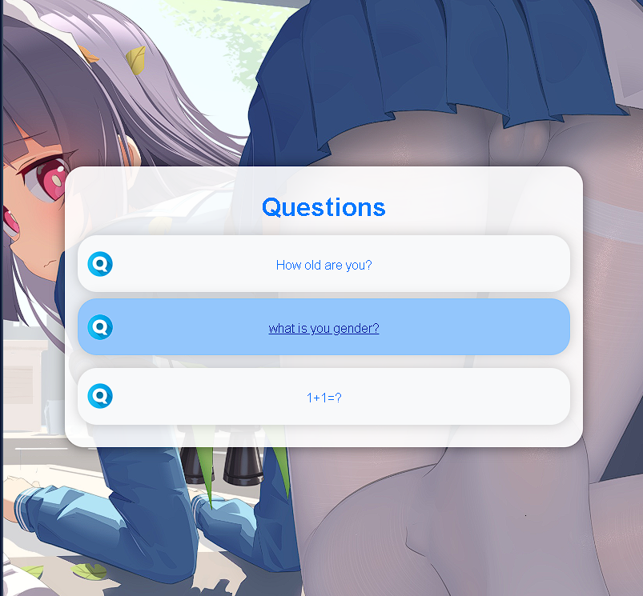
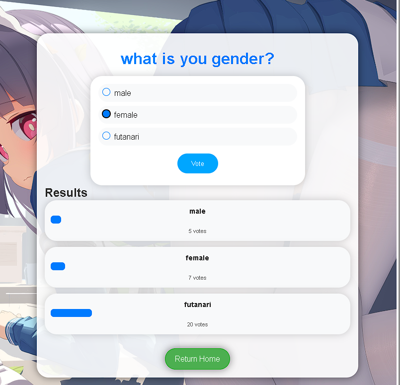

# Polls 应用

这是我第一次使用 Django (v5.0.3)框架创建的项目，跟着官方教程做的一个简单的投票应用。

- 使用 Django 开发的投票应用
- 包括了一个简单的投票问题和选项的管理界面
- 页面美化，使用了 CSS 动画效果
- 增加了一个限制：每个 IP 地址只能对一个问题进行一次投票


- 运行测试：运行 `test.bat`
- 运行网站服务：运行 `run.bat`，我将 Polls 应用放到了主路由路径上 `127.0.0.1:61111`
- 后台 ```127.0.0.1:61111/admin``` 
- user:```admin``` , pass:```django112233```


## 页面


