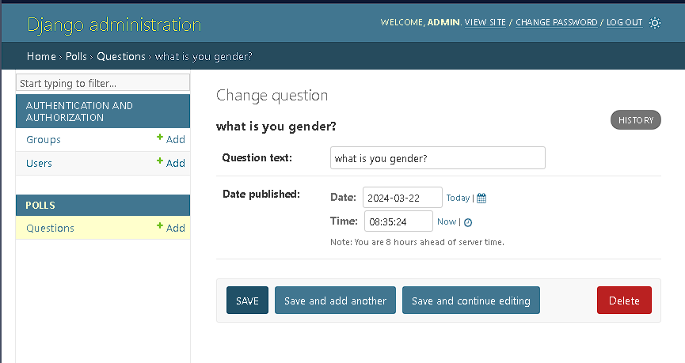

# 创建一个管理员账号

## 启动开发服务器

Django 的管理界面默认就是启用的。让我们启动开发服务器，看看它到底是什么样的。

如果开发服务器未启动，用以下命令启动它：

```bash
$ python manage.py runserver
```

现在，打开浏览器，转到你本地域名的 “/admin/” 目录， -- 比如 [http://127.0.0.1:8000/admin/](http://127.0.0.1:8000/admin/)。你应该会看见管理员登录界面：


因为翻译功能默认是开启的，如果你设置了 LANGUAGE_CODE，登录界面将显示你设置的语言（如果 Django 有相应的翻译）。

## 进入管理站点页面

现在，试着使用你在上一步中创建的超级用户来登录。然后你将会看到 Django 管理页面的索引页：


你将会看到几种可编辑的内容：组和用户。它们是由 `django.contrib.auth` 提供的，这是 Django 开发的认证框架。

## 向管理页面中加入投票应用

但是我们的投票应用在哪呢？它没在索引页面里显示。

只需要再做一件事：我们得告诉管理，问题 Question 对象需要一个后台接口。

打开 `polls/admin.py` 文件，把它编辑成下面这样：

**polls/admin.py**

```python
from django.contrib import admin
from .models import Question

admin.site.register(Question)
```

## 体验便捷的管理功能

现在我们向管理页面注册了问题 Question 类。Django 知道它应该被显示在索引页里：


点击 "Questions" 。现在看到是问题 "Questions" 对象的列表 "change list" 。这个界面会显示所有数据库里的问题 Question 对象，你可以选择一个来修改。这里现在有我们在上一部分中创建的 “What's up?” 问题。


点击 “What's up?” 来编辑这个问题（Question）对象：



注意事项：

- 这个表单是从问题 Question 模型中自动生成的
- 不同的字段类型（日期时间字段 DateTimeField 、字符字段 CharField）会生成对应的 HTML 输入控件。每个类型的字段都知道它们该如何在管理页面里显示自己。
- 每个日期时间字段 DateTimeField 都有 JavaScript 写的快捷按钮。日期有转到今天（Today）的快捷按钮和一个弹出式日历界面。时间有设为现在（Now）的快捷按钮和一个列出常用时间的方便的弹出式列表。

页面的底部提供了几个选项：

- 保存（Save） - 保存改变，然后返回对象列表。
- 保存并继续编辑（Save and continue editing） - 保存改变，然后重新载入当前对象的修改界面。
- 保存并新增（Save and add another） - 保存改变，然后添加一个新的空对象并载入修改界面。
- 删除（Delete） - 显示一个确认删除页面。

如果显示的 “发布日期(Date Published)” 和你在[教程 1](https://docs.djangoproject.com/en/3.2/intro/tutorial01/)里创建它们的时间不一致，这意味着你可能没有正确的设置 `TIME_ZONE` 。改变设置，然后重新载入页面看看是否显示了正确的值。

通过点击 “今天(Today)” 和 “现在(Now)” 按钮改变 “发布日期(Date Published)”。然后点击 “保存并继续编辑(Save and add another)”按钮。然后点击右上角的 “历史(History)”按钮。你会看到一个列出了所有通过 Django 管理页面对当前对象进行的改变的页面，其中列出了时间戳和进行修改操作的用户名：


当你熟悉了数据库 API 之后，你就可以开始阅读[教程第 3 部分](https://docs.djangoproject.com/en/3.2/intro/tutorial03/)，下一部分我们将会学习如何为投票应用添加更多视图。
```