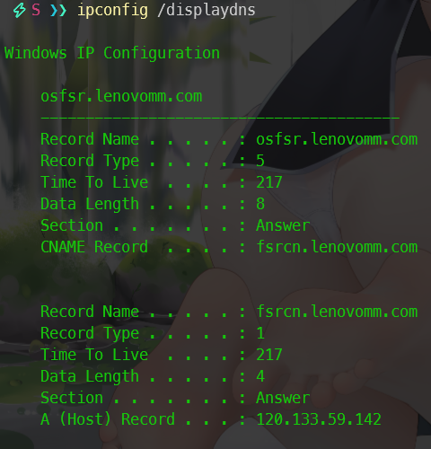

## ipconfig 命令与 DNS 和 DHCP

在 Windows 中

- `ipconfig /flushdns`命令来清除本地 DNS 缓存
- `ipconfig /displaydns`显示客户端 DNS 缓存的内容
- `ipconfig /registerdns`刷新所有 DHCP 租约，并重新注册 DNS 名字
- `ipconfig /release`释放网卡的 DHCP 配置参数和当前使用的 IP 地址

