# 标准访问控制列表的配置

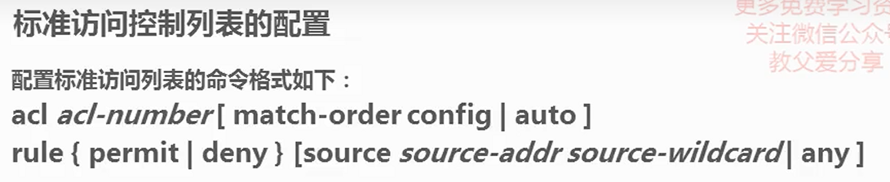

## 1. source-wildcard


## 2. ACL规则匹配顺序

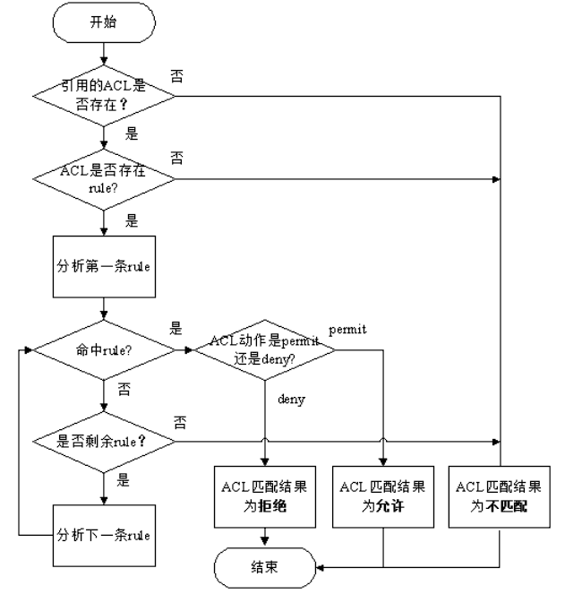

首先系统会查找设备上是否配置了ACL。

* 如果ACL不存在，则返回ACL匹配结果为：不匹配。
* 如果ACL存在，则查找设备是否配置了ACL规则。
  * 如果规则不存在，则返回ACL匹配结果为：不匹配。
  * 如果规则存在，则系统会从ACL中编号最小的规则开始查找。
* 如果匹配上了permit规则，则停止查找规则，并返回ACL匹配结果为：匹配（允许）。
* 如果匹配上了deny规则，则停止查找规则，并返回ACL匹配结果为：匹配（拒绝）。
* 如果未匹配上规则，则继续查找下一条规则，以此循环。如果一直查到最后一条规则，报文仍未匹配上，则返回ACL匹配结果为：不匹配。

从整个ACL匹配流程可以看出，报文与ACL规则匹配后，会产生两种匹配结果：“匹配”和“不匹配”。

* 匹配（命中规则）：指存在ACL，且在ACL中查找到了符合匹配条件的规则。不论匹配的动作是“permit”还是“deny”，都称为“匹配”，而不是只是匹配上permit规则才算“匹配”。
* 不匹配（未命中规则）：指不存在ACL，或ACL中无规则，再或者在ACL中遍历了所有规则都没有找到符合匹配条件的规则。以上三种情况，都叫做“不匹配”。

## 3. ACL规则匹配方式


### 3. 配置顺序

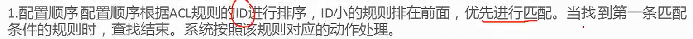

### 3. 2 自动顺序

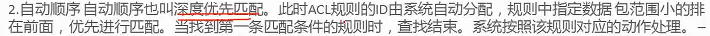

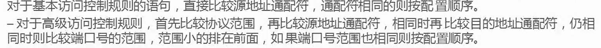

对于高级访问控制规则

范围小的排在前面, 深度优先

先协议 -> 源地址 -> 目的地址 -> 端口号


### 3.3 访问控制列表的组合

auto 与 config的差别

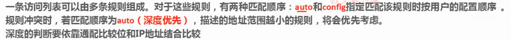

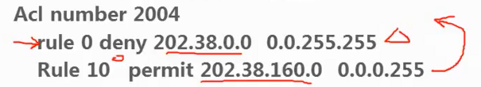

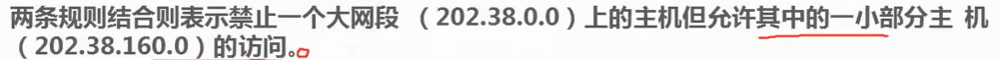

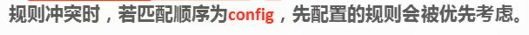

# 拓展访问控制列表的配置命令

## tcp/udp

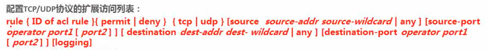

## icmp

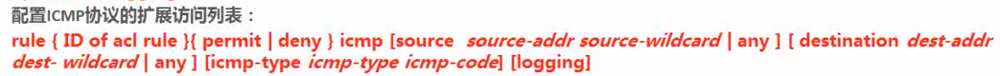

## igmp

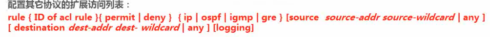

## operator

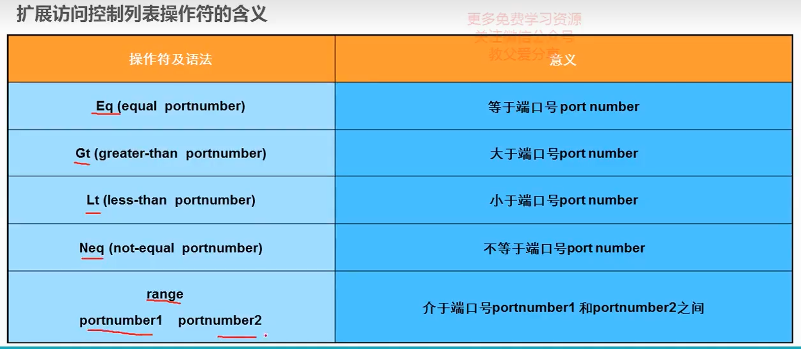

# 华为acl配置步骤

1. **进入系统视图**

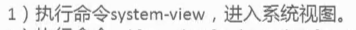

system-view

2. **创建acl**

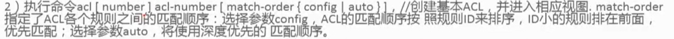

acl number 200

acl 2000

//默认匹配顺序为config

acl 2000 match-order auto


```
[Switch] acl 3001
[Switch-acl-adv-3001] rule deny ip source 10.1.1.0 0.0.0.255 destination 10.1.2.0 0.0.0.255  //禁止研发部访问市场部
[Switch-acl-adv-3001] quit
```


3. **创建acl规则**

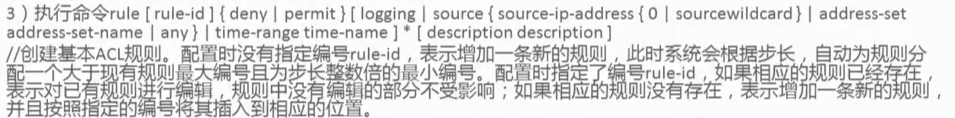

rule 2000 deny 10.10.1.2 0.0.0.255

rule 2000 deny 10.10.1.2 0.0.0.255

rule 3000 deny 10.10.3.0 0.0.0.255 destination 10.10.2.0 0.0.0.255

rule 5 deny tcp source 192.168.1.12 0 destination-port eq www

4. **应用acl到对应的接口**

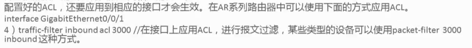

//进入接口配置

interface GigabitEnthernet 0/0/1

//入站口方向应用acl 200

traffic-filter inbound acl 200

# acl应用规则

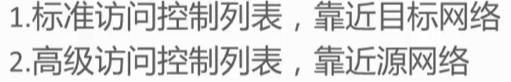

# 示例

## 访问外网限制

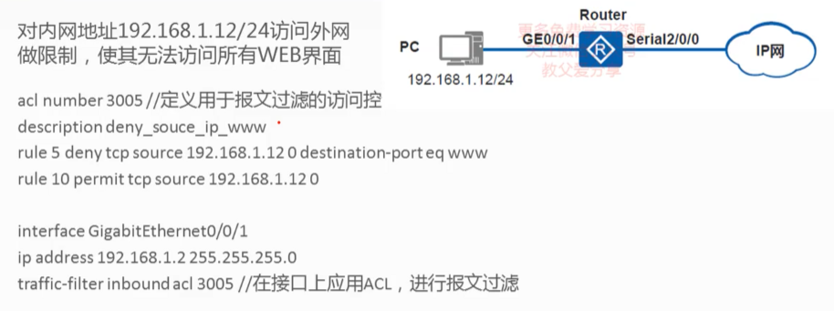

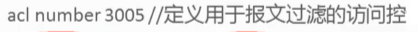


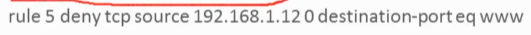

`0` 是源地址的通配符掩码，表示匹配源 IP 地址的所有位。

 **`destination-port eq www`** ：目的端口匹配条件。

* `destination-port` 指定了目的端口的匹配条件。
* `eq www` 表示要匹配的目的端口是 `www`，通常是指 Web 服务的默认端口 80。
* 这个条件要求目的端口必须是 `www`（端口 80）

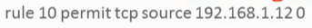

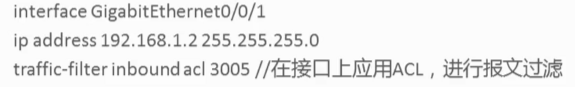

## 交换机进行acl配置例子

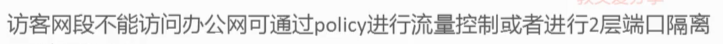

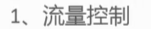


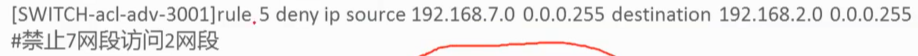

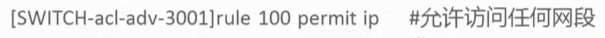


## 交换机应用acl

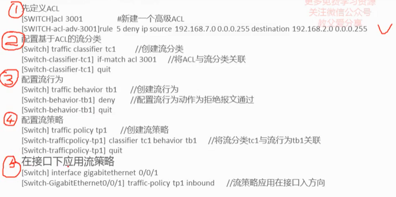
