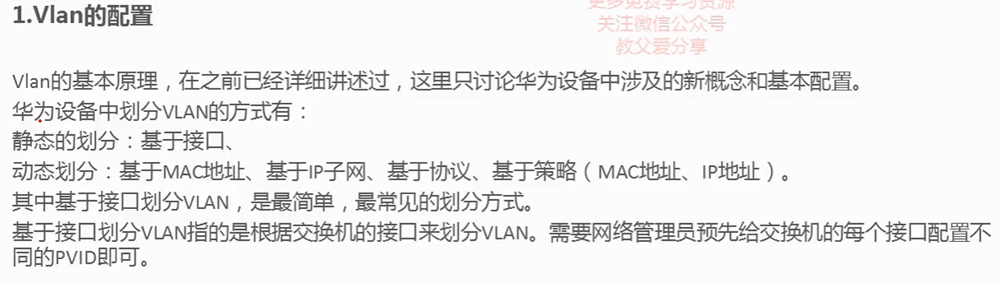
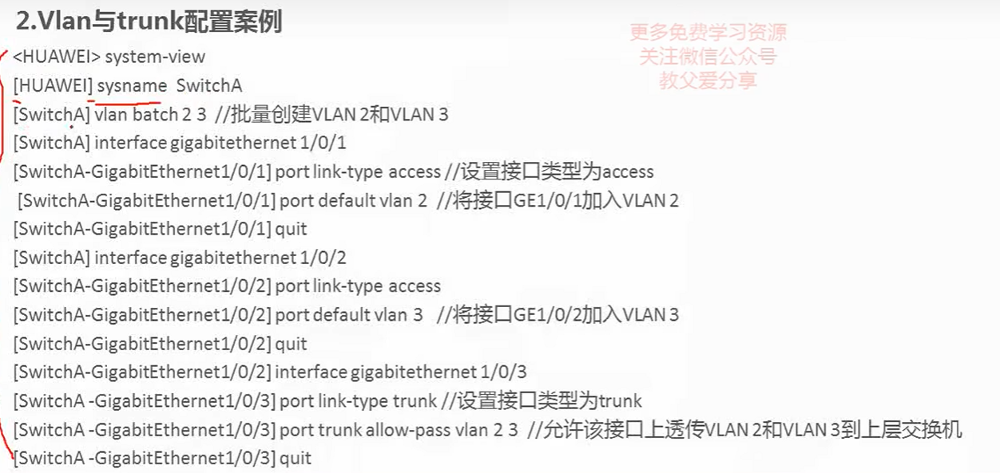
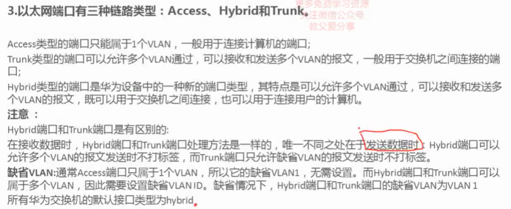
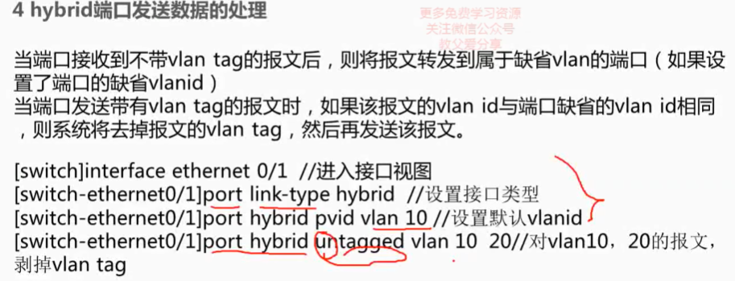
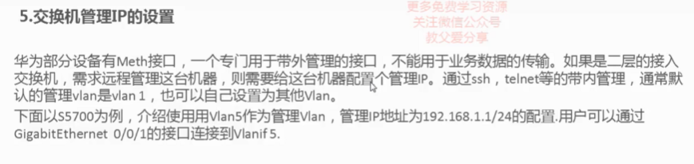
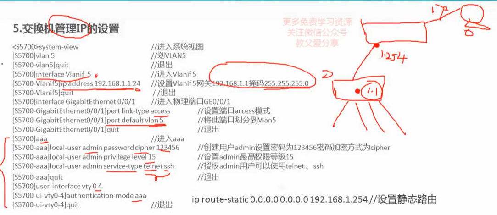

## 1.vlan的配置0



## 2.vlan与trunk配置



```
<HUAWEI> system-view        //从用户视图进入系统视图
```








### vlanif (vlan interface)

在华为交换机配置中，`vlanif` 是指 VLAN 接口（VLAN Interface），也称为 SVI（Switched Virtual Interface）。

`vlanif` 允许为每个 VLAN 创建一个虚拟接口，这样就可以为每个 VLAN 分配一个逻辑 IP 地址，从而实现不同 VLAN 之间的路由。

以下是一个简单的示例，展示了如何在华为交换机上配置 `vlanif`：

```bash
<设备> system-view
[设备] interface Vlanif10  # 进入 VLAN 10 接口配置模式
[设备-Vlanif10] ip address 192.168.10.1 24  # 设置 VLAN 10 接口的 IP 地址和子网掩码
[设备-Vlanif10] quit

[设备] interface Vlanif20  # 进入 VLAN 20 接口配置模式
[设备-Vlanif20] ip address 192.168.20.1 24  # 设置 VLAN 20 接口的 IP 地址和子网掩码
[设备-Vlanif20] quit

[设备] interface Vlanif30  # 进入 VLAN 30 接口配置模式
[设备-Vlanif30] ip address 192.168.30.1 24  # 设置 VLAN 30 接口的 IP 地址和子网掩码
[设备-Vlanif30] quit
```

在上述示例中，我们为 VLAN 10、20 和 30 分别创建了 `vlanif` 接口，并为每个接口分配了一个 IP 地址。这样，不同 VLAN 的设备就可以使用相应 VLAN 接口的 IP 地址进行路由通信。

需要注意的是，`vlanif` 接口通常用于在交换机上实现三层路由功能，使得交换机可以在不同 VLAN 之间进行 IP 层面的通信。

### vty (Virtual Terminal )

在华为交换机配置中，`vty` 是指虚拟终端（Virtual Terminal），是用于通过 Telnet 或 SSH 协议进行远程管理和配置的虚拟终端线路。

`vty` 的名称是 "Virtual Terminal" 的缩写。

华为交换机上，你可以通过配置 `vty` 线路来管理远程访问。

这包括设置 Telnet 或 SSH 访问的参数，如允许访问的 IP 地址范围、最大连接数、登录验证方式等。

以下是一个简单的示例，展示如何在华为交换机上配置 `vty` 线路：

```bash
<设备> system-view
[设备] user-interface vty 0 4  # 进入 vty 线路配置模式，0 到 4 表示线路号范围
[设备-ui-vty0-4] authentication-mode aaa  # 设置认证方式为 AAA（可以根据需求选择其他认证方式）
[设备-ui-vty0-4] protocol inbound telnet  # 允许 Telnet 访问
[设备-ui-vty0-4] protocol inbound ssh  # 允许 SSH 访问
[设备-ui-vty0-4] user privilege level 15  # 设置用户权限级别，这里设置为最高级别 15
[设备-ui-vty0-4] quit
[设备] save  # 保存配置
```

在上述示例中，`user-interface vty 0 4` 进入了 `vty` 线路配置模式，并对 Telnet 和 SSH 进行了一些基本的配置。



