# 1. 防火墙

## 1.1 四个基本安全区域

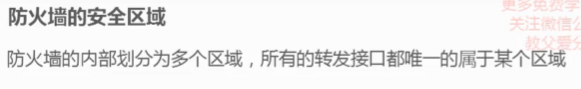

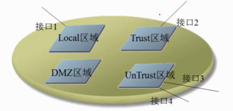

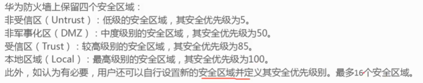

## 1.2 域间数据流方向

方向以双方第一个出流量的方向定义

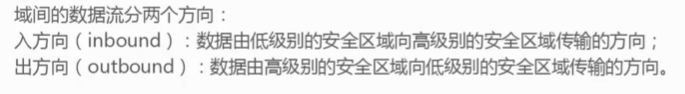

## 1.3 区域策略

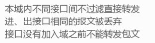

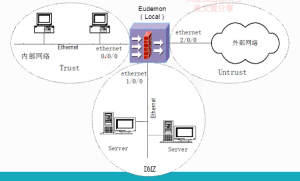

## 1.4 防火墙配置

### 1 配置ip地址

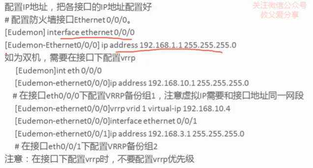

### 2 配置区域

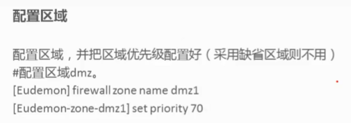

### 3 把接口加入区域中

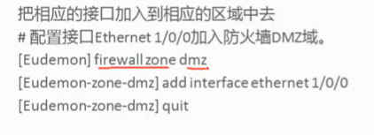

### 4 在区域间应用访问控制列表

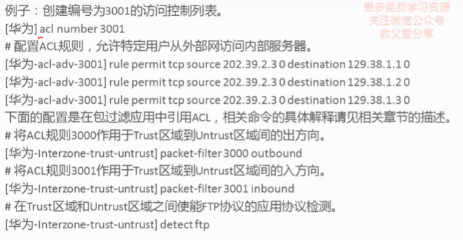

进入域间 firewall interzone x y

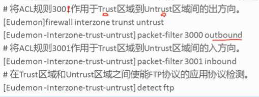

## 防火墙访问控制

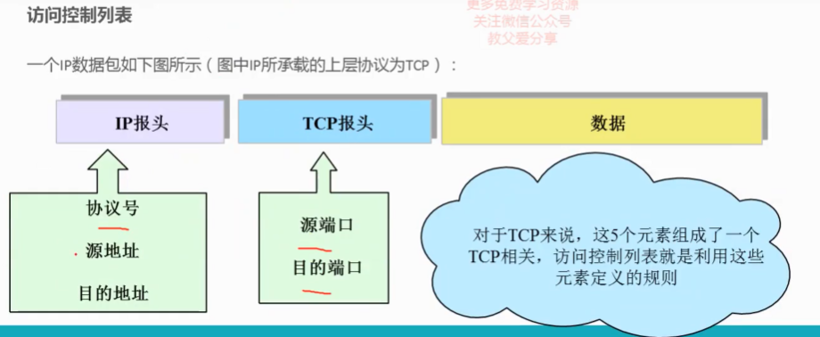
