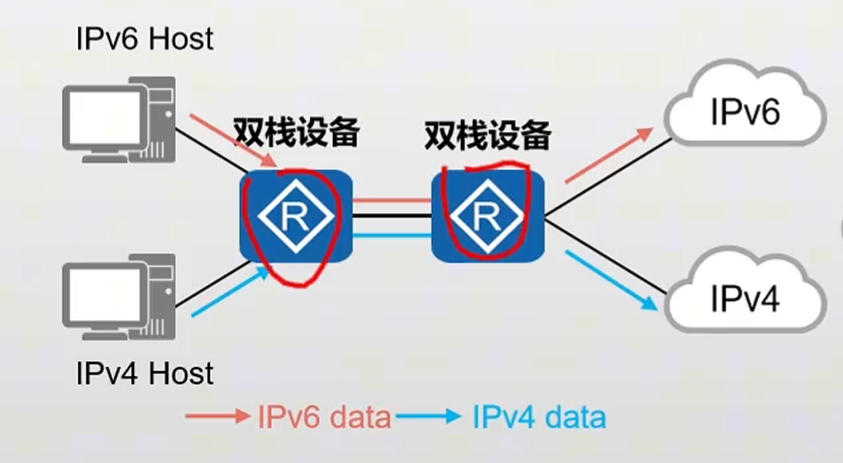

# 生成树协议 Spanning tree protocol

## 1.1 种类

生成树协议（Spanning Tree Protocol，STP）是一组用于以太网网络中避免环路并确保网络拓扑稳定的协议。

其中最常见的生成树协议是STP（IEEE 802.1D标准定义的协议），但还有其他一些变种和改进版本的生成树协议，包括以下几种：

1. **STP**：这是生成树协议的最早版本，它通过选举一个根桥和确定每个网络段的根桥端口来确保网络中没有环路。STP存在一些问题，包括较慢的收敛时间，因此后来的协议版本进行了改进。

2. **RSTP（Rapid Spanning Tree Protocol）**：RSTP是STP的改进版本，它通过加速收敛时间来提高性能。RSTP引入了一些改进，如端口状态变迁、提前终止以及更快的BPDU传输，以减少网络恢复时间。

3. **MSTP（Multiple Spanning Tree Protocol）**：MSTP是STP的扩展，它允许网络管理员定义多个生成树实例，每个实例对应于一个VLAN。这使得不同的VLAN可以使用不同的生成树，从而更好地满足各种网络需求。

4. **PVST+（Per-VLAN Spanning Tree Plus）**：PVST+是思科公司开发的生成树协议的变种，它通过在每个VLAN上运行独立的STP实例来提供对每个VLAN的更精细控制。这可以在多VLAN环境中更好地优化生成树拓扑。

5. **RPVST+（Rapid PVST+）**：RPVST+是思科公司的改进版本，它结合了RSTP的快速收敛特性和PVST+的多VLAN支持。

## 作用

- 解决二层交换机的环路问题
- 解决广播风暴
- 解决MAC地址表震荡
## 概念

1. 优先级 默认为32768, 是4096的倍数
2. 

## 原理

