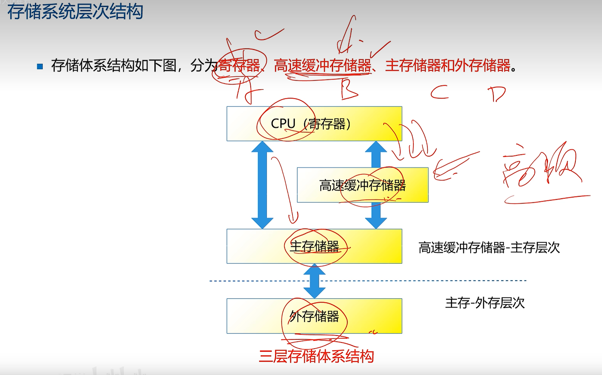
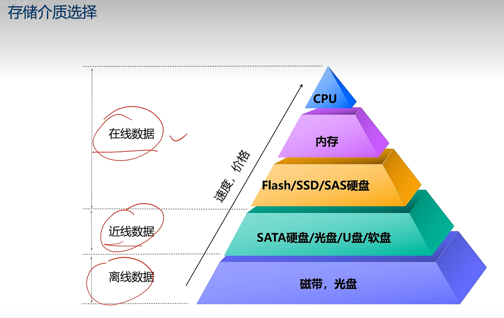
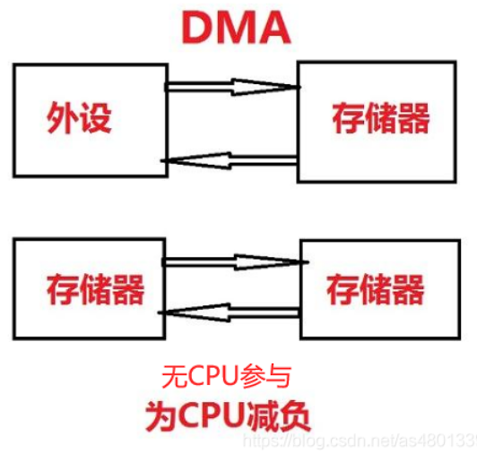
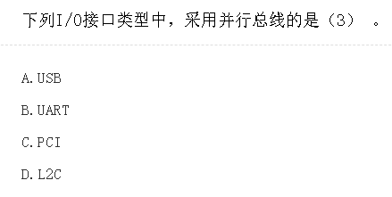

## 存储层次结构

<!--  -->

    

        
    

    

        速度: 寄存器 > 高速缓存 > 主存储器 > 外存储器
        <ul>
        <li>寄存器（Register）：寄存器是CPU内部的存储单元，速度非常快，用于存储CPU正在执行的指令和数据。</li>
        <li>高速缓存（Cache）：高速缓存是位于CPU和主存储器之间的存储层，它用于存储最常用的数据和指令，以便CPU更快地访问它们。</li>
        <li>主存储器（Main Memory）：主存储器通常是计算机中的RAM（随机存取存储器），速度比高速缓存慢一些，但仍然比外存储器快得多。主存储器用于存储运行中的程序和数据。</li>
        <li>外存储器（External Storage）：外存储器通常指的是硬盘驱动器（HDD）或固态硬盘（SSD），它们的速度相对较慢，但可以长期存储大量的数据，通常用于文件存储。</li>
        </ul>
    

## 存储介质

- 光盘
- 软盘
- 硬盘
- 闪存

## DMA 

Direct Memory Access

DMA方式是DMA控制器从CPU接管对总线的控制，数据交换不经过CPU，而直接在内存和I/O设备之间进行，当数据传送结束后，再交给CPU处理，因此无法控制硬盘到光盘的传输。

直接内存访问（DMA）是一种计算机系统中的数据传输技术，旨在改善数据在计算机内部各个组件之间的传输效率。通常，当数据需要从一个设备（如硬盘驱动器、网络适配器、音频卡等）传输到内存或从内存传输到设备时，CPU通常会参与传输过程。但是，CPU本身有其他任务要执行，因此在数据传输时占用CPU资源可能会导致性能下降。这就是DMA技术的作用所在。

DMA允许外部设备通过直接访问系统内存来执行数据传输，而无需CPU的介入。这样一来，CPU可以继续执行其他任务，而数据传输可以在后台进行，不会对CPU的性能造成负面影响。DMA通常涉及一个或多个DMA控制器，它们负责协调数据传输，控制数据的来源和目的地址以及数据的方向（读取或写入）。

计算机外设：

显示器、鼠标、键盘、调制解调器、扫描仪、打印机、数码相机、数字摄像机、光盘刻录机等。

1、显示器

显示器(display)通常也被称为监视器。显示器是属于电脑的I/O设备，即输入输出设备。它是一种将一定的电子文件通过特定的传输设备显示到屏幕上再[反射](https://so.csdn.net/so/search?q=%E5%8F%8D%E5%B0%84&spm=1001.2101.3001.7020)到人眼的显示工具。根据制造材料的不同，可分为：阴极射线管显示器(CRT)，等离子显示器PDP，液晶显示器LCD等等。

2、鼠标

鼠标，计算机的一种输入设备，也是计算机显示系统纵横坐标定位的指示器，因形似老鼠而得名(港台作滑鼠)。其标准称呼应该是“鼠标器”，英文名“Mouse”，鼠标的使用是为了使计算机的操作更加简便快捷，来代替键盘那繁琐的指令。

3、键盘

键盘是用于操作设备运行的一种指令和数据输入装置，也指经过系统安排操作一台机器或设备的一组功能键(如打字机、电脑键盘)。键盘是最常用也是最主要的输入设备，通过键盘可以将英文字母、数字、标点符号等输入到计算机中，从而向计算机发出命令、输入数据等。也可当做笔记本电脑和ipad的外设连接设备。

4、调制解调器

调制解调器是一种计算机硬件，它能把计算机的数字信号翻译成可沿普通电话线传送的模拟信号，而这些模拟信号又可被线路另一端的另一个调制解调器接收，并译成计算机可懂的语言。这一简单过程完成了两台计算机间的通信。

5、扫描仪

扫描仪(scanner)，是利用光电技术和数字处理技术，以扫描方式将图形或图像信息转换为数字信号的装置。扫描仪通常被用于计算机外部仪器设备，通过捕获图像并将之转换成计算机可以显示、编辑、存储和输出的数字化输入设备。

办公设备：

1.文件输入及处理设备：计算机、文件处理机、打字机、扫描仪等。

2.文件输出设备：可分为文件复制设备和文件打印设备，以及文件传送设备。

3.文件复制设备包括：制版印刷一体化速印机和油印机、小胶印机、重氮复印机(晒图机)、静电复印机、数字式多功能一体机、数字印刷机、轻印刷机、喷墨复印机等。

4.文件打印设备包括：激光打印机、喷墨打印机、针式打印机和绘图机等。

5.文件传输设备：传真机、计算机、电传机等。

6.文件储存设备：缩微设备、硬盘、云盘等。

7.文件整理设备：分页机、裁切机、装订机、打孔机、折页机、封装机等。

8.网络设备：网络适配器、路由器、交换机、调制解调器等。

9.沟通设备：座机电话、网络电视会议软件、电话会议等

## 硬盘接口协议

## 计算机常见I/O接口

| 接口类型                                    | 描述                                                                               |
| ------------------------------------------- | ---------------------------------------------------------------------------------- |
| USB (Universal Serial Bus)                  | 通用的串行接口，用于连接各种外部设备，提供高速数据传输和热插拔功能。               |
| Ethernet (RJ-45)                            | 用于连接计算机到局域网络（LAN）或互联网，支持有线和无线网络连接。                  |
| HDMI (High-Definition Multimedia Interface) | 用于连接计算机到高清电视、显示器或投影仪，支持高清视频和多通道音频传输。           |
| VGA (Video Graphics Array)                  | 用于连接计算机到老式显示器，提供较低分辨率和模拟视频传输。                         |
| DVI (Digital Visual Interface)              | 用于连接计算机到数字显示器，提供数字视频传输以提高图像质量。                       |
| Audio Jacks                                 | 用于连接扬声器、耳机、麦克风等音频设备，通常有3.5毫米或6.35毫米的标准插孔。        |
| Thunderbolt                                 | 支持高速数据传输和视频传输，用于连接外部硬盘驱动器、显示器和其他周边设备。         |
| SATA (Serial ATA)                           | 用于连接内部硬盘驱动器和光盘驱动器，提供高速数据传输，用于存储设备。               |
| PCI (Peripheral Component Interconnect)     | 并行总线接口，用于将扩展卡连接到计算机主板上的插槽，提供高带宽和低延迟的数据传输。 |
| PCIe (PCI Express)                          | 现代的PCI标准，用于连接各种扩展卡，提供高性能数据传输和可扩展性。                  |
| FireWire (IEEE 1394)                        | 用于连接视频摄像头、音频设备和外部硬盘驱动器，提供快速数据传输。                   |

A. **USB (Universal Serial Bus)**:

- USB是一种通用的、串行的I/O接口，旨在连接各种外部设备到计算机。它使用串行通信方式，其中数据位按顺序一个接一个传输。USB接口具有广泛的应用，包括USB 2.0、USB 3.0、USB 3.1和USB 3.2等不同版本，提供高速数据传输和热插拔功能。USB接口通常用于连接键盘、鼠标、打印机、闪存驱动器、摄像头等外部设备。

B. **UART (Universal Asynchronous Receiver/Transmitter)**:

- UART是一种串行通信协议，通常用于连接计算机和串行设备，例如调制解调器、串行打印机、嵌入式系统等。 UART负责将并行数据转换为串行数据以进行传输，或者反过来。虽然UART本身不是一种I/O接口，但它是一种通用的串行通信标准，通常在计算机和外部设备之间的通信中使用。

C. **PCI (Peripheral Component Interconnect)**:

- PCI是一种并行总线接口，用于将扩展卡（如图形卡、声卡、网络适配器等）连接到计算机主板上的插槽上。它提供高带宽和低延迟的数据传输，广泛用于桌面计算机和服务器系统。有不同版本的PCI，包括PCI、PCI-X和PCIe（PCI Express）。PCIe是一种现代的、高性能的接口标准，通常用于连接各种扩展卡。

D. **L2C**:

- "L2C" 不是一个通用的I/O接口标准，也不是一个常见的术语。在计算机领域，L2C通常用于指代二级高速缓存（Level 2 Cache）或其他特定的硬件组件，而不是一个独立的I/O接口。

因此，正确答案是C，采用并行总线的接口是PCI（Peripheral Component Interconnect）。
