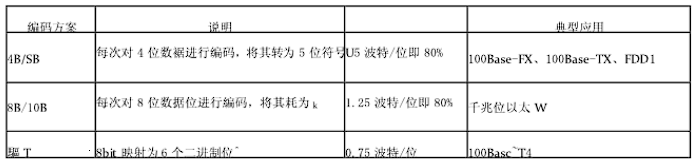
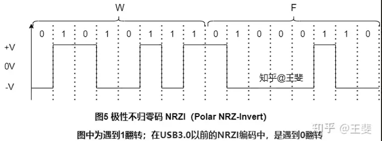
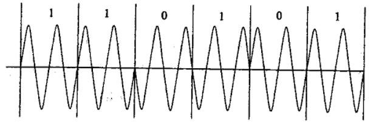
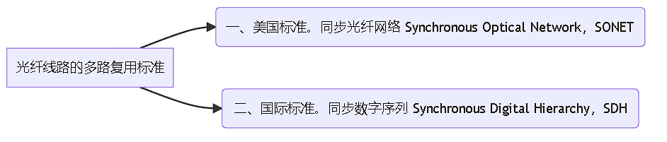
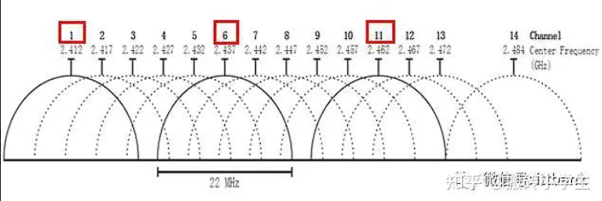
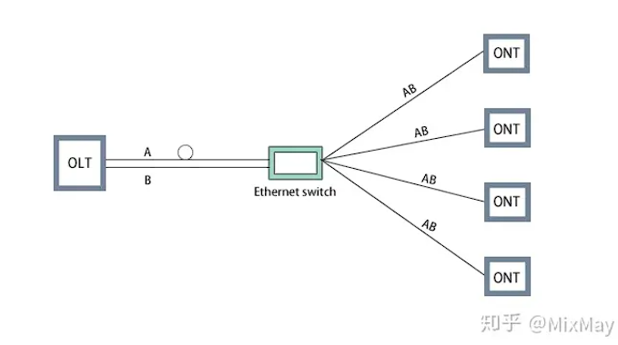
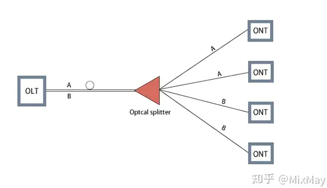

# 杂项常识

* 中国自主研发的3G通信标准是TD-SCDMA
  * 1985年，ITU提出了对第三代移动通信标准的需求，
  * 1996年正式命名为IMT-2000 (International Mobile Telecommunications-2000),其中的2000有3层含义：
    •使用的频段在2000MHz附近
    •通信速率于约为2000kb/s (即2Mb/s)
    •预期在2000年推广商用，1999年ITU批准了五个IMT-2000的无线电接口，这五个标准是：

> IMT-DS(Direct Spread)：即W-CDMA，属于频分双工模式，在日本和欧洲制定的UMTS系统中使用。
> IMT-MC(Multi-Carrier)：即CDMA-2000,属于频分双工模式，是第二代CDMA系统的继承者。
> IMT-TC(Time-Code)：这一标准是中国提出的TD-SCDMA,属于时分双工模式。
> IMT-SC(Single Carrier)：也称为EDGE，是一种2.75G技术。
> lMT-FT(Frequency Time)：也称为DECT。
> 2007年10月19日，ITU会议批准移动WiMAX作为第6个3G标准，称为IMT-2000 OFDMATDD WMAN,即无线城域网技术。
> 第三代数字蜂窝通信系统提供第二代蜂窝通信系统提供的所有业务类型，并支持移动多媒体业务。在高速车辆行驶时支持144kb/s的数据速率，步行和慢速移动环境下支持384kb/s的数据速率，室内静止环境下支持2Mb/s的髙速数据传输，并保证可靠的服务质量。

* 2.4GHZ频段在我们国家是13个信道，一般我们用1,6,11。

## wifi6

* WIFI6技术是2.4GHz和5GHz频段的。

  * WiFi 6很好的解决了2.4GHz和5GHz频段过度拥塞的问题，相比于上一代802.11ac的WiFi 5，
  * WiFi 6最大传输速率由前者的3.5Gbps，提升到了9.6Gbps，理论速度提升了近3倍。
  * 频段方面WiFi 5只涉及5GHz，WiFi 6则覆盖2.4/5GHz，完整涵盖低速与高速设备。
  * 调制模式方面，WiFi 6支持1024-QAM，高于WiFi 5的256-QAM，数据容量更高，意味着更高的数据传输速度。

# 数据通信原理

## 尼奎斯特定理

尼奎斯特定理指出：

若信道带宽为W,则最大码元速率为
B=2W (Baud)
这是由信道的物理特性决定的，是在无噪声的理想情况下的极限值。

实际信道会受到各种噪声的干扰，因而达不到按尼奎斯特定理计算出的数据传送速率。

## 香农定理

香农（Shannon) 的研究表明，

有噪声信道的极限数据速率可由下面的公式计算：

这个公式叫做香农定理。

其中，w为信道带宽，S为信号的平均功率，N为噪声的平均功率，S/N叫做信噪比。

由于在实际使用中S与N的比值太大，故常取其分贝数(dB)。

分贝与信噪比的关系为 $SNRDB=10logl0(S/N)$

例如当S/N=1000时，信噪比为30dB。

这个公式表明，无论用什么方式调制，只要给定了信噪比，则单位时间内可传输的最大信息量就确定了，所以称为信道容景。

## 光纤跳线的接头类型

常见的光纤跳线有以下几种接头：SC、ST、FC、LC、MPO。

智能以太网保护SEP是一种专用于以太网链路层的环网协议，它以SEP段为基本单位。

所谓SEP段，就是由一组配置了相同的SEP段D和控制VLAN且互连的二层交换设备群体构成。

以下是这些缩写的全名及其解释：

- SC：Subscriber Connector，订户连接器。SC接头是一种光纤跳线的连接器，用于连接光纤设备。
- ST：Straight Tip，直接插入式连接器。ST接头也是一种光纤跳线的连接器，常用于连接多模光纤设备。
- FC：Ferrule Connector，光纤套管连接器。FC接头是一种光纤跳线的连接器，通常用于连接单模光纤设备。
- LC：Lucent Connector，卢森特连接器。LC接头也是一种光纤跳线的连接器，常用于高密度光纤设备。
- MPO：Multi-fiber Push-On/Pull-off，多芯光纤压入/拉出连接器。MPO接头是一种用于高速数据传输的多芯光纤连接器。

在D选项中，SEP代表Selective Ethernet Protection，即选择性以太网保护。

SEP是一种专用于以太网链路层的环网协议，用于提供网络中断恢复和冗余保护。

SEP段是由一组配置了相同的SEP段D和控制VLAN且互连的二层交换设备群体构成的。

## DPSK调制技术

**差分相移键控**

Differential Phase Shift Keying

指利用调制信号前后码元之间载波相对相位的变化来传递信息。

利用DPSK调制技术可有效提高混沌通信系统的性能，并有利于提高信号的隐藏性。

对于DPSK，除了可以克服PSK的相位模糊现象，而且有较好的频谱利用率。

采用2种相位，通过前沿有无相位的改变来表示数据“0”和“1”

## T1载波

T1载波是专用电话连接、时分多路数字传输设施，其支持的**数据传输速度为 1.544M 比特/秒**。

T1载波也叫一次群，它把 **24 路话音信道按时分多路的原理复合在一条高速信道上**。**每个通道支持 64K 比特/秒的传输速度。**

该系统的工作是这样的:

用一个编码解码器轮流对24路话音信道取样、量化和编码，

一个取样周期中（125ms）得到的7位一组的数字组合成一串，共7×24位长。

这样的数字串在送入高速信道前要在每一个7位组的后面插入一个信令位，于是变成了8×24=192位长的数字串。

这192位数字组成一帧，最后再加入一个帧同步位，故帧长为193位。每125μs传送一帧，其中包含了各路话音信道的一组数字，还包含总共24位的控制信息以及1位帧同步信息。

这样，不难算出T1载波的各项比特率。对每一路话音信道来说，传输数据的比特率为7b/125jμs=56Kb/s，传输控制信息的比特率为1b/125μs=8Kb/s，总的比特率为193b/125μs=1.544Mb/s。

* T1载波的数据速率是 1.544Mb/s

## E1载波

E1载波（E1 Carrier）是一种2.048Mbps速率的PCM载波。

采用同步时分复用技术将30个话音信道（64K）和2个控制信道（16K）复合在一条2.048Mb/s的高速信道上。

**E1载波的基本帧由32个子信道组成，其中子信道（CH0和CH16）用于传送控制信令。**

【帧结构】：

每一帧开始处有8位作同步用,中间有8位用作信令,在组织30路8位数据,全帧包含256位,且每一帧用 125us时间传送。

(通常我们把E1载波的一个帧分为32个时隙，一个时隙为8个bit；其中时隙0和时隙16是传输控制信令用，所以一条E1可以传30路话音。

这里要注意：在[路由器](https://baike.baidu.com/item/%E8%B7%AF%E7%94%B1%E5%99%A8?fromModule=lemma_inlink)上的E1是不能划分时隙的，只能做2M线使用）。

（1） E1载波支持的[数据传输速率](https://baike.baidu.com/item/%E6%95%B0%E6%8D%AE%E4%BC%A0%E8%BE%93%E9%80%9F%E7%8E%87?fromModule=lemma_inlink)为2.048Mbps （即 256bit/125us=2.048Mbps)

（2）每个通道支持 的传输速度（或数据速率）为 64Kb/s  **E1子信道速率为：64kbps。**

因为每个时隙在E1帧中占8bit，8*8k=64k，即一条E1中含有32个64K，则 2.048Mbps/32=64Kb/s

（3）E1载波开销所占比例为6.25% 。因为一帧32个时隙中，30个用于用户数据，2个用于开销。所以开销所占比例=2/32=6.25%

（4）E1的有效数据率（开销比）：（32-2）/32 *2.048Mbps=1.92Mbps

.

E1的一个时分复用帧（其长度T=125us）共划分为**32相等的时隙**，

时隙的编号为CH0 - CH31。

其中**时隙CH0用作帧同步，时隙CH16用来传送信令**，剩下CH1-CH15和CH17-CH31 共30个时隙用作30个话路。

## 数字用户线路（DSL）

数字用户线路（Digital Subscriber Line，DSL）

允许用户在传统的电话线上提供高速的数据传输，用户计算机借助于DSL调制解调器连接到电话线上，通过DSL连接访问因特网络或者企业网络。

DSL采用尖端的数字调制技术，可以提供比ISDN快得多的速率，其实际速率取决于DSL的业务类型和很多物理层因素，例如电话线的长度、线径、串扰和噪音等。

DSL技术存在多种类型，以下是常见的技术类型。

①**ADSL**：非对称DSL，上下行流量不对称，一般具有三个信道，分别为1.544〜9Mb/s的高速下行信道，16〜640Kb/s的双工信道，64Kb/s的语音信道。

②**SDSL**：对称DSL，用户的上下行流量对称，最高可以达到1.544Mb/s。
③**ISDN , DSL**：介于ISDN和DSL之间，可以提供最远距离为4600〜5500m的128Kb/s双向对称传输。
④**HDSL**：高比特率DSL，是在两个线对上提供1.544Mb/s或在三个线对上提供2.048Mb/s对称通信的技术，其最大特点是可以运行在低质量线路上，最大距离为3700〜4600m。
⑤**VDSL**：甚高比特率DSL，一种快速非对称DSL业务，可以在一对电话线上提供数据和语音业务。

### ADSL

**Asymmetric Digital Subscriber Line，非对称数字用户线路。**

ADSL用于连接公共交换电话网PSTN。

**使用PPPOE协议认证**

PSTN属于电路交换网，所以ADSL是电路交换网的一部分。

X.25、FRN和ATM都是分组交换网。

- X.25：X.25是一种分组交换协议，用于在广域网中传输数据。它定义了一套规范，用于分组交换网络中的数据传输和错误检测。X.25在过去曾是广域网连接的主要标准之一，但现在已经被更快、更高效的技术所取代。
- FRN：Frame Relay Network，帧中继网络。FRN是一种广域网技术，使用帧中继交换技术将数据以帧的形式传输。它提供了高速、低延迟的数据传输服务，适用于连接分支机构和数据中心等场景。
- ATM：Asynchronous Transfer Mode，异步传输模式。ATM是一种基于分组交换的传输技术，它将数据划分为固定长度的小单元（称为单元或细胞），并以异步方式进行传输。ATM在过去被广泛应用于公共通信网络和广域网中，但现在主要被以太网所取代。

这三种技术都属于分组交换网，与电路交换网（如PSTN）不同，数据在传输过程中被分割成小包（分组）进行传输，而不是建立独占的物理连接。

- ADSL：Asymmetric Digital Subscriber Line，非对称数字用户线路。ADSL是一种用于宽带互联网接入的技术，通过普通的电话线（PSTN）提供高速数据传输。ADSL允许同时使用电话和互联网，其中下载速度比上传速度更快，因此称为“非对称”。ADSL通过将高频信号和语音信号分离来实现数据传输。
- PSTN：Public Switched Telephone Network，公共交换电话网。PSTN是传统的电话网络基础设施，由电路交换系统组成，用于提供传统的语音通信服务。PSTN使用专用的物理线路来建立点对点的连接，以进行电话呼叫和传输语音信号。它是一个全球范围的公共通信网络，在许多地方仍然广泛使用。

## PPPOE

PPPoE（Point-to-Point Protocol Over Ethernet的缩写），

以太网上的点对点协议，是将点对点协议（PPP）封装在以太网（Ethernet）框架中的一种网络隧道协议。

由于协议中集成PPP协议，所以实现出传统以太网不能提供的身份验证、加密以及压缩等功能，

也可用于缆线调制解调器（cable modem）和数字用户线路（DSL）等以以太网协议向用户提供接入服务的协议体。

## 单位换算：

s(秒), ms(毫秒), μs(微秒), ns(纳秒), ps(皮秒)

1 秒 = 1000 毫秒 = 1000 * 1000 微秒 = 1000*1000*1000 纳秒 = 1000*1000*1000*1000 皮秒

## 关于STDM多路复用计算

**例题:**

**5个64kb/s的信道按统计时分多路复用在一条主线路上传输，主线路的开销为4% ，假定每个子信道利用率为90% ，那么这些信道在主线路上占用的带宽为（）kb/s。**

计算:

主线路的开销为 4 % 那么, 传输数据只能占主线路的 96%

每个子信道大小为 64kbps , 但信道利用率只有 90%

故实际上这些信道在主线路上占用的带宽为 5 * 64 kbps * 90% / 96% =

## 关于传播或发送时间计算

**例题:**

**在地面上相距2000公里的两地之间通过电缆传输4000比特长的数据包，数据速率为64Kb/s，从开始发送到接收完成需要的时间为?**

从开始发送到接收完成的时间包含**数据包的发送（或接收）时间**，以及**信号在电缆中的传播延迟时间**。

**电信号在电缆中的传播速度是200m/μs，**

所以传播延迟时间为 2000Km÷200m/μs= 10ms,

而发送（或接收）数据包的时间为4000bit÷64Kb/s=62.5ms，

总共是72.5ms。

**例题:**

**在相隔20km的两地间通过电缆以100Mb/s的速率传送1518字节长的以太帧，从开始发送到接收完数据需要的时间约是（）（信号速率为200m/us）。**

* 信道延迟=传输距离（D）/传输速度（V）=20000/200000000=0.0001s；
* 调制延迟=数据帧大小/速率=1518×8/100000000=0.00012144。
* 发送数据总时间=信道延迟+调制延迟=0.0001s+0.00012144=221us。

## Modem

调制解调器（Modem）是一种计算机硬件，

它能把计算机的数字信号翻译成可沿普通电话线传送的模拟信号，

而这些模拟信号又可被线路另一端的另一个调制解调器接收，

并译成计算机可懂的语言。

## 快速以太网编码标准

* 8B6T 100Base-T4
* 4B5B+NRZI 100BASE-FX

## 100BASE-FX

100Mbps的高速网络，采用的编码方式是4B5B+NRZI的方法。

100BASE-FX是基于光缆的快速以太网的技术名称。

它是快速以太网的一种版本，在局域网(LAN)中以100 Mbps(兆比特/秒)的速度传输数据流量。

它于1995年作为IEEE 802.3u标准发布。此处，100是最大吞吐量，即100 Mbps，BASE表示使用基带传输，而FX表示在快速以太网中使用光纤。

100BASE-FX物理相关介质(PMD)子层由光纤分布式数据接口(FDDI)定义。

* 它有两对光纤。一对从集线器传输到设备，另一对从设备传输到集线器。
* 集线器与站点之间的最大距离为2000m。
* 它的数据速率为125 Mbps。
* 它使用NRZ-1编码方案以及4B / 5B块编码。
* 在大多数快速以太网应用中，光纤用于长距离传输，各个设备通过双绞铜线即100BASE-TX连接。这需要连接之间的转换器。

## 编码技术

### 曼彻斯特编码

曼彻斯特编码（Manchester Encoding），也叫做相位编码（ Phase Encode，简写PE），

是一个同步时钟编码技术，被物理层使用来编码一个同步位流的时钟和数据。

它在以太网媒介系统中的应用属于数据通信中的两种位同步方法里的自同步法（另一种是外同步法），即接收方利用包含有同步信号的特殊编码从信号自身提取同步信号来锁定自己的时钟脉冲频率，达到同步目的。

曼彻斯特编码，常用于局域网传输。曼彻斯特编码将时钟和数据包含在数据流中，在传输代码信息的同时，也将时钟同步信号一起传输到对方，每位编码中有一跳变，不存在直流分量，因此具有自同步能力和良好的抗干扰性能。但每一个码元都被调成两个电平，所以数据传输速率只有调制速率的1/2。

### 4B5B+NRZI

4B/5B是每次对4位数据进行编码，将其转为5位符号，编码效率即80%。

代表的标准有

* 100Base-FX
* 100Base-TX
* FDDI   FDDI（Fiber Distributed Data Interface），光纤分布式数据接口

4B5B是一种多比特编码方案，将4位二进制数据映射为5位的编码字符。这种编码方案用于增加数据传输的可靠性和减少误码率，并且保持了传输速率不变。

4B/5B编码实际上是一种两级编码。

系统中使用不归零编码，在发送到传输介质之前要变成见1就翻的不归零编码(NRZ-I)。

NRZ-I代码序列中1的个数越多，越能提供同步定时信息，但如果遇到长串的0，则不能提供同步信息。

所以在发送到介质之前还需要进行一次4B/5B编码，发送器扫描要发送的位序列，将其每4位分成一组，然后按照4B/5B编码规则转换成相应的5位代码。

NRZI（Non-Return to Zero Inverted）是一种编码方式，在每个高位或低位之间进行变化以表示数据位。

4B5B+NRZI结合了多比特编码和NRZI编码，常用于以太网等通信协议中。

### MLT-3+NRZl

MLT-3（Multi-Level Transition 3）是一种多电平编码方案，将每个数据位映射为三个电平。相邻的逻辑1之间进行电平变化，而逻辑0保持不变。

NRZl（Non-Return to Zero Level）是一种编码方式，用两个电平表示数据位。

MLT-3+NRZl结合了多电平编码和NRZl编码，常用于一些有限带宽的传输介质，例如电话线路。

### 8B6T

8B6T是一种更高级别的多比特编码方案，将8位二进制数据映射为6位的编码字符。

它主要应用于1000BASE-T以太网中的物理层信号传输。

8B6T通过在每个时间周期内选择其中一个离散信号水平来表示数据，以提供较高的传输效率和较低的误码率。

### NRZI

**极性不归零码 NRZI（Polar NRZ-Invert）**

### BAMI/AMI

传号交替反转码（AIM码，Alternative Mar Inversion），

其编码规则为将消息码的“1”（传号码）交替地变为“+1”和“-1”而“0”（空号码）保持不变，并没有引入新的码元。

**但是变换后有三个电平，三个电平仅代表了1个比特的两种状态**

### 编码效率

* NRZ-I编码中，编码后电平只有正负电平之分，没有零电平，是不归零编码，编码效率是100%。
* BAMI的编码是通过使用三个电平来表示二进制数0和1，可以认为这种编码方式的的效率是2/3，
* 曼彻斯特编码的编码效率是50%，
* 4B5B的编码效率是80%。

## 调制技术与多路复用技术

### DPSK

**DPSK(差分相移键控)**

图形可知是以载波的相对初始相位变化来实现数据的传送，

并且初始相位与前一码元的发生180度变化为二进制0，无变化为1.

因此可知采用的调制技术为DPSK(差分相移键控)。

* 对应的码元速率和二进制数据速率相同，而载波速率为其两倍。

### QAM

正交幅度调制（Quadrature Amplitude Modulation，QAM），

**就是把两个幅度相同但相位相差90°的模拟信号合成为一个模拟信号。**

下表的例子是把ASK和PSK技术结合起来，形成幅度相位复合调制，这也是一种正交幅度调制技术。

**由于形成了16种不同的码元，所以每一个码元可以表示4位二进制数据**，使得数据速率大大提高。

QAM调制实际上是幅度调制和相位调制的组合，同时利用了载波的幅度和相位来传递数据信息。

与单纯的PSK调制相比，在最小距离相同的条件下，QAM星座图中可以容纳更多的载波码点，可以实现更高的频带利用率。

#### 16-QAM

是用一个码元表示4比特二进制数据，它的数据速率是码元速率的4倍。目前最高可以达到1024-QAM，即用一个码元表示10比特数据。

QAM是幅度、相位联合调制的技术，它同时利用了载波的幅度和相位来传递信息比特。例如具有16个样点的16-QAM信号，16-QAM中规定了16种载波和相位的组合，16-QAM的每个符号和周期传送4比特。

#### 256AM

5G采用的正交振幅调制(Quadrature Amplitude Modulation, QAM)技术中,256AM的一个载波上可以调制8比特信息。

**注意:**

5G 无线通信采用的载波调制技术 F-OFDM

F-OFDM是一种可变子载波带宽的自适应空口波形调制技术，是基于OFDM的改进方案。

F-OFDM既能够实现空口物理层切片后向兼容LTE 4G系统、又能满足未来5G发展的需求。

### OFDM

正交频分复用（Orthogonal Frequency Division Multiplexing）是一种调制和多路复用技术，广泛应用于无线通信系统中。

OFDM将高速数据流分成多个较低速的子载波，并在频域上将这些子载波之间保持正交关系，以避免互相干扰。

这种技术提供了高效的频谱利用和抗多径衰落的能力，使其适用于高速数据传输，如无线局域网（Wi-Fi）、4G LTE和5G等。

### F-OFDM

过滤OFDM（Filtered-OFDM）是一种改进的OFDM技术，通过在每个子载波上应用滤波器来减少带外辐射和频谱泄漏。

相比传统的OFDM，F-OFDM具有更好的频谱容量和抗干扰性能，可以更有效地利用频谱资源，并减少对相邻频带的干扰。

F-OFDM广泛应用于5G无线通信和数字音视频广播等领域。

### QPSK

四相移键控（Quadrature Phase Shift Keying）是一种常见的调制技术，用于将数字数据映射到模拟信号。

QPSK将两个比特组合成一个相位符号，每个符号代表一个特定的相位，从而可以传输更多的比特信息。

QPSK具有较高的频谱效率和较好的抗噪声性能，是许多无线通信系统中常用的调制方式，如Wi-Fi、蜂窝网络和卫星通信等。

* QPSK调制技术，4种码元，对应需要用二位二进制表示。因此每2位二进制表示一种码元，码元速率为二进制数据速率的一半。

### 256QAM

256-ary Quadrature Amplitude Modulation（256进制正交振幅调制）是一种高阶调制技术，在每个符号周期内将8个比特映射为一个256种可能的信号点之一。256QAM提供了更高的传输速率和更高的频谱效率，但相对于低阶调制来说，对信道质量和抗噪声性能要求也更高。

它在高容量的无线通信系统中使用，如数字电视广播、光纤通信和4G LTE等。

## PCM

脉冲编码调制（Pulse Code Modulation）是一种用于模拟信号数字化的编码技术。

PCM将连续的模拟信号离散化为一系列固定间隔的采样点，并使用固定位数的二进制码来表示每个采样点的幅值

PCM广泛应用于音频和语音通信领域，提供高质量的数字音频传输和存储。

PCM主要经过3个过程：

* 采样
* 量化
* 编码

采样过程通过周期性扫描将时间连续、幅度连续的模拟信号变换为时间离散、幅度连续的采样信号；

量化过程将采样信号变为时间离散、幅度离散的数字信号；

编码过程将最化后的离散信号编码为二进制码组。

采样频率决定了可恢复的模拟信号的质量。

根据尼奎斯特采样定理，为了恢复原来的模拟信号，采样频率必须大于模拟信号最高频率的二倍，即

其中f为采样频率，T为采样周期，fmax为信号的最高频率。

通常模拟话音信道的带宽（即最高频率）是4000Hz，所以在数字化时采样频率至少为8000次/秒。

**例题:**

设信道带宽为5000Hz，采用PCM编码，采样周期为125μs，每个样本量化为256个等级，则信道的数据速率为（）。

解题:

频率=1/周期=1/125us=8000HZ

量化即是离散数为256=log2 256 = 8比特

故每秒传输 8 * 8000=64kb/s

## 光纤多路复用标准 SONET SDH

SONET为光纤传输系统定义了同步传输的线路速率等级结构，其传输速率以51.84Mbps为基础，大约对应于T3/E3传输速率，此速率对电信号称为第1级同步传送信号即STS-1。对光信号则称为第1级光载波即OC-1。

| 复用方式 | 描述       | 应用场景                        |
| :------- | :--------- | :------------------------------ |
| 频分多路 | 频率不同   | 无线电广播、ADSL、FDD-LTE       |
| 时分多路 | 时间片不同 | T1/E1、WIFI、SONET/SDH、TDD-LTE |
| 波分多路 | 波长不同   | 光纤                            |

SDH 的基本速率是 155.52 Mbps，称为第 1 级同步传递模块（Synchronous Transfer Module），即 STM-1，相当于 SONET 体系中的 OC-3 速率

重点：记住 STM-1 速率的值，其它 STM-N 的速率 = STM-1 的速率 * N

## 802.11 2.4G频率划分和使用

（1） band范围：2.4 GHz 到2.497 GHz，包含14个channel

（2） 每个channel，宽度其实是22MHz, 和常说的20M带宽有2M差别，多出来的这2M属于保护隔离频带

（3） 每个信道对应一个中心频点，信道1的中心频点2412MHz,信道2的中心频点是2417MHz，相差5M,其他依次类推；信道14是特例，相差12M

（4） 互不干扰的信道，有4组，1/6/11, 2/7/12，3/8/13，4/9/14.最常用的是第一组，1、6、11

# 传输介质

## 单模光纤与多模光纤

多模光纤：很多不同角度的入射的光线在一条光纤中传输。适合用于近距离传输，一般约束在550M。

单模光纤：如光纤的直径减小到只有一个光的波长，使光纤一直向前传播，而不会产生多次反射，这样的光纤就成为单模光纤。

单模光纤传输距离数十公里而不必要采用中继器。

## 传输介质性能指标

### 双绞线

双绞线布线性能指标包括

* 衰减(Attenuation)
* 近端串扰(NEXT)
* 直流电阻
* 阻抗特性
* 衰减串扰比(ACR)
* 电缆特性（SNR）等

光缆铡试指标: 播到端光纤链路损耗、每单位长度的衮减速率、熔接点、连接器与耦合器各个事件、光缆长度或者事件的距离r每单位长度光纤报耗的线性(衮撼不连续性)、反射或者光回拔(ORL)、 色散(CD)、 极化模式色散(PMD)、 衰减特性(AP)。

### 光纤

* 回波损耗，又称为反射损耗。是电缆链路由于阻抗不匹配所产生的反射，是一对线自身的反射。

# 实际技术与标准

## 光网络,FTTH网络部署

[光纤到户](https://link.zhihu.com/?target=https%3A//cn.hyc-system.com/news/CompanyInfo/)（FTTH）实现了将光纤从中心点直接安装到终端用户家中，提供了前所未有的高速互联网接入。

实现FTTH网络部署有两种类型的系统：AON（有源光网络）和PON（无源光网络）。

AON网络中，用户拥有专用的光纤线路，这易于后期网络维护、容量扩展、网络升级等。且AON网络覆盖范围广，可覆盖大约100公里的范围；

PON网络通常仅限于长达20公里的光纤线缆。AON主要通过有源设备引导光信号，PON使用无源器件而不需电源，导致AON网络部署要比PON成本高一些。

### ANO

AON是Active Optical Network有源光网络，

主要采用**点对点（PTP）网络架构**，每个用户都可有一个专用的光纤线路。

有源光网络是指信号在传输过程中，从局端设备到用户分配单元之间部署了诸如路由器和交换聚合器之类的交换设备、有源光器件等，

这些交换设备由电力驱动以管理特定客户的信号分配和方向信号。

有源光器件有光源（激光器）、光接收机、光收发模块、光放大器（光纤放大器和半导体光放大器）等。

### PNO

PON是Passive Optical Network 无源光网络，

一种**点对多点网络结构**，是实现FTTB/FTTH的主要技术。

无源光网络中指ODN（光配线网）仅使用光纤和无源组件，只需要在信号源和信号接收端使用带电的设备。

在典型的PON系统中，分光器是核心，利用分光器来分离和收集通过网络传输的光信号。

这些用于PON的分路器是双向的，在下行方向，IP数据、语音、视频等多种业务由位于中心局的OLT，采用广播方式，

通过ODN中的1：N无源光分配器分配到PON上的所有ONU单元；在上行方向，

来自各个ONU的多种业务信息互不干扰地通过ODN中的1：N无源光合路器耦合到同一根光纤，最终送到位于局端OLT接收端。

一个无源光网络包括一个安装于中心控制站的光线路终端（OLT），以及一批配套的安装于用户场所的光网络单元（ONUs）。

在OLT与ONU之间的光配线网（ODN）包含了光纤以及无源分光器或者耦合器。

PON根据其传输协议的不同又分为基于ATM的APON（ATM PON）、基于Ethernet的EPON（Ethernet PON）、和基于General Frame Protocol的GPON（Gigabit PON）三种技术标准。

## MPLS

多协议标记交换（Multiprotocol Label Switching，MPLS，RFC3031）

IETF(**IETF工作组**(IETF Working Group)开发的多协议标记交换（Multiprotocol Label Switching，MPLS，RFC3031）

把第2层的链路状态信息（带宽、延迟、利用率等）集成到第3层的协议数据单元中，从而简化和改进了第3层分组的交换过程。

理论上，**MPLS支持任何第2层和第3层协议。**

**MPLS包头的位置界于第2层和第3层之间**，可称为第2.5层，标准格式如下图所示。

MPLS可以承载的报文通常是IP包，当然也可以直接承载以太帧、AAL5包、甚至ATM信元等。可以承载MPLS的第2层协议可以是PPP、以太帧、ATM和帧中继等。

IETF开发的多协议标记交换（MPLS)把第2层的链路状态信息（带宽、延迟、利用率等）集成到第3层的协议数据单元中，从而简化和改进了第3层分组的交换过程 。

理论上，MPLS支持任何第2层和第3层协议。MPLS包头的位置界于第2层和第3层之间，可称为第2.5层，标准格式如下图所示。

MPLS可以承载的报文通常是IP包，当然也可以直接承载以太帧、AAL5包甚至ATM信元等。

可以承载MPLS的第2层协议可以是PPP、以太顿、ATM和帧中继等，如下图所示。

当分组进入MPLS网络时，标记边缘路由器（LER)就为其加上一个标记，这种标记不仅包含了路由表项中的信息（目标地址、带宽和延迟等)，而且还引用了IP头中的源地址字段、传输层端口号和服务质量等。

这种分类一旦建立，分组就被指定到对应的标记交换通路（LSP)中，标记交换路由器（LSR)将根据标记来处置分组，不再经过第3层转发，从而加快了网络的传输速度。

**MPLS可以把多个通信流汇聚成为一个转发等价类（FEC)**。

LER根据目标地址和端口号把分组指派到一个等价类中，在LSR中只需根据等价类标记査找标记信息库(LIB), 确定下一跳的转发地址。这样使得协议更具伸缩性。

MPLS标记具有局部性，一个标记只是在一定的传输域中有效。

## HFC接入网

Hybrid Fiber－Coaxial的缩写，即混合光纤[同轴电缆](https://zhidao.baidu.com/search?word=%E5%90%8C%E8%BD%B4%E7%94%B5%E7%BC%86&fr=iknow_pc_qb_highlight)网。

是一种经济实用的综合数字服务宽带网接入技术 。
HFC通常由光纤干线、同轴电缆支线和用户配线网络三部分组成，从有线电视台出来的节目信号先变成光信号在干线上传输；

到用户区域后把光信号转换成电信号，经分配器分配后通过同轴电缆送到用户。
它与早期CATV同轴电缆网络的不同之处主要在于，在干线上用光纤传输光信号，在前端需完成电—光转换，进入用户区后要完成光—电转换。

* **HFC是将光缆敷设到小区，**

然后通过光电转换结点，

利用有线电视CATV的总线式同轴电缆连接到用户，提供综合电信业务的技术。

这种方式可以充分利用CATV原有的网络。

## SONET

同步光网络(Synchronous Optical Networking，SONET）是使用光纤进行数字化信息通信的一个标准。

今天SONET和SDH两种技术体制都被广泛的应用；SONET应用在美国和加拿大，SDH应用在世界其他国家。

* 采用时分复用成帧

### 同步数字体系SDH

更新近的 同步数字体系SDH（代表Synchronous Digital Hierarchy）标准建立在SONET发展的经验上。

今天SONET和SDH两种技术体制都被广泛的应用；SONET应用在美国和加拿大，SDH应用在世界其他国家。

同步联网不同于PDH的地方就在于用来传送数据的多个精确的速率严格的同步于基于网络的时钟,这样整个网络就同步的运作。

原子时钟的出现使得SDH的产生成为可能。

SONET和SDH体制都能够用来封装较早的数字传输标准，比如PDH标准，或者直接用来支持ATM以及所谓的SONET上的分组业务(Packet Over SONET)网络。

**基本SONET信号运行在51.840Mbit/s的速率，且被指定为STS-1(同步传送信号第一级),STS-1数据帧是SONET中传送的基本单元。**

### STS-1帧的两个基本组成部分

STS-1帧的两个基本组成部分是传送开销和同步载荷包封(SPE)。

传送开销(27字节)由段开销和线路开销(line overhead)组成。这些字节用于信令和测量传输差错比率。

SPE由载荷开销（9字节，用于端到端信令和差错测量）和774字节的载荷组成。STS-1载荷被指定用于承载一个完整的DS-3帧。

整个STS-1帧是810字节。在光载波第一级别OC-1上STS-1帧传送完成恰好需要125微秒。在实践中STS-1和OC-1是可以互换的。

3个OC-1（STS-1）信号通过**时分复用**的方式复用成SONET层次的下一个级别OC-3（STS-3）速率为155.520Mbit/s。通过间插3个STS-1帧中的字节完成复用形成STS-3帧，包含2430字节且传送时间为125微秒。STS-3信号也被用作SDH体制的一个基础，那里它被指定为[STM-1](https://baike.baidu.com/item/STM-1?fromModule=lemma_inlink)（同步传输模块第一级别）。

更高速率的电路由多个低级速率的电路的连续汇聚构成，他们的速度总是可以从他们的名称上立即知道。例如，4个OC-3或者STM-1电路可以汇聚而构成一个622.08Mbit/s的电路，其名称分别为OC-12或STM-4。

这种技术的当前状态是最高级别为OC-192或者STM-64,恰好低于10Gbit/s的速率。超过10Gbit/s的速率在当前技术上还不成熟；然而多个OC-192电路可以通过密集波分DWDM的方式在一对光纤上传输。这些电路是所有现代跨洋电缆系统和其他长距通信电路的基础。

由于比特速率上的幸运巧合，10G比特以太网已经设计了和OC-192/STM-64设备的互操作的能力。

SONET设备通常使用TL1协议管理。
