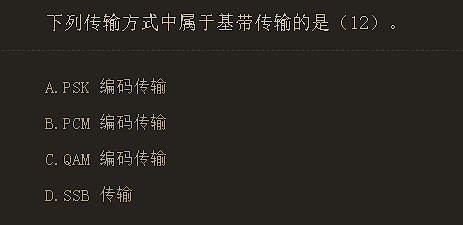
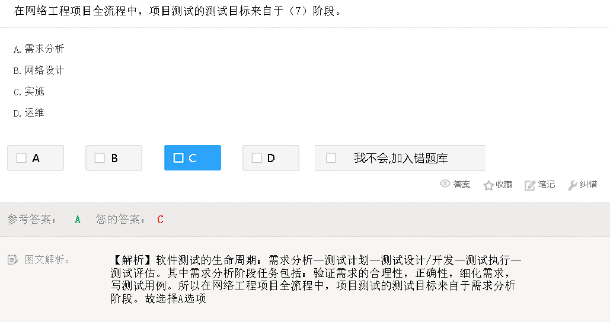
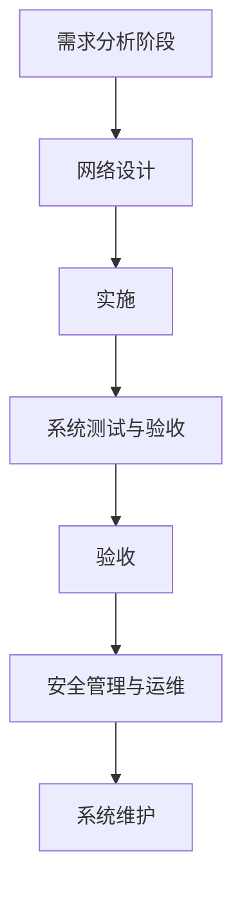

# 杂项常识

- 中国自主研发的 3G 通信标准是 TD-SCDMA
  - 1985 年，ITU 提出了对第三代移动通信标准的需求，
  - 1996 年正式命名为 IMT-2000 (International Mobile Telecommunications-2000),其中的 2000 有 3 层含义：
    •使用的频段在 2000MHz 附近
    •通信速率于约为 2000kb/s (即 2Mb/s)
    •预期在 2000 年推广商用，1999 年 ITU 批准了五个 IMT-2000 的无线电接口，这五个标准是：

> IMT-DS(Direct Spread)：即 W-CDMA，属于频分双工模式，在日本和欧洲制定的 UMTS 系统中使用。

> IMT-MC(Multi-Carrier)：即 CDMA-2000,属于频分双工模式，是第二代 CDMA 系统的继承者。

> IMT-TC(Time-Code)：这一标准是中国提出的 TD-SCDMA,属于时分双工模式。

> IMT-SC(Single Carrier)：也称为 EDGE，是一种 2.75G 技术。

> lMT-FT(Frequency Time)：也称为 DECT。

> 2007 年 10 月 19 日，ITU 会议批准移动 WiMAX 作为第 6 个 3G 标准，称为 IMT-2000 OFDMATDD WMAN,即无线城域网技术。

> 第三代数字蜂窝通信系统提供第二代蜂窝通信系统提供的所有业务类型，并支持移动多媒体业务。在高速车辆行驶时支持 144kb/s 的数据速率，步行和慢速移动环境下支持 384kb/s 的数据速率，室内静止环境下支持 2Mb/s 的髙速数据传输，并保证可靠的服务质量。

- 2.4GHZ 频段在我们国家是 13 个信道，一般我们用 1,6,11。

## wifi6

- WIFI6 技术是 2.4GHz 和 5GHz 频段的。

  - WiFi 6 很好的解决了 2.4GHz 和 5GHz 频段过度拥塞的问题，相比于上一代 802.11ac 的 WiFi 5，
  - WiFi 6 最大传输速率由前者的 3.5Gbps，提升到了 9.6Gbps，理论速度提升了近 3 倍。
  - 频段方面 WiFi 5 只涉及 5GHz，WiFi 6 则覆盖 2.4/5GHz，完整涵盖低速与高速设备。
  - 调制模式方面，WiFi 6 支持 1024-QAM，高于 WiFi 5 的 256-QAM，数据容量更高，意味着更高的数据传输速度。

# 数据通信原理

## 尼奎斯特定理

尼奎斯特定理指出：

若信道带宽为 W, 则最大码元速率为
B=2W (Baud)
这是由信道的物理特性决定的，是在无噪声的理想情况下的极限值。

实际信道会受到各种噪声的干扰，因而达不到按尼奎斯特定理计算出的数据传送速率。

### 码元

N=log2 (N)

若码元取0和1两个离散值，则一个码元携带1比特（bit）的信息。

若码元可取4个离散值，则一个码元携带2比特信息。

一般的，一个码元携带的信息量n（比特）与码元取的离散值个数N具有如下关系：

**n=log2 (N)**

比特率指单位时间内信道上传送的信息量（比特数），也叫数据速率。

## 香农定理

香农（Shannon) 的研究表明，

有噪声信道的极限数据速率可由下面的公式计算：

这个公式叫做香农定理。

其中，w 为信道带宽，S 为信号的平均功率，N 为噪声的平均功率，S/N 叫做信噪比。

由于在实际使用中 S 与 N 的比值太大，故常取其分贝数(dB)。

分贝与信噪比的关系为 $SNRDB=10lg(S/N)$

例如当 S/N=1000 时，信噪比为 30dB。

这个公式表明，无论用什么方式调制，只要给定了信噪比，则单位时间内可传输的最大信息量就确定了，所以称为信道容景。

## 光纤跳线的接头类型

常见的光纤跳线有以下几种接头：SC、ST、FC、LC、MPO。

智能以太网保护 SEP 是一种专用于以太网链路层的环网协议，它以 SEP 段为基本单位。

所谓 SEP 段，就是由一组配置了相同的 SEP 段 D 和控制 VLAN 且互连的二层交换设备群体构成。

以下是这些缩写的全名及其解释：

- SC：Subscriber Connector，订户连接器。SC 接头是一种光纤跳线的连接器，用于连接光纤设备。
- ST：Straight Tip，直接插入式连接器。ST 接头也是一种光纤跳线的连接器，常用于连接多模光纤设备。
- FC：Ferrule Connector，光纤套管连接器。FC 接头是一种光纤跳线的连接器，通常用于连接单模光纤设备。
- LC：Lucent Connector，卢森特连接器。LC 接头也是一种光纤跳线的连接器，常用于高密度光纤设备。
- MPO：Multi-fiber Push-On/Pull-off，多芯光纤压入/拉出连接器。MPO 接头是一种用于高速数据传输的多芯光纤连接器。

在 D 选项中，SEP 代表 Selective Ethernet Protection，即选择性以太网保护。

SEP 是一种专用于以太网链路层的环网协议，用于提供网络中断恢复和冗余保护。

SEP 段是由一组配置了相同的 SEP 段 D 和控制 VLAN 且互连的二层交换设备群体构成的。

## DPSK 调制技术

**差分相移键控**

Differential Phase Shift Keying

指利用调制信号前后码元之间载波相对相位的变化来传递信息。

利用 DPSK 调制技术可有效提高混沌通信系统的性能，并有利于提高信号的隐藏性。

对于 DPSK，除了可以克服 PSK 的相位模糊现象，而且有较好的频谱利用率。

采用 2 种相位，通过前沿有无相位的改变来表示数据“0”和“1”

## T1 载波

T1 载波是专用电话连接、时分多路数字传输设施，其支持的**数据传输速度为 1.544M 比特/秒**。

T1 载波也叫一次群，它把 **24 路话音信道按时分多路的原理复合在一条高速信道上**。**每个通道支持 64K 比特/秒的传输速度。**

该系统的工作是这样的:

用一个编码解码器轮流对 24 路话音信道取样、量化和编码，

一个取样周期中（125ms）得到的 7 位一组的数字组合成一串，共 7×24 位长。

这样的数字串在送入高速信道前要在每一个 7 位组的后面插入一个信令位，于是变成了 8×24=192 位长的数字串。

这 192 位数字组成一帧，最后再加入一个帧同步位，故帧长为 193 位。每 125μs 传送一帧，其中包含了各路话音信道的一组数字，还包含总共 24 位的控制信息以及 1 位帧同步信息。

这样，不难算出 T1 载波的各项比特率。对每一路话音信道来说，传输数据的比特率为 7b/125jμs=56Kb/s，传输控制信息的比特率为 1b/125μs=8Kb/s，总的比特率为 193b/125μs=1.544Mb/s。

- T1 载波的数据速率是 1.544Mb/s

## E1 载波

E1 载波（E1 Carrier）是一种 2.048Mbps 速率的 PCM 载波。

采用同步时分复用技术将 30 个话音信道（64K）和 2 个控制信道（16K）复合在一条 2.048Mb/s 的高速信道上。

**E1 载波的基本帧由 32 个子信道组成，其中子信道（CH0 和 CH16）用于传送控制信令。**

【帧结构】：

每一帧开始处有 8 位作同步用,中间有 8 位用作信令,在组织 30 路 8 位数据,全帧包含 256 位,且每一帧用 125us 时间传送。

(通常我们把 E1 载波的一个帧分为 32 个时隙，一个时隙为 8 个 bit；其中时隙 0 和时隙 16 是传输控制信令用，所以一条 E1 可以传 30 路话音。

这里要注意：在[路由器](https://baike.baidu.com/item/%E8%B7%AF%E7%94%B1%E5%99%A8?fromModule=lemma_inlink)上的 E1 是不能划分时隙的，只能做 2M 线使用）。

（1） E1 载波支持的[数据传输速率](https://baike.baidu.com/item/%E6%95%B0%E6%8D%AE%E4%BC%A0%E8%BE%93%E9%80%9F%E7%8E%87?fromModule=lemma_inlink)为 2.048Mbps （即 256bit/125us=2.048Mbps)

（2）每个通道支持 的传输速度（或数据速率）为 64Kb/s **E1 子信道速率为：64kbps。**

因为每个时隙在 E1 帧中占 8bit，8\*8k=64k，即一条 E1 中含有 32 个 64K，则 2.048Mbps/32=64Kb/s

（3）E1 载波开销所占比例为 6.25% 。因为一帧 32 个时隙中，30 个用于用户数据，2 个用于开销。所以开销所占比例=2/32=6.25%

（4）E1 的有效数据率（开销比）：（32-2）/32 \*2.048Mbps=1.92Mbps

.

E1 的一个时分复用帧（其长度 T=125us）共划分为**32 相等的时隙**，

时隙的编号为 CH0 - CH31。

其中**时隙 CH0 用作帧同步，时隙 CH16 用来传送信令**，剩下 CH1-CH15 和 CH17-CH31 共 30 个时隙用作 30 个话路。

## 数字用户线路（DSL）

数字用户线路（Digital Subscriber Line，DSL）

允许用户在传统的电话线上提供高速的数据传输，用户计算机借助于 DSL 调制解调器连接到电话线上，通过 DSL 连接访问因特网络或者企业网络。

DSL 采用尖端的数字调制技术，可以提供比 ISDN 快得多的速率，其实际速率取决于 DSL 的业务类型和很多物理层因素，例如电话线的长度、线径、串扰和噪音等。

DSL 技术存在多种类型，以下是常见的技术类型。

①**ADSL**：非对称 DSL，上下行流量不对称，一般具有三个信道，分别为 1.544〜9Mb/s 的高速下行信道，16〜640Kb/s 的双工信道，64Kb/s 的语音信道。

②**SDSL**：对称 DSL，用户的上下行流量对称，最高可以达到 1.544Mb/s。
③**ISDN , DSL**：介于 ISDN 和 DSL 之间，可以提供最远距离为 4600〜5500m 的 128Kb/s 双向对称传输。
④**HDSL**：高比特率 DSL，是在两个线对上提供 1.544Mb/s 或在三个线对上提供 2.048Mb/s 对称通信的技术，其最大特点是可以运行在低质量线路上，最大距离为 3700〜4600m。
⑤**VDSL**：甚高比特率 DSL，一种快速非对称 DSL 业务，可以在一对电话线上提供数据和语音业务。

### ADSL

**Asymmetric Digital Subscriber Line，非对称数字用户线路。**

ADSL 用于连接公共交换电话网 PSTN。

**使用 PPPOE 协议认证**

PSTN 属于电路交换网，所以 ADSL 是电路交换网的一部分。

X.25、FRN 和 ATM 都是分组交换网。

- X.25：X.25 是一种分组交换协议，用于在广域网中传输数据。它定义了一套规范，用于分组交换网络中的数据传输和错误检测。X.25 在过去曾是广域网连接的主要标准之一，但现在已经被更快、更高效的技术所取代。
- FRN：Frame Relay Network，帧中继网络。FRN 是一种广域网技术，使用帧中继交换技术将数据以帧的形式传输。它提供了高速、低延迟的数据传输服务，适用于连接分支机构和数据中心等场景。
- ATM：Asynchronous Transfer Mode，异步传输模式。ATM 是一种基于分组交换的传输技术，它将数据划分为固定长度的小单元（称为单元或细胞），并以异步方式进行传输。ATM 在过去被广泛应用于公共通信网络和广域网中，但现在主要被以太网所取代。

这三种技术都属于分组交换网，与电路交换网（如 PSTN）不同，数据在传输过程中被分割成小包（分组）进行传输，而不是建立独占的物理连接。

- ADSL：Asymmetric Digital Subscriber Line，非对称数字用户线路。ADSL 是一种用于宽带互联网接入的技术，通过普通的电话线（PSTN）提供高速数据传输。ADSL 允许同时使用电话和互联网，其中下载速度比上传速度更快，因此称为“非对称”。ADSL 通过将高频信号和语音信号分离来实现数据传输。
- PSTN：Public Switched Telephone Network，公共交换电话网。PSTN 是传统的电话网络基础设施，由电路交换系统组成，用于提供传统的语音通信服务。PSTN 使用专用的物理线路来建立点对点的连接，以进行电话呼叫和传输语音信号。它是一个全球范围的公共通信网络，在许多地方仍然广泛使用。

## PPPOE

PPPoE（Point-to-Point Protocol Over Ethernet 的缩写），

以太网上的点对点协议，是将点对点协议（PPP）封装在以太网（Ethernet）框架中的一种网络隧道协议。

由于协议中集成 PPP 协议，所以实现出传统以太网不能提供的身份验证、加密以及压缩等功能，

也可用于缆线调制解调器（cable modem）和数字用户线路（DSL）等以以太网协议向用户提供接入服务的协议体。

## 单位换算：

s(秒), ms(毫秒), μs(微秒), ns(纳秒), ps(皮秒)

1 秒 = 1000 毫秒 = 1000 * 1000 微秒 = 1000*1000*1000 纳秒 = 1000*1000*1000*1000 皮秒

## 关于 STDM 多路复用计算

**例题:**

**5 个 64kb/s 的信道按统计时分多路复用在一条主线路上传输，主线路的开销为 4% ，假定每个子信道利用率为 90% ，那么这些信道在主线路上占用的带宽为（）kb/s。**

计算:

主线路的开销为 4 % 那么, 传输数据只能占主线路的 96%

每个子信道大小为 64kbps , 但信道利用率只有 90%

故实际上这些信道在主线路上占用的带宽为 5 _ 64 kbps _ 90% / 96% =

## 关于传播或发送时间计算

**例题:**

**在地面上相距 2000 公里的两地之间通过电缆传输 4000 比特长的数据包，数据速率为 64Kb/s，从开始发送到接收完成需要的时间为?**

从开始发送到接收完成的时间包含**数据包的发送（或接收）时间**，以及**信号在电缆中的传播延迟时间**。

**电信号在电缆中的传播速度是 200m/μs，**

所以传播延迟时间为 2000Km÷200m/μs= 10ms,

而发送（或接收）数据包的时间为 4000bit÷64Kb/s=62.5ms，

总共是 72.5ms。

**例题:**

**在相隔 20km 的两地间通过电缆以 100Mb/s 的速率传送 1518 字节长的以太帧，从开始发送到接收完数据需要的时间约是（）（信号速率为 200m/us）。**

- 信道延迟=传输距离（D）/传输速度（V）=20000/200000000=0.0001s；
- 调制延迟=数据帧大小/速率=1518×8/100000000=0.00012144。
- 发送数据总时间=信道延迟+调制延迟=0.0001s+0.00012144=221us。

## Modem

调制解调器（Modem）是一种计算机硬件，

它能把计算机的数字信号翻译成可沿普通电话线传送的模拟信号，

而这些模拟信号又可被线路另一端的另一个调制解调器接收，

并译成计算机可懂的语言。

## 快速以太网编码标准

- 8B6T 100Base-T4
- 4B5B+NRZI 100BASE-FX

## 100BASE-FX

100Mbps 的高速网络，采用的编码方式是 4B5B+NRZI 的方法。

100BASE-FX 是基于光缆的快速以太网的技术名称。

它是快速以太网的一种版本，在局域网(LAN)中以 100 Mbps(兆比特/秒)的速度传输数据流量。

它于 1995 年作为 IEEE 802.3u 标准发布。此处，100 是最大吞吐量，即 100 Mbps，BASE 表示使用基带传输，而 FX 表示在快速以太网中使用光纤。

100BASE-FX 物理相关介质(PMD)子层由光纤分布式数据接口(FDDI)定义。

- 它有两对光纤。一对从集线器传输到设备，另一对从设备传输到集线器。
- 集线器与站点之间的最大距离为 2000m。
- 它的数据速率为 125 Mbps。
- 它使用 NRZ-1 编码方案以及 4B / 5B 块编码。
- 在大多数快速以太网应用中，光纤用于长距离传输，各个设备通过双绞铜线即 100BASE-TX 连接。这需要连接之间的转换器。

## 编码技术

### 百/千兆以太网采用的数据编码

|                              | 编码方式 |  |
| ---------------------------- | -------- | - |
| 百兆以太网采用的数据编码     | 4B5B     |  |
| 千兆以太网采用的数据编码方法 | 8B10B    |  |

### 曼彻斯特编码

曼彻斯特编码（Manchester Encoding），也叫做相位编码（ Phase Encode，简写 PE），

是一个同步时钟编码技术，被物理层使用来编码一个同步位流的时钟和数据。

它在以太网媒介系统中的应用属于数据通信中的两种位同步方法里的自同步法（另一种是外同步法），即接收方利用包含有同步信号的特殊编码从信号自身提取同步信号来锁定自己的时钟脉冲频率，达到同步目的。

曼彻斯特编码，常用于局域网传输。曼彻斯特编码将时钟和数据包含在数据流中，在传输代码信息的同时，也将时钟同步信号一起传输到对方，每位编码中有一跳变，不存在直流分量，因此具有自同步能力和良好的抗干扰性能。但每一个码元都被调成两个电平，所以数据传输速率只有调制速率的 1/2。

### 4B5B+NRZI

4B/5B 是每次对 4 位数据进行编码，将其转为 5 位符号，编码效率即 80%。

代表的标准有

- 100Base-FX
- 100Base-TX
- FDDI FDDI（Fiber Distributed Data Interface），光纤分布式数据接口

4B5B 是一种多比特编码方案，将 4 位二进制数据映射为 5 位的编码字符。这种编码方案用于增加数据传输的可靠性和减少误码率，并且保持了传输速率不变。

4B/5B 编码实际上是一种两级编码。

系统中使用不归零编码，在发送到传输介质之前要变成见 1 就翻的不归零编码(NRZ-I)。

NRZ-I 代码序列中 1 的个数越多，越能提供同步定时信息，但如果遇到长串的 0，则不能提供同步信息。

所以在发送到介质之前还需要进行一次 4B/5B 编码，发送器扫描要发送的位序列，将其每 4 位分成一组，然后按照 4B/5B 编码规则转换成相应的 5 位代码。

NRZI（Non-Return to Zero Inverted）是一种编码方式，在每个高位或低位之间进行变化以表示数据位。

4B5B+NRZI 结合了多比特编码和 NRZI 编码，常用于以太网等通信协议中。

### MLT-3+NRZl

MLT-3（Multi-Level Transition 3）是一种多电平编码方案，将每个数据位映射为三个电平。相邻的逻辑 1 之间进行电平变化，而逻辑 0 保持不变。

NRZl（Non-Return to Zero Level）是一种编码方式，用两个电平表示数据位。

MLT-3+NRZl 结合了多电平编码和 NRZl 编码，常用于一些有限带宽的传输介质，例如电话线路。

### 8B6T

8B6T 是一种更高级别的多比特编码方案，将 8 位二进制数据映射为 6 位的编码字符。

它主要应用于 1000BASE-T 以太网中的物理层信号传输。

8B6T 通过在每个时间周期内选择其中一个离散信号水平来表示数据，以提供较高的传输效率和较低的误码率。

### NRZI

**极性不归零码 NRZI（Polar NRZ-Invert）**

### BAMI/AMI

传号交替反转码（AIM 码，Alternative Mar Inversion），

其编码规则为将消息码的“1”（传号码）交替地变为“+1”和“-1”而“0”（空号码）保持不变，并没有引入新的码元。

**但是变换后有三个电平，三个电平仅代表了 1 个比特的两种状态**

### 编码效率

- NRZ-I 编码中，编码后电平只有正负电平之分，没有零电平，是不归零编码，编码效率是 100%。
- BAMI 的编码是通过使用三个电平来表示二进制数 0 和 1，可以认为这种编码方式的的效率是 2/3，
- 曼彻斯特编码的编码效率是 50%，
- 4B5B 的编码效率是 80%。

## 调制技术与多路复用技术

### 基带传输

基带传输（Baseband Transmission）是一种数字通信技术，其中数字信号直接传输在信号传输媒体上，而不需要调制为模拟信号或载波信号。

在基带传输中，信号的频率范围通常局限于低频范围，接近零频率。这种传输方式通常用于短距离通信和数字数据传输。

基带传输的特点包括：

1. **低频信号：** 基带传输中，信号的频率范围通常在几赫兹范围内，因此信号的频率非常低。
2. **直接传输：** 原始的数字信号直接传输，而不需要经过模拟调制过程或频率变换。
3. **适用于数字数据：** 基带传输非常适合数字数据传输，因为数字信号本身已经是离散的、数字化的。
4. **短距离通信：** 基带传输通常用于短距离通信，如局域网（LAN）、USB 连接、以太网等。
5. **不需要载波：** 与调制方式不同，基带传输不需要携带载波信号。因此，信号的频率通常局限在较低的频段内。

基带传输在数字通信中非常常见，特别是在短距离通信和数字数据传输中。

它简化了通信过程，因为不需要进行复杂的模拟调制和解调操作。这种传输方式被广泛用于计算机网络、有线电视、数字音频传输等应用中。

#### 调制传输

相对于基带传输的概念是 "带通传输" 或 "调制传输"（Passband Transmission 或 Modulated Transmission）。

在带通传输中，数字信号不直接传输，而是被调制到一个特定的频率范围内，然后再通过通信媒体传输。

这种调制可以将数字信号转换为模拟信号或其他频域信号，以便更好地适应传输媒体或传输距离。

带通传输通常需要解调器来将信号还原为原始数字信号。

带通传输与基带传输的主要区别在于频率范围和调制。

在带通传输中，信号具有更高的频率，并且通常包括一个载波频率，这使得信号在传输媒体上更容易传播。

典型的带通传输方式包括调幅调制（AM）、调频调制（FM）、正交幅度调制（QAM）等。

基带传输适用于短距离、数字数据传输和通信系统中，而带通传输通常用于长距离通信、广播、电视传输和其他需要更高频率的应用。

选择哪种传输方式通常取决于具体的通信需求和传输媒体。

#### 例题

让我详细讲解这道题的各个选项的知识：

**A. PSK 编码传输（相移键控传输）：Phase-Shift Keying）**

- PSK 是一种调制技术，它涉及到改变信号的相位来传输数字信息。
- PSK 通常用于传输数字信号，而不是基带传输。它需要在传输前将数字信号调制成载波信号。

**B. PCM 编码传输（脉冲编码调制）：（Pulse Code Modulation）**

- PCM 是一种数字信号传输技术，通常用于将模拟信号数字化，并通过数字信号进行传输。
- PCM 是一种基带传输，因为它将原始信号直接编码为数字信号，而不需要调制成载波信号。

**C. QAM 编码传输（正交幅度调制）：（Quadrature Amplitude Modulation）**

- QAM 是一种调制技术，它涉及同时改变信号的振幅和相位来传输数字信息。
- QAM 通常用于传输数字信号，并通常涉及载波。因此，它不是基带传输。

**D. SSB 传输（单边带传输）：（Single Sideband）**

- SSB 是一种调制技术，它只传输信号的一个侧边带，通常是上侧边带或下侧边带。它通常与载波一起使用，因此不是基带传输。
- 5G 无线技术用的多

基带传输是指在传输信号时，直接使用原始信号，而不涉及调制成载波信号的过程。因此，唯一属于基带传输的选项是 B. PCM 编码传输，因为它直接将模拟信号数字化并进行传输，而不需要调制成载波信号。其他选项通常涉及调制和使用载波传输数字信息。

### DPSK

**DPSK(差分相移键控)**

图形可知是以载波的相对初始相位变化来实现数据的传送，

并且初始相位与前一码元的发生 180 度变化为二进制 0，无变化为 1.

因此可知采用的调制技术为 DPSK(差分相移键控)。

- 对应的码元速率和二进制数据速率相同，而载波速率为其两倍。

### QAM

正交幅度调制（Quadrature Amplitude Modulation，QAM），

**就是把两个幅度相同但相位相差 90° 的模拟信号合成为一个模拟信号。**

下表的例子是把 ASK 和 PSK 技术结合起来，形成幅度相位复合调制，这也是一种正交幅度调制技术。

**由于形成了 16 种不同的码元，所以每一个码元可以表示 4 位二进制数据**，使得数据速率大大提高。

QAM 调制实际上是幅度调制和相位调制的组合，同时利用了载波的幅度和相位来传递数据信息。

与单纯的 PSK 调制相比，在最小距离相同的条件下，QAM 星座图中可以容纳更多的载波码点，可以实现更高的频带利用率。

#### 16-QAM

是用一个码元表示 4 比特二进制数据，它的数据速率是码元速率的 4 倍。目前最高可以达到 1024-QAM，即用一个码元表示 10 比特数据。

QAM 是幅度、相位联合调制的技术，它同时利用了载波的幅度和相位来传递信息比特。例如具有 16 个样点的 16-QAM 信号，16-QAM 中规定了 16 种载波和相位的组合，16-QAM 的每个符号和周期传送 4 比特。

#### 256AM

5G 采用的正交振幅调制(Quadrature Amplitude Modulation, QAM)技术中,256AM 的一个载波上可以调制 8 比特信息。

**注意:**

5G 无线通信采用的载波调制技术 F-OFDM

F-OFDM 是一种可变子载波带宽的自适应空口波形调制技术，是基于 OFDM 的改进方案。

F-OFDM 既能够实现空口物理层切片后向兼容 LTE 4G 系统、又能满足未来 5G 发展的需求。

### OFDM

正交频分复用（Orthogonal Frequency Division Multiplexing）是一种调制和多路复用技术，广泛应用于无线通信系统中。

OFDM 将高速数据流分成多个较低速的子载波，并在频域上将这些子载波之间保持正交关系，以避免互相干扰。

这种技术提供了高效的频谱利用和抗多径衰落的能力，使其适用于高速数据传输，如无线局域网（Wi-Fi）、4G LTE 和 5G 等。

### F-OFDM

过滤 OFDM（Filtered-OFDM）是一种改进的 OFDM 技术，通过在每个子载波上应用滤波器来减少带外辐射和频谱泄漏。

相比传统的 OFDM，F-OFDM 具有更好的频谱容量和抗干扰性能，可以更有效地利用频谱资源，并减少对相邻频带的干扰。

**F-OFDM 广泛应用于 5G 无线通信和数字音视频广播等领域。**

### QPSK

四相移键控（Quadrature Phase Shift Keying）是一种常见的调制技术，用于将数字数据映射到模拟信号。

QPSK 将两个比特组合成一个相位符号，每个符号代表一个特定的相位，从而可以传输更多的比特信息。

QPSK 具有较高的频谱效率和较好的抗噪声性能，是许多无线通信系统中常用的调制方式，如 Wi-Fi、蜂窝网络和卫星通信等。

- QPSK 调制技术，4 种码元，对应需要用二位二进制表示。因此每 2 位二进制表示一种码元，码元速率为二进制数据速率的一半。

### 256QAM

256-ary Quadrature Amplitude Modulation（256 进制正交振幅调制）是一种高阶调制技术，在每个符号周期内将 8 个比特映射为一个 256 种可能的信号点之一。256QAM 提供了更高的传输速率和更高的频谱效率，但相对于低阶调制来说，对信道质量和抗噪声性能要求也更高。

它在高容量的无线通信系统中使用，如数字电视广播、光纤通信和 4G LTE 等。

## PCM

脉冲编码调制（Pulse Code Modulation）是一种用于模拟信号数字化的编码技术。

PCM 将连续的模拟信号离散化为一系列固定间隔的采样点，并使用固定位数的二进制码来表示每个采样点的幅值

PCM 广泛应用于音频和语音通信领域，提供高质量的数字音频传输和存储。

PCM 主要经过 3 个过程：

- 采样
- 量化
- 编码

采样过程通过周期性扫描将时间连续、幅度连续的模拟信号变换为时间离散、幅度连续的采样信号；

量化过程将采样信号变为时间离散、幅度离散的数字信号；

编码过程将最化后的离散信号编码为二进制码组。

采样频率决定了可恢复的模拟信号的质量。

根据尼奎斯特采样定理，为了恢复原来的模拟信号，采样频率必须大于模拟信号最高频率的二倍，即

其中 f 为采样频率，T 为采样周期，fmax 为信号的最高频率。

通常模拟话音信道的带宽（即最高频率）是 4000Hz，所以在数字化时采样频率至少为 8000 次/秒。

**例题:**

设信道带宽为 5000Hz，采用 PCM 编码，采样周期为 125μs，每个样本量化为 256 个等级，则信道的数据速率为（）。

解题:

频率=1/周期=1/125us=8000HZ

量化即是离散数为 256=log2 256 = 8 比特

故每秒传输 8 \* 8000=64kb/s

## 光纤多路复用标准 SONET SDH

SONET 为光纤传输系统定义了同步传输的线路速率等级结构，其传输速率以 51.84Mbps 为基础，大约对应于 T3/E3 传输速率，此速率对电信号称为第 1 级同步传送信号即 STS-1。对光信号则称为第 1 级光载波即 OC-1。

| 复用方式 | 描述       | 应用场景                        |
| :------- | :--------- | :------------------------------ |
| 频分多路 | 频率不同   | 无线电广播、ADSL、FDD-LTE       |
| 时分多路 | 时间片不同 | T1/E1、WIFI、SONET/SDH、TDD-LTE |
| 波分多路 | 波长不同   | 光纤                            |

SDH 的基本速率是 155.52 Mbps，称为第 1 级同步传递模块（Synchronous Transfer Module），即 STM-1，相当于 SONET 体系中的 OC-3 速率

重点：记住 STM-1 速率的值，其它 STM-N 的速率 = STM-1 的速率 \* N

## 802.11 2.4G 频率划分和使用

（1） band 范围：2.4 GHz 到 2.497 GHz，包含 14 个 channel

（2） 每个 channel，宽度其实是 22MHz, 和常说的 20M 带宽有 2M 差别，多出来的这 2M 属于保护隔离频带

（3） 每个信道对应一个中心频点，信道 1 的中心频点 2412MHz,信道 2 的中心频点是 2417MHz，相差 5M,其他依次类推；信道 14 是特例，相差 12M

（4） 互不干扰的信道，有 4 组，1/6/11, 2/7/12，3/8/13，4/9/14.最常用的是第一组，1、6、11

# 加密算法

## 商用密码算法体系 SM2,3,4,9

SM2 和 SM9 属于非对称密码算法，SM4 属于对称加密算法，用作分组密码，用途广泛，可用于大数据量的加密。SM3 哈希算法，属于摘要算法。

| 算法 | 类型           | 用途                   | 备注                 |
| ---- | -------------- | ---------------------- | -------------------- |
| SM2  | 非对称密码算法 | 通常用于加密和数字签名 |                      |
| SM4  | 对称加密算法   | 分组密码，用途广泛     | 适用于大数据量的加密 |
| SM3  | 哈希算法       | 摘要算法               |                      |
| SM9  | 非对称密码算法 | 通常用于加密和数字签名 |                      |

---

以下是 SM2、SM4、SM3 和 SM9 这四种密码算法的详细信息，制作成 Markdown 表格：

| 算法 | 类型           | 用途           | 特点和细节                                   |
| ---- | -------------- | -------------- | -------------------------------------------- |
| SM2  | 非对称密码算法 | 加密和数字签名 | - 基于椭圆曲线密码学 (ECC)。                 |
|      |                |                | - 用于保护通信的机密性和身份验证。           |
|      |                |                | - 适用于密码学协议和数字证书。               |
|      |                |                | - 中国国家密码管理局标准。                   |
| SM4  | 对称加密算法   | 分组密码       | - 用于数据加密和解密。                       |
|      |                |                | - 适用于大数据量的加密，如网络通信。         |
|      |                |                | - 中国国家密码管理局标准。                   |
| SM3  | 哈希算法       | 摘要算法       | - 用于生成消息摘要，验证数据完整性。         |
|      |                |                | - 抗碰撞性能强，不可逆的哈希函数。           |
|      |                |                | - 中国国家密码管理局标准。                   |
| SM9  | 非对称密码算法 | 加密和数字签名 | - 基于身份基础密码 (ID-based cryptography)。 |
|      |                |                | - 用于实现匿名数字身份验证和加密通信。       |
|      |                |                | - 中国国家密码管理局标准。                   |

这个表格提供了每种算法的类型、用途以及一些重要特点和细节，以便更全面地理解它们。如果您需要进一步的信息或有其他问题，请随时告诉我。

# 传输介质

## 单模光纤与多模光纤

多模光纤：很多不同角度的入射的光线在一条光纤中传输。适合用于近距离传输，一般约束在 550M。

单模光纤：如光纤的直径减小到只有一个光的波长，使光纤一直向前传播，而不会产生多次反射，这样的光纤就成为单模光纤。

单模光纤传输距离数十公里而不必要采用中继器。

## 传输介质性能指标

### 双绞线

双绞线布线性能指标包括

- 衰减(Attenuation)
- 近端串扰(NEXT)
- 直流电阻
- 阻抗特性
- 衰减串扰比(ACR)
- 电缆特性（SNR）等

1. 长度测量：用于测量电缆的物理长度，以确保其符合规范要求。准确的长度测量对于确定信号传输的延迟和衰减非常重要。
2. 近端串扰（NEXT）：指信号在发送端引起的串扰，对相邻线对上的信号传输造成干扰。测量近端串扰可以帮助判断电缆的质量和性能。
3. 综合近端串扰（PSNEXT）：考虑了所有可能的发送器和接收器组合，测量信号在整个电缆长度上的串扰。它提供了更全面的评估，以确定电缆的性能。
4. 衰减：衡量信号在传输过程中的信号强度损失。衰减越小，信号传输质量越好。衰减测试可以帮助确定电缆的传输能力。
5. 衰减串扰比（ACR）：衡量信号强度和串扰之间的差异。较高的 ACR 值表示更好的信号传输性能。
6. 远端串扰（FEXT）：指信号在接收端引起的串扰，可能来自其他线对的信号。测量远端串扰可以评估电缆的抗干扰能力。
7. 等电平远端串扰（ELFEXT）：类似于 FEXT，但考虑了信号强度差异。ELFEXT 测试提供了更准确的评估，以确定电缆的性能。
8. 综合等效远端串扰（PSELFEXT）：考虑了所有可能的发送器和接收器组合，测量信号在整个电缆长度上的远端串扰。它提供了更全面的评估，以确定电缆的性能。
9. 传输延迟：测量信号从发送到接收所需的时间。传输延迟对于某些应用（如音视频传输）非常重要。

光缆铡试指标: 播到端光纤链路损耗、每单位长度的衮减速率、熔接点、连接器与耦合器各个事件、光缆长度或者事件的距离 r 每单位长度光纤报耗的线性(衮撼不连续性)、反射或者光回拔(ORL)、 色散(CD)、 极化模式色散(PMD)、 衰减特性(AP)。

双绞线通常不需要测试丢包率，因为双绞线是一种物理介质，丢包率主要是在数据包传输过程中发生的。通常，丢包率更多地与网络设备（如交换机、路由器）和网络协议有关，而不是与双绞线本身的物理特性相关。因此，双绞线测试主要关注电缆的物理参数，以确保其质量和性能符合标准要求。

### 光纤

- 回波损耗，又称为反射损耗。是电缆链路由于阻抗不匹配所产生的反射，是一对线自身的反射。

# 实际技术与标准

## 网络工程项目全流程

1. **需求分析阶段**：

   - 确定项目的网络应用目标，包括商业需求、工作环境和组织结构。
   - 考虑网络的约束条件，包括商业约束和环境约束。
   - 确定网络通讯特征，如通讯流量。
   - 收集具体需求，包括现场勘察、数据收集、业务需求、环境需求、管理需求、安全需求、通信需求等。
2. **网络设计阶段**：

   - 逻辑设计包括拓扑结构设计、IP 地址划分、局域网设计、VLAN 设计、广域网设计、网络冗余设计、网络管理设计和网络安全设计。
   - 物理设计包括综合布线设计、中心机房设计和供电系统设计。
3. **实施阶段**：

   - 制定实施计划，包括工期、分工、实施方式、资金使用和竣工验收。
   - 选择系统和设备，进行采办。
   - 进行安装和调试，包括综合布线、硬件软件安装调试，以及测试和试运行。
4. **系统测试与验收**：

   - 在系统测试中，审核系统性能和试运行情况，检查项目实施资料的准确性、一致性和完整性。
   - 测试内容包括满足商务、技术目标，验证技术和设备的适用性，分析性能瓶颈和故障，等等。
5. **验收阶段**：

   - 现场验收考虑环境、设备安装、网络性能、网络安全等方面是否达到预期目标。
   - 文档验收包括开发文档、管理文档和用户文档的审查。
6. **安全管理与运维**：

   - 对网络资源进行安全分析，制定安全策略和进行安全性测试。
   - 进行网络管理，包括拓扑管理、配置管理、性能管理、故障管理、计费管理和应用管理。
   - 进行系统维护，包括性能检查、故障定位、改造、修复、扩充和改建。

## 计算机等级保护

## 三层模型

三层模型是指计算机网络设计中的一种层次化结构，用于有效管理网络中的不同功能和数据流。这个模型通常涉及三个主要层次，分别是核心层（Core Layer）、分发层（Distribution Layer）和边缘层（Access Layer）。每个层次都具有不同的任务和责任，以协同工作来构建稳定、高性能的网络。

### 1. 核心层（Core Layer）：

- 核心层是整个网络的高速骨干，主要任务是快速传递数据包。
- 在核心层，网络设计应具备冗余性，以确保高可用性和故障容忍性。
- 核心层的设计目标是高吞吐量和低延迟，以确保网络的性能。
- 在需要连接到互联网或其他外部网络时，核心层通常包括连接到外部网络的连接。
- 核心层是整个网络的高速骨干，应有冗余设计
- 核心层连接的设备不应过多
- 需要访问互联网时，核心层应包括一条或多条连接到外部网络的连接

### 2. 分发层（Distribution Layer）：

- 分发层起到分隔边缘层设备和核心层设备之间的功能。
- **在分发层进行路由和策略控制，以确保数据流量被正确引导和控制**。
- 分发层还通常执行访问控制和安全策略，以提高网络安全性。
- 从边缘层到核心层的所有路由都应该经过分发层。

### 3. 边缘层（Access Layer）：

- 边缘层是与用户设备（如计算机、电话、终端设备）直接连接的地方。
- 边缘层提供用户设备的接入点，以便它们能够连接到网络。
- 在边缘层执行用户认证、端口安全和 VLAN 分配等操作。
- 边缘层设备通常包括交换机和无线接入点。

三层模型的层次化结构有助于网络设计和管理，它将不同的功能和责任分布在不同的层次中，从而提高了网络的可维护性、可扩展性和性能。

这个模型通常与 OSI 模型或 TCP/IP 模型一起使用，以便更好地理解和设计网络架构。

## 5G 技术

### MIMO (Multiple-Input Multiple-Output)

是一种无线通信技术，它利用多个天线来提高数据传输速率和信号质量。MIMO 技术可以同时传输多个数据流，从而提高了频谱效率和吞吐量。

MIMO 技术是指能在不增加带宽的情况下，成倍地提高通信系统的容量和频谱利用率。MIMO 是 5G 技术中用于提升接入用户数的技术之一。

### NGV (New Radio Network Generation)

是 5G 网络的核心技术之一，它是一种新的无线通信标准，旨在提供更快的数据传输速度、更低的延迟和更好的网络覆盖。

### SOMA (Self-Organizing Network Optimization)

是一种自组织网络优化技术，它可以自动优化网络配置和性能，从而提高网络效率和用户体验。

### SDN (Software-Defined Networking)

是一种新型的网络架构，它将网络控制平面和数据平面分离，从而实现了网络资源的灵活配置和管理。

## 光网络,FTTH 网络部署

[光纤到户](https://link.zhihu.com/?target=https%3A//cn.hyc-system.com/news/CompanyInfo/)（FTTH）实现了将光纤从中心点直接安装到终端用户家中，提供了前所未有的高速互联网接入。

实现 FTTH 网络部署有两种类型的系统：AON（有源光网络）和 PON（无源光网络）。

AON 网络中，用户拥有专用的光纤线路，这易于后期网络维护、容量扩展、网络升级等。且 AON 网络覆盖范围广，可覆盖大约 100 公里的范围；

PON 网络通常仅限于长达 20 公里的光纤线缆。AON 主要通过有源设备引导光信号，PON 使用无源器件而不需电源，导致 AON 网络部署要比 PON 成本高一些。

### ANO

AON 是 Active Optical Network 有源光网络，

主要采用**点对点（PTP）网络架构**，每个用户都可有一个专用的光纤线路。

有源光网络是指信号在传输过程中，从局端设备到用户分配单元之间部署了诸如路由器和交换聚合器之类的交换设备、有源光器件等，

这些交换设备由电力驱动以管理特定客户的信号分配和方向信号。

有源光器件有光源（激光器）、光接收机、光收发模块、光放大器（光纤放大器和半导体光放大器）等。

### PNO

PON 是 Passive Optical Network 无源光网络，

一种**点对多点网络结构**，是实现 FTTB/FTTH 的主要技术。

无源光网络中指 ODN（光配线网）仅使用光纤和无源组件，只需要在信号源和信号接收端使用带电的设备。

在典型的 PON 系统中，分光器是核心，利用分光器来分离和收集通过网络传输的光信号。

这些用于 PON 的分路器是双向的，在下行方向，IP 数据、语音、视频等多种业务由位于中心局的 OLT，采用广播方式，

通过 ODN 中的 1：N 无源光分配器分配到 PON 上的所有 ONU 单元；在上行方向，

来自各个 ONU 的多种业务信息互不干扰地通过 ODN 中的 1：N 无源光合路器耦合到同一根光纤，最终送到位于局端 OLT 接收端。

一个无源光网络包括一个安装于中心控制站的光线路终端（OLT），以及一批配套的安装于用户场所的光网络单元（ONUs）。

在 OLT 与 ONU 之间的光配线网（ODN）包含了光纤以及无源分光器或者耦合器。

PON 根据其传输协议的不同又分为基于 ATM 的 APON（ATM PON）、基于 Ethernet 的 EPON（Ethernet PON）、和基于 General Frame Protocol 的 GPON（Gigabit PON）三种技术标准。

### EPNO

在 EPON(Ethernet Passive Optical Network，以太网无源光网络）中，如果用户端的家庭网关或者交换机是运营商提供并统一进行 VLAN 管理，那么在 UNI 端口上 VLAN 操作模式优先配置为 （ ）。

- A.标记模式
- B.透传模式
- C.Trunk 模式
- D.Translation 模块

## MPLS

多协议标记交换（Multiprotocol Label Switching，MPLS，RFC3031）

IETF(**IETF 工作组**(IETF Working Group)开发的多协议标记交换（Multiprotocol Label Switching，MPLS，RFC3031）

把第 2 层的链路状态信息（带宽、延迟、利用率等）集成到第 3 层的协议数据单元中，从而简化和改进了第 3 层分组的交换过程。

理论上，**MPLS 支持任何第 2 层和第 3 层协议。**

**MPLS 包头的位置界于第 2 层和第 3 层之间**，可称为第 2.5 层，标准格式如下图所示。

MPLS 可以承载的报文通常是 IP 包，当然也可以直接承载以太帧、AAL5 包、甚至 ATM 信元等。可以承载 MPLS 的第 2 层协议可以是 PPP、以太帧、ATM 和帧中继等。

IETF 开发的多协议标记交换（MPLS)把第 2 层的链路状态信息（带宽、延迟、利用率等）集成到第 3 层的协议数据单元中，从而简化和改进了第 3 层分组的交换过程 。

理论上，MPLS 支持任何第 2 层和第 3 层协议。MPLS 包头的位置界于第 2 层和第 3 层之间，可称为第 2.5 层，标准格式如下图所示。

MPLS 可以承载的报文通常是 IP 包，当然也可以直接承载以太帧、AAL5 包甚至 ATM 信元等。

可以承载 MPLS 的第 2 层协议可以是 PPP、以太顿、ATM 和帧中继等，如下图所示。

当分组进入 MPLS 网络时，标记边缘路由器（LER)就为其加上一个标记，这种标记不仅包含了路由表项中的信息（目标地址、带宽和延迟等)，而且还引用了 IP 头中的源地址字段、传输层端口号和服务质量等。

这种分类一旦建立，分组就被指定到对应的标记交换通路（LSP)中，标记交换路由器（LSR)将根据标记来处置分组，不再经过第 3 层转发，从而加快了网络的传输速度。

**MPLS 可以把多个通信流汇聚成为一个转发等价类（FEC)**。

LER 根据目标地址和端口号把分组指派到一个等价类中，在 LSR 中只需根据等价类标记査找标记信息库(LIB), 确定下一跳的转发地址。这样使得协议更具伸缩性。

MPLS 标记具有局部性，一个标记只是在一定的传输域中有效。

## HFC 接入网

Hybrid Fiber－Coaxial 的缩写，即混合光纤[同轴电缆](https://zhidao.baidu.com/search?word=%E5%90%8C%E8%BD%B4%E7%94%B5%E7%BC%86&fr=iknow_pc_qb_highlight)网。

是一种经济实用的综合数字服务宽带网接入技术 。
HFC 通常由光纤干线、同轴电缆支线和用户配线网络三部分组成，从有线电视台出来的节目信号先变成光信号在干线上传输；

到用户区域后把光信号转换成电信号，经分配器分配后通过同轴电缆送到用户。
它与早期 CATV 同轴电缆网络的不同之处主要在于，在干线上用光纤传输光信号，在前端需完成电—光转换，进入用户区后要完成光—电转换。

- **HFC 是将光缆敷设到小区，**

然后通过光电转换结点，

利用有线电视 CATV 的总线式同轴电缆连接到用户，提供综合电信业务的技术。

这种方式可以充分利用 CATV 原有的网络。

## SONET

同步光网络(Synchronous Optical Networking，SONET）是使用光纤进行数字化信息通信的一个标准。

今天 SONET 和 SDH 两种技术体制都被广泛的应用；SONET 应用在美国和加拿大，SDH 应用在世界其他国家。

- 采用时分复用成帧

### 同步数字体系 SDH

更新近的 同步数字体系 SDH（代表 Synchronous Digital Hierarchy）标准建立在 SONET 发展的经验上。

今天 SONET 和 SDH 两种技术体制都被广泛的应用；SONET 应用在美国和加拿大，SDH 应用在世界其他国家。

同步联网不同于 PDH 的地方就在于用来传送数据的多个精确的速率严格的同步于基于网络的时钟,这样整个网络就同步的运作。

原子时钟的出现使得 SDH 的产生成为可能。

SONET 和 SDH 体制都能够用来封装较早的数字传输标准，比如 PDH 标准，或者直接用来支持 ATM 以及所谓的 SONET 上的分组业务(Packet Over SONET)网络。

**基本 SONET 信号运行在 51.840Mbit/s 的速率，且被指定为 STS-1(同步传送信号第一级),STS-1 数据帧是 SONET 中传送的基本单元。**

### STS-1 帧的两个基本组成部分

STS-1 帧的两个基本组成部分是传送开销和同步载荷包封(SPE)。

传送开销(27 字节)由段开销和线路开销(line overhead)组成。这些字节用于信令和测量传输差错比率。

SPE 由载荷开销（9 字节，用于端到端信令和差错测量）和 774 字节的载荷组成。STS-1 载荷被指定用于承载一个完整的 DS-3 帧。

整个 STS-1 帧是 810 字节。在光载波第一级别 OC-1 上 STS-1 帧传送完成恰好需要 125 微秒。在实践中 STS-1 和 OC-1 是可以互换的。

3 个 OC-1（STS-1）信号通过**时分复用**的方式复用成 SONET 层次的下一个级别 OC-3（STS-3）速率为 155.520Mbit/s。通过间插 3 个 STS-1 帧中的字节完成复用形成 STS-3 帧，包含 2430 字节且传送时间为 125 微秒。STS-3 信号也被用作 SDH 体制的一个基础，那里它被指定为[STM-1](https://baike.baidu.com/item/STM-1?fromModule=lemma_inlink)（同步传输模块第一级别）。

更高速率的电路由多个低级速率的电路的连续汇聚构成，他们的速度总是可以从他们的名称上立即知道。例如，4 个 OC-3 或者 STM-1 电路可以汇聚而构成一个 622.08Mbit/s 的电路，其名称分别为 OC-12 或 STM-4。

这种技术的当前状态是最高级别为 OC-192 或者 STM-64,恰好低于 10Gbit/s 的速率。超过 10Gbit/s 的速率在当前技术上还不成熟；然而多个 OC-192 电路可以通过密集波分 DWDM 的方式在一对光纤上传输。这些电路是所有现代跨洋电缆系统和其他长距通信电路的基础。

由于比特速率上的幸运巧合，10G 比特以太网已经设计了和 OC-192/STM-64 设备的互操作的能力。

SONET 设备通常使用 TL1 协议管理。
