# 子网划分

# VLAN

## 802.1Q帧

### vlan tag 4字节

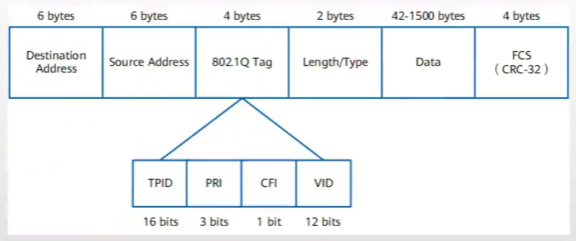

## 接口的链路类型

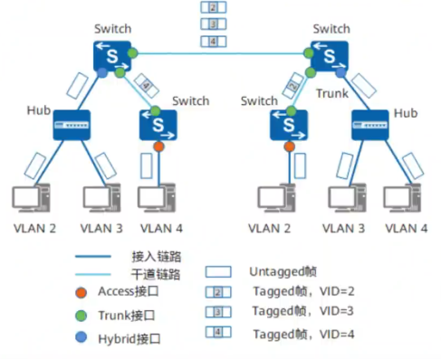

### Access

### Trunk

### Hybrid

### QinQ

## PVID(Port Default VLAN ID) 缺省VLAN

## VLAN标签的添加和剥离

## VLAN划分方式

- 接口
- 协议
- 子网
- MAC地址
- 策略（流策略）

默认优先级 策略 -> MAC地址 -> 子网 -> 协议 ->  接口

但最常用基于接口划分的方式

## VLAN配置

### VLAN创建

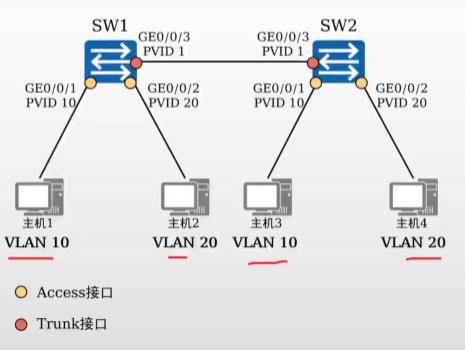

- 单个创建
  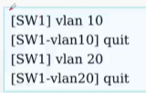
- 批创建
  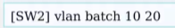

### 配置Access接口

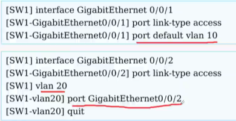

### 配置Trunk接口，并创建对应的允许通过列表

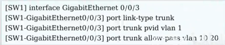

### VLAN间通信

#### 三层交换机配置Vlanif

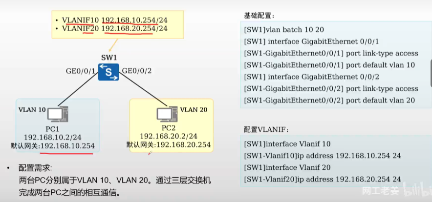

#### 单臂路由

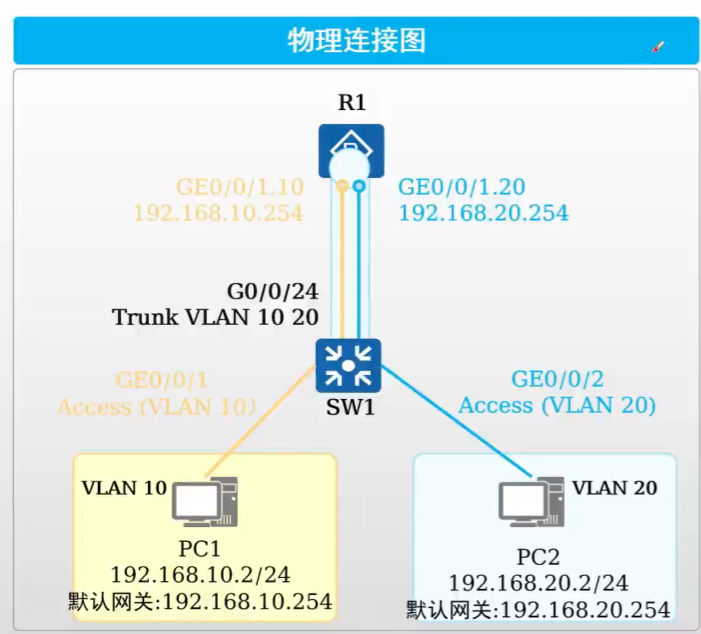

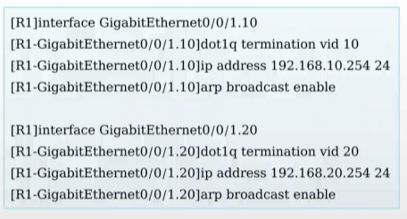

还需要在把连路由器的接口配置为Trunk端口，允许要所有要互通的VLAN通过

## VLAN聚合

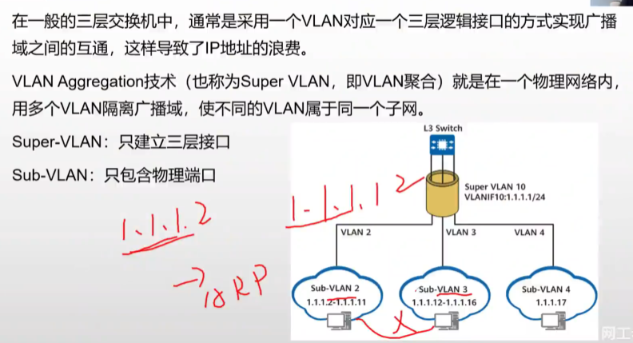

### 关键配置命令

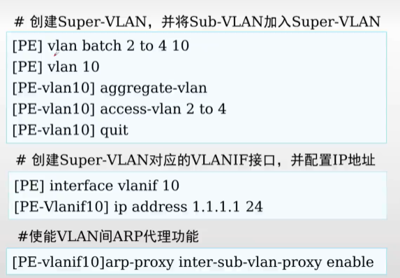

### ARP代理

## MUX VLAN

Multiplex VLAN

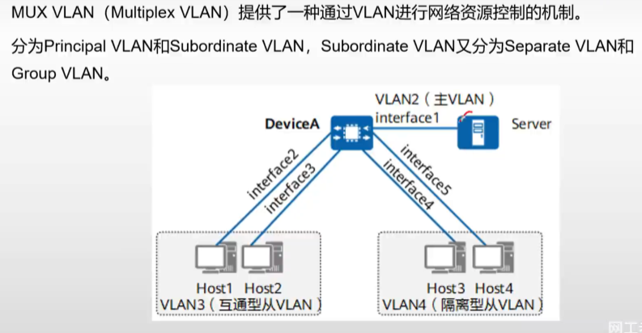

### 关键配置命令

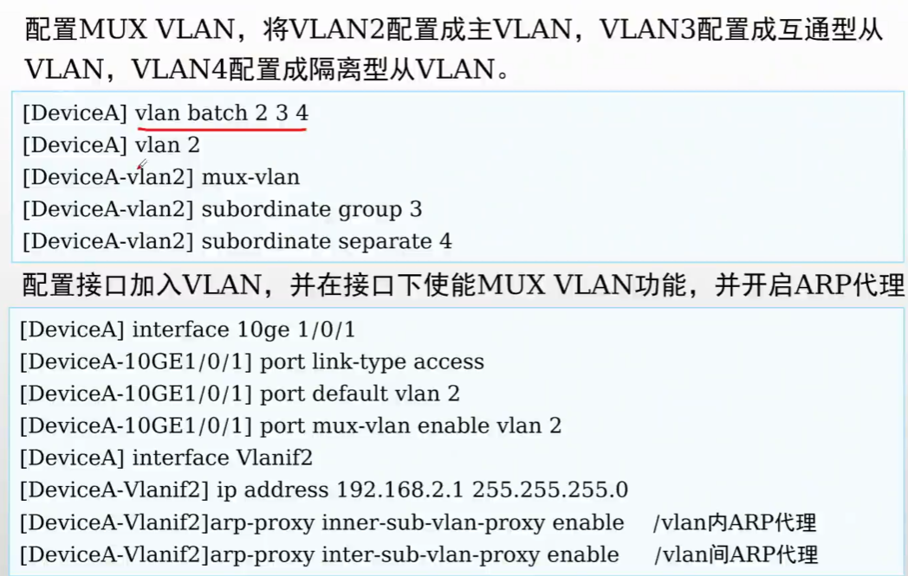

## QinQ

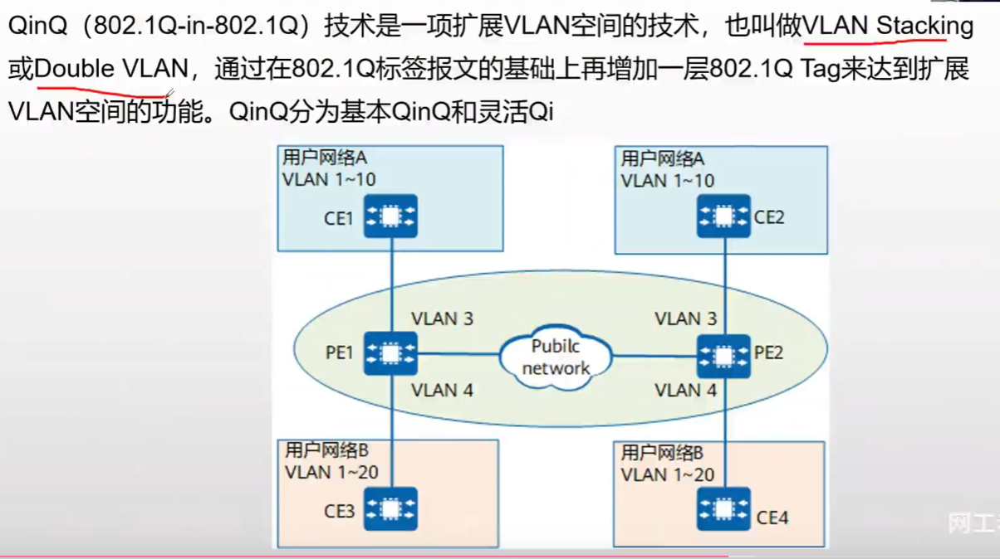

- 大二层，公用VLAN,私有VLAN， 一般运营商配置

### 关键配置命令

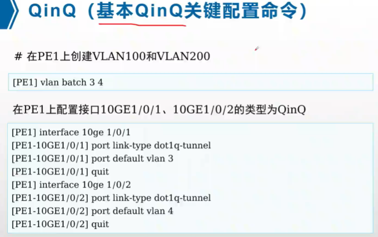

## VLAN内二层隔离

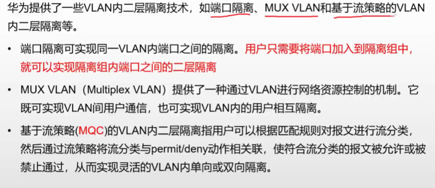

### 端口隔离

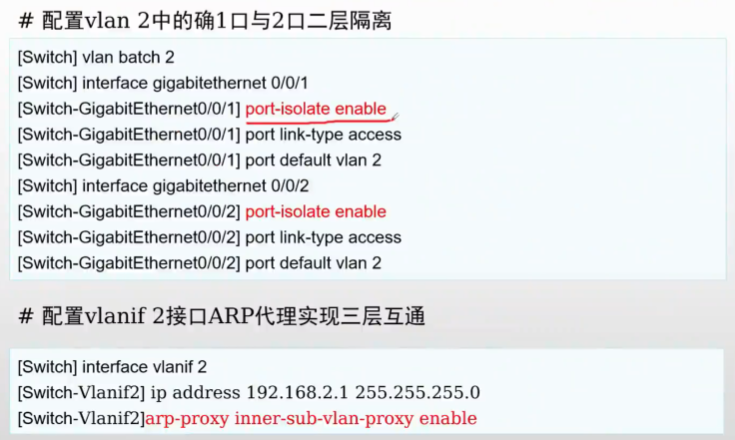

# 生成树协议

## 组播MAC地址

第八位是1代表组播，0代表单播

## 种类

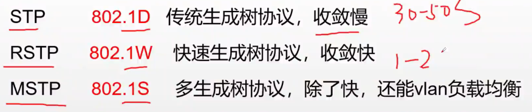

* STP
  * 802.1D
* RSTP
  * 802.1W
* MSTP
  * 802.1S

## BPDU报文

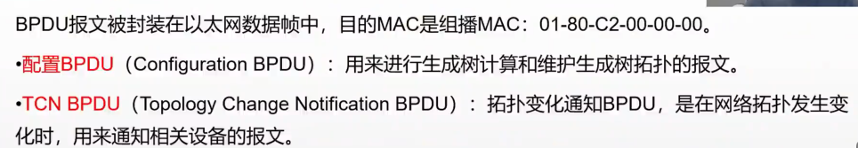

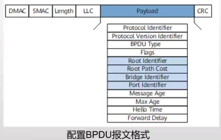

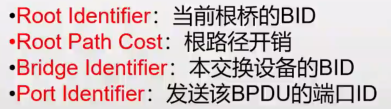

- Root Identifier 当前根桥的BID
  - 默认情况与Bridge Identifier相同
  - 初始情况都认为自己是根
- Root Path Cost  到达根桥的根路径开销
- Bridge Identifier 桥ID长度为8个字节，由两部分组成: 一字节8比特
  * 2个字节的桥优先级 pow(2,16)/2 = 32768 默认优先级 ， 4096的倍数
  * 6个字节的桥MAC地址 6 x 8 = 48 位
* Port Identifier 发送该BPDU的端口ID 2字节
  * 优先级 默认 pow(2,8)/2 = 128
  * 端口号

## STP根桥，根端口，和指定端口的选举原则

都是比小，越小越优

1. 根网桥的选举规则 **所有交换机选择一个根交换机**
   1. 比优先级，越小越优先
   2. 比MAC地址，越小越优先
2. 根端口 PR 的选举规则 **每个非根交换机选择一个根端口**
   1. 选择根路径开销 Root Path Cost RPC, 最低的端口
   2. 如果相等，选择对端桥ID最低的端口
   3. 如果相等，选择对端端口ID最低的端口
   4. 如果相等，端口ID
3. 指定端口 也就是 DR 的选举规则 每个二层链路选一个指定端口
   1. 根路径开销
   2. 如果相等，本端桥ID
   3. 如果相等，本端口ID
4. 其余端口全部堵塞

根桥上面的所有端口的是指定端口

## STP

### 配置

## RSTP

### 配置

## MSTP

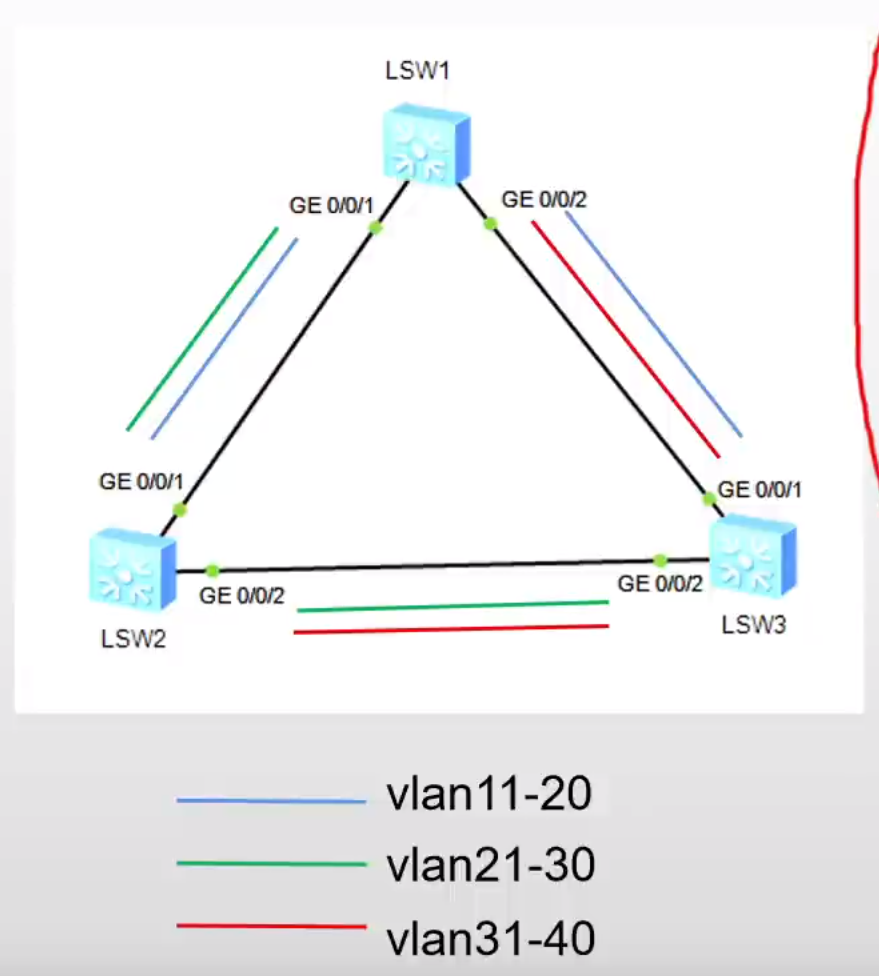

### 配置

PVID就是1，Trunk口允许了1

all 

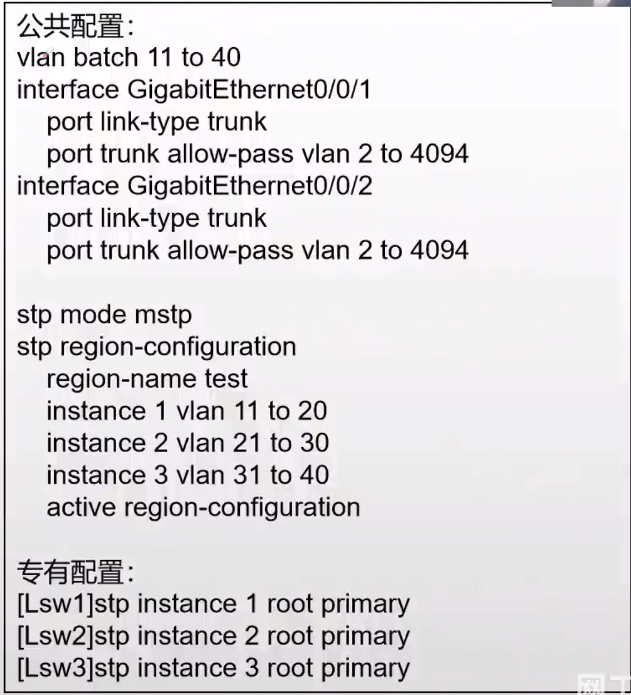

## 在交换机上的一些注意配置

边缘端口配置 

- stp bpdu-protection

启用BPDU保护的端口在接收到BPDU数据包时，会自动关闭（进入errdisable状态）。
这样做是为了防止那些不应该发送BPDU数据包的设备引发网络问题。

# 静态路由

## 路由信息获取方式

## IP路由表

### 路由Flags

路由标记，标记当前网络节点的状态。

其中R是relay的首字母，说明是迭代路由，会根据路由下一跳的IP地址获取出接口。配置静态路由时如果你只指定下一跳IP地址，而不指定出接口，那么就是迭代路由，需要根据下一跳IP地址的路由获取出接口。

D是download的首字母，表示该路由下发到FIB表。

### 样式

| Destination/Mask   | Proto  | Pre | Cost | Flags | NextHop   | Interface   |
| ------------------ | ------ | --- | ---- | ----- | --------- | ----------- |
| 10.0.1.0/24        | O_ASE  | 150 | 1    | D     | 10.0.35.3 | Serial2/0/0 |
| 10.0.2.0/24        | OSPF   | 10  | 9764 | D     | 10.0.35.3 | Serial2/0/0 |
| 10.0.3.0/24        | OSPF   | 10  | 4882 | D     | 10.0.35.3 | Serial2/0/0 |
| 10.0.5.0/24        | Direct | 0   | 0    | D     | 10.0.5.5  | LoopBack0   |
| 10.0.5.5/32        | Direct | 0   | 0    | D     | 127.0.0.1 | LoopBack0   |
| 10.0.5.255/32      | Direct | 0   | 0    | D     | 127.0.0.1 | LoopBack0   |
| 10.0.23.0/24       | OSPF   | 10  | 9764 | D     | 10.0.35.3 | Serial2/0/0 |

### 如果接口为NULL0表示黑洞路由，丢弃

## 路由表添加

### 优先过程

1. 一条路由条目
2. 如果网段掩码不同Destination/Mask，加入路由表
3. 如果相等，看优先级Pre，优先级高的加入（pre更小的）
4. 如果相等，看度量值，Cost,开销小的加入路由表

### 常见路由协议优先级

1. Direct 0
2. OSPF 10
3. IS-IS 15
4. Static 60
5. RIP 100
6. OSPF ASE 150 **OSPF ASE（External routes injected by Autonomous System External）** 指的是从外部自治系统注入的外部路由. 因为外部路由通常不如内部路由可靠和稳定。
7. OSPF NSSA 150 **OSPF NSSA（Not-So-Stubby Area）**是一种特殊的OSPF区域类型，允许有限的外部路由注入。
8. IBGP 255 **IBGP（Internal Border Gateway Protocol）**用于同一自治系统内部的BGP对等体之间。
9. EBGP 255 **EBGP（External Border Gateway Protocol）**用于不同自治系统之间的BGP对等体之间。

## 路由表使用

1. 最长网络前缀匹配原则
   1. 如果目的网络相等，优先使用网络前缀长的
2. 路由表检索采用二叉树检索
   1. 使用路由条目 unique prefix 来构造二叉树
3. 两种特殊路由
   1. 主机路由 匹配32位
   2. 默认路由 匹配0位

## 路由转发流程

### 图示

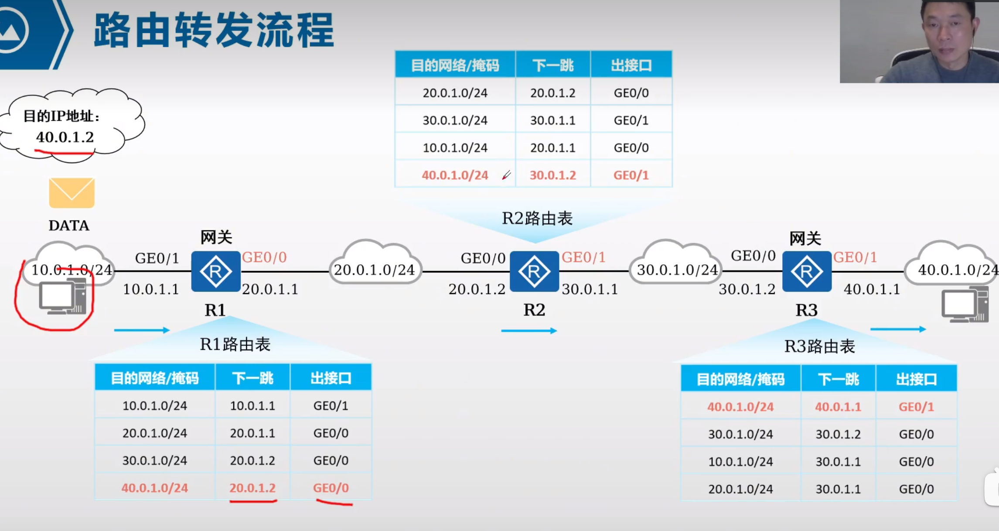
### 注意

1. 每个路由器只会维护自己的路由表
2. 但是有一些技术比如SDN能全局分发路由表
   1. SDK Sortware Defined Networking

## 静态路由 由管理员手动配置的路由

### 配置

1. 关联下一跳ip的方式 ip route-static ip-address {masl | mask-length} nexthop-address
2. 关联出接口方式 ip route-static ip-address {masl | mask-length} interface-type interface-number
3. 同时指定 ip route-static ip-address {masl | mask-length} interface-type interface-number [nexthop-address]

## 缺省路由 静态路由

- 源/掩码 0.0.0.0/0 

## 路由递归/路由迭代

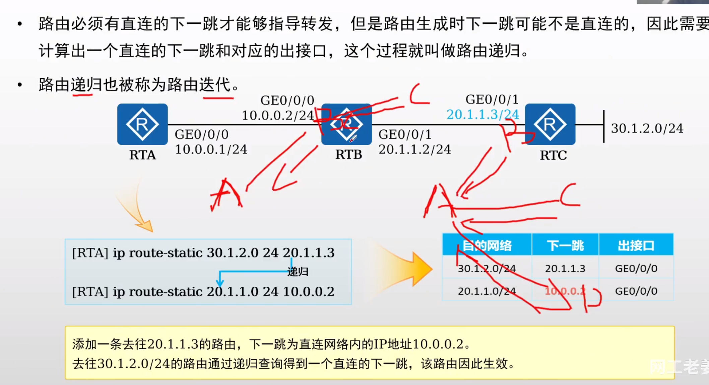

## 等价路由

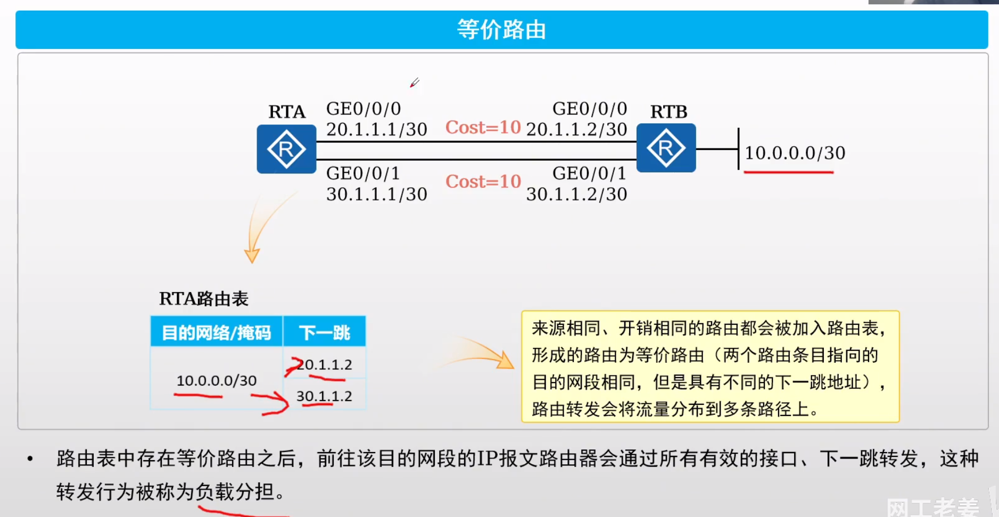

## 浮动路由

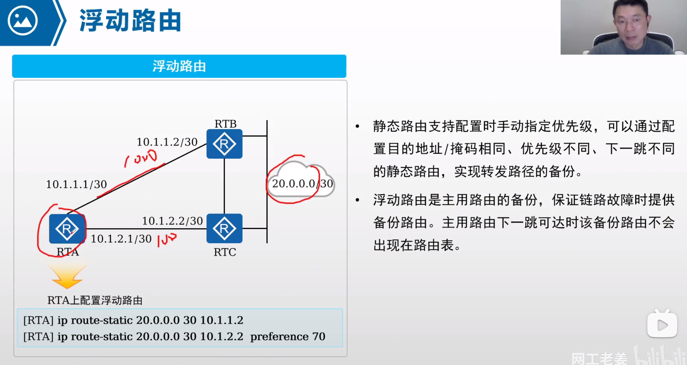

- 添加多条源ip相同的路由但是优先级不同，下一跳不同的路由到路由表
- 当前面优先级高的路由失效时候
- 下面的路由能浮上来使用，作为备份路由使用

# ACL

## ACL概述

- ALC是有一系列permit或者deny语句组成的，有序规则的列表
- ACL是一个匹配工具，能够对报文进行匹配和划分

## ACL应用

- 匹配ip流量
- 在traffic-filter中被调用
- 在NAT中被调用
- 路由策略
- 防火墙
- Qos
- 其他..

## ACL组成

- 编号 
  - acl number 2000  //number 可以省略
  - acl 2000
  - acl 3001
- 动作
  - acl 2000 
    - rule 5 permit
    - rul2 10 deny
- 匹配项
  - acl 2000 
    - rule 5 permit source 192.168.1.0 0.0.0.255
- rule 一条 acl 可以包含多个 rule 

## 反掩码与通配符掩码（wildcard）

- 反掩码是子网掩码取反，0或1连续
- 通配符掩码是可以不连续，0代表强匹配，1代表任意匹配
  - 比如0.0.0.254（11111110）

## ACL的分类和标识

好的，我来帮助你创建两个Markdown表格来讲解基于ACL规则定义方式的分类和基于ACL标识方法的分类。以下是表格内容：

### 基于ACL规则定义方式的分类

| 分类         | 编号范围   | 规则定义描述                                                                                   |
|--------------|------------|------------------------------------------------------------------------------------------------|
| 基本ACL      | 2000~2999  | 仅使用报文的源IP地址、分片信息和生效时间段来定义规则。                                         |
| 高级ACL      | 3000~3999  | 可使用IPv4报文的源IP地址、目的IP地址、IP协议类型、ICMP类型、TCP源/目的端口号、UDP源/目的端口号、生效时间段等来定义规则。 |
| 二层ACL      | 4000~4999  | 使用报文的以太网帧头信息来定义规则，如根据源MAC地址、目的MAC地址、二层协议类型等。              |
| 用户自定义ACL | 5000~5999  | 使用报文头、偏移位置、字符串匹配码和用户自定义字符串来定义规则。                                |
| 用户ACL      | 6000~6999  | 既可使用IPv4报文的源IP地址或目的IP地址，也可使用目的的UCL（User Control List）组，或IP协议类型、ICMP类型、TCP源端口/目的端口、UDP源端口/目的端口号等来定义规则。 |

### 基于ACL标识方法的分类

| 分类           | 规则定义描述                                                          |
|----------------|-----------------------------------------------------------------------|
| 数字型ACL      | 传统的ACL标识方法。创建ACL时，指定一个唯一的数字标识该ACL。            |
| 命名型ACL      | 通过名称代替编号来标识ACL。                                           |

## 基本ACL和高级ACL

- 基本ACL
  - 编号范围 2000-2999
  - acl number 2000  // 回车会进入对应acl配置视图
    - rule 5 deny source 10.1.1.1 0 // 按步长5创建是为了防备后续维护和插入
    - rule 10 deny source 10.1.1.2 0
    - rule 5 premit source 10.1.1.2 0.0.0.255
- 高级acl
  - 基本编号 3000-3999
  - acl number 3001
    - rule 5 permit ip source 10.1.1.0 0.0.0.255 destination 10.1.3.0 0.0.0.225
    - rule 10 permit tcp source 10.1.2.0 0.0.0.255 destination 10.1.3.0 0.0.0.255 destination-port eq 21

## 拓展访问控制列表的配置命令

- 通配符掩码可以写成 any
- 任意ip源 可以写成 0.0.0.0
- tcp/udp
  - source-port 
  - destination-port
- icmp //Internet Control Message Protocol 网际控制报文协议
  - icmp-type
  - icmp-code

## operator 对应匹配端口的操作符号

- eq
  - eq www
- gt
  - gt 6000
- lt
- neq //不等于
- range // 范围
  - range 20 34

## ACL的匹配顺序和匹配结果

### 图示

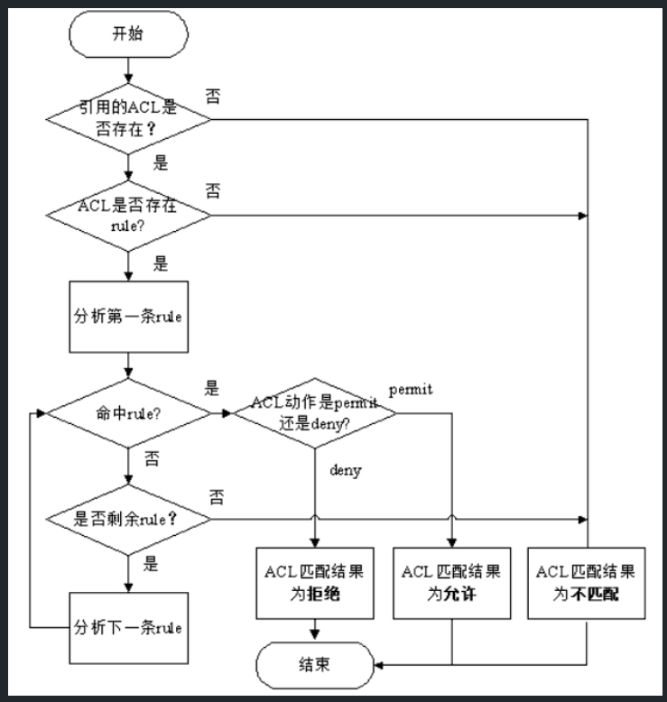

### acl匹配模式/匹配顺序 默认是config

- acl 2000 match-order auto
- config 严格按照顺序匹配
- auto 深度优先

## time-range

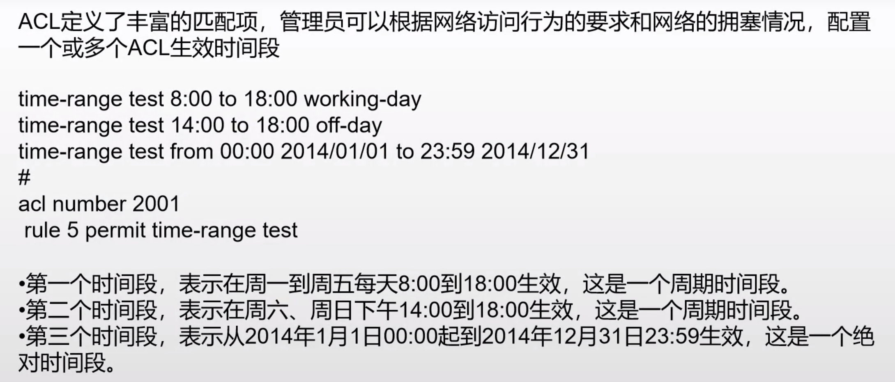
