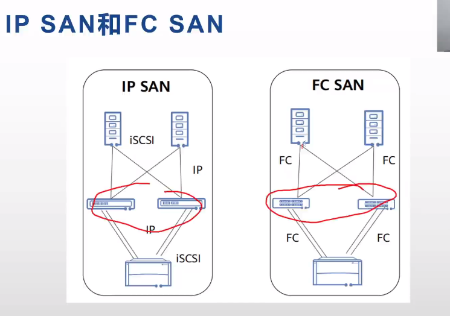
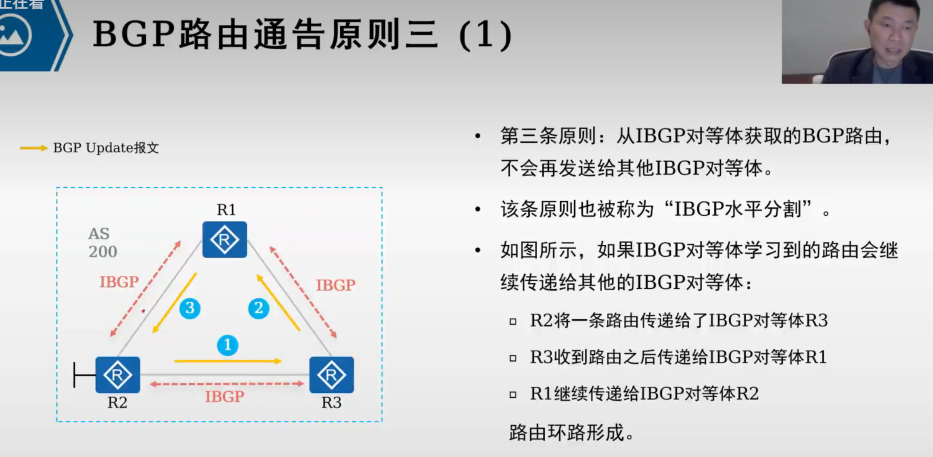
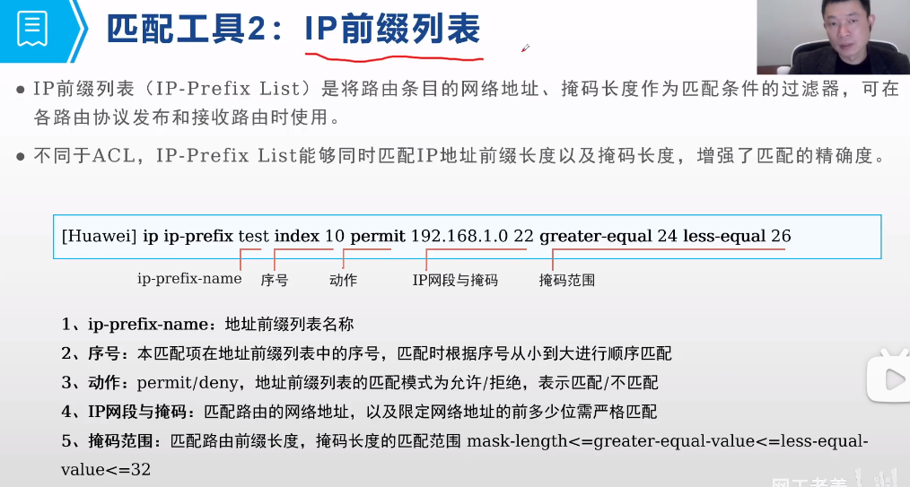
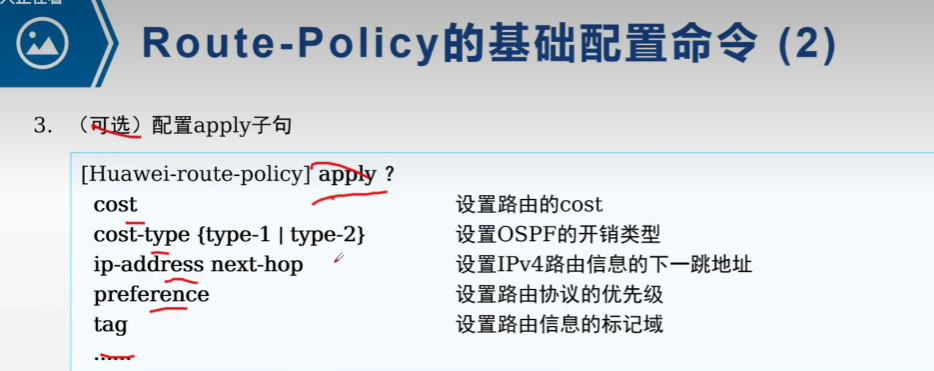
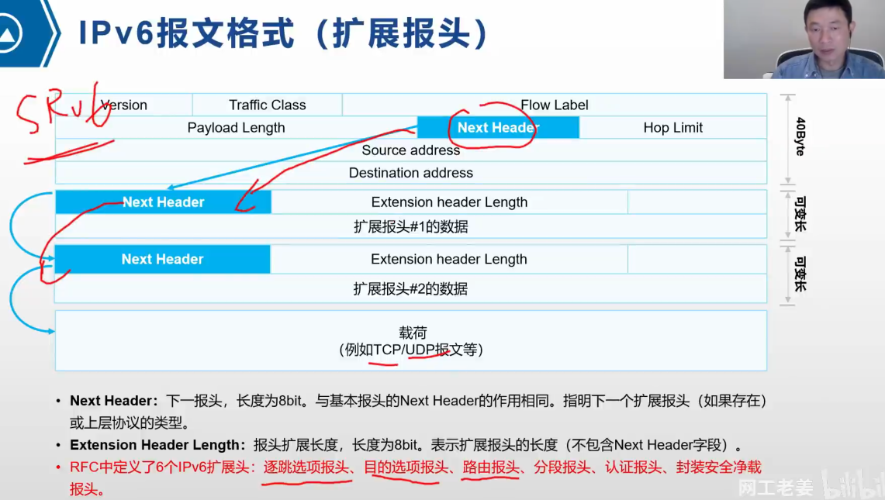
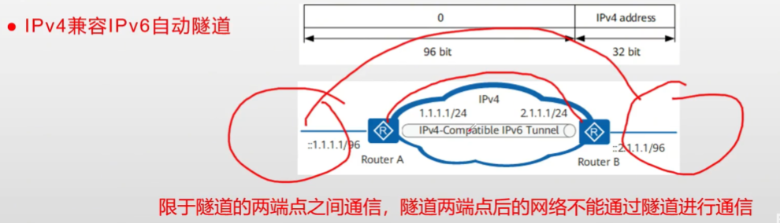
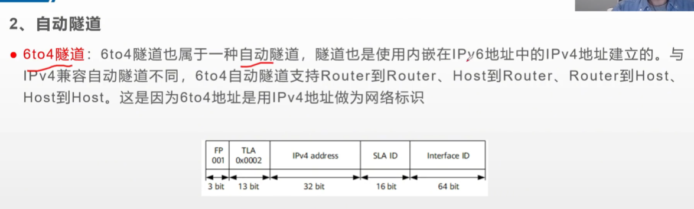
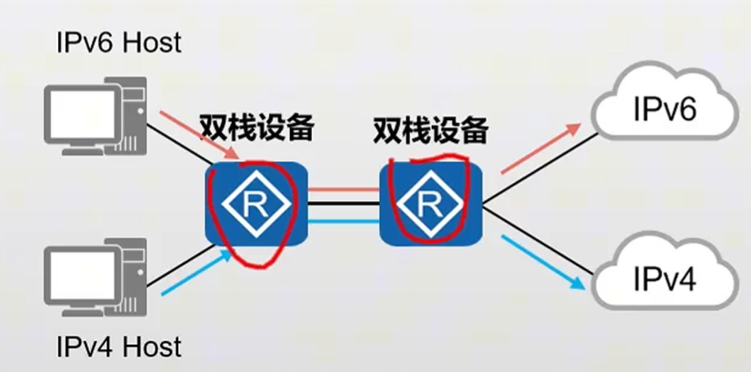
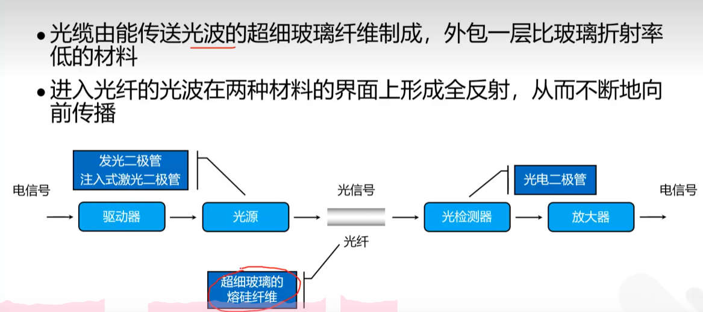

# 操作系统相关知识

## Linux 相关知识

### Linux创建分区

- 和 Windows 使用盘符定义分区的方式不同，Linux 系统使用树状目录的方式来定义分区，这也被称为 **挂载点** 。
- 安装Linux时必须创建的分区有：
  * /boot分区
    * 用于引导系统，包含了操作系统的内核和在启动系统过程中所要的文件。
  * swap分区
    * 用于虚拟内存，当物理内存不足时，会将一部分硬盘空间作为虚拟内存使用。
  * /(根分区)
    * 用于存放操作系统和用户数据。

### **常见分区和目录**

| 分区名称 | 作用                                                                                              |
| -------- | ------------------------------------------------------------------------------------------------- |
| /        | 根分区目录，其他所有分区目录都位于其下。                                                          |
| /boot/   | 存放系统启动时所需的各种文件。                                                                    |
| /root/   | 系统管理员 root 用户的主目录。                                                                    |
| /home/   | 普通用户的主目录。                                                                                |
| /etc/    | 配置文件的目录。平常通过系统包管理命令安装的各种软件，它们的配置文件默认都在此目录下。            |
| /bin/    | 系统核心命令的存放目录。                                                                          |
| /usr/    | 系统默认软件的安装目录和共享资源目录。通过系统包管理命令安装的软件，大多都位于这里。              |
| /opt/    | 用户软件的安装目录。                                                                              |
| /var/    | 存放软件运行时生成的一些文件，比如日志，运行中的进程 ID 文件等。                                  |
| /tmp/    | 系统临时文件的目录。每次系统关机时，此目录中的所有文件都会清除。                                  |
| Swap     | 这不是目录，是一个特殊的 Linux 分区，通过文件系统的方式模拟物理内存，以应对物理内存使用时的不足。 |

### **文件系统**

- 给硬盘分好区，接下来要面对的就是把分区格式化的问题。Linux 有专属的各种分区格式，也就是俗称的文件系统。常用的文件系统如下：

* ext4：目前 Linux 主流的文件系统，如无意外的话，默认都应该选择它。
* swap：Swap 交换分区专属的文件系统，如果有划分 Swap 分区，需要格式化为这种格式。

## 存储技术

### RAID

* raid 0
* raid 1
* raid 5
* raid 10
* 

### RAID 2.0

* 快速重构
* 磁盘负载均衡
* 磁盘利用率高
* 易拓展

### DAS direct attached storage

* scsi //small computer system interface

### NAS Network Attached Storage

* nfs //network file system
* cifs //通用互联网文件系统（Common Internet File Systems）
* 

### FC SAN 光纤通道存储区域网络 Fibre Channel storage area network

* HBA 卡 // 主机总线适配器(Host Bus Adapter)

### ip SAN


### ip san 与 fc san 对比




### dan，nas，san 对比


### 分布式存储组网


### 对象存储/块存储/文件存储


# 网络基础

## 大纲

- tcp/ip模型
- 华为路由器交换机防火墙配置
- 路由与路由表
- 路由递归查询
- 路由类型
- 路由协议/static/rip,bgp/ospf,isis
- 分流/load-balance/fallback
- 链路故障检测/bfd/ip-link/nqa
- 物理链路故障检测和处理
- 网络故障分析和处理/网络连通性测试
- nat
- dns
- vpn
- wlan
- firewall
- ipv6
- 简单网络管理协议snmp

## 华为基础配置命令

### 命令视图


#### system-view

#### sysname

#### return //直接返回用户视图

#### quit //退出当前视图

### 配置文件

#### display current-configuration

#### display current-configuration brief

#### save [ all ] [ configuration-file ]

### 交换机

#### portswitch

#### undo portswitch

#### broadcast-suppression 80 //用来配置接口下允许通过的最大广播报文流量

#### undo broadcast-suppression //用来恢复接口下允许通过的最大广播报文流量为缺省值

### 权限与认证


## 子网划分

### 子网掩码

### 可用地址

## VLAN

### 802.1Q帧

#### vlan tag 4字节


### 接口的链路类型


#### Access

#### Trunk

#### Hybrid

#### QinQ

### PVID(Port Default VLAN ID) 缺省VLAN

- 配置pvid
- port hybrid pvid vlan 200

### VLAN标签的添加和剥离

### VLAN划分方式

- 接口
- 协议
- 子网
- MAC地址
- 策略（流策略）

默认优先级 策略 -> MAC地址 -> 子网 -> 协议 ->  接口

但最常用基于接口划分的方式

### VLAN配置

#### VLAN创建


- 单个创建
  
- 批创建
  

#### 配置Access接口


#### 配置Trunk接口，并创建对应的允许通过列表


#### VLAN间通信

##### 三层交换机配置Vlanif


##### 单臂路由


还需要在把连路由器的接口配置为Trunk端口，允许要所有要互通的VLAN通过

### VLAN聚合


#### 关键配置命令


#### ARP代理

### MUX VLAN

Multiplex VLAN


#### 关键配置命令


### QinQ


- 大二层，公用VLAN,私有VLAN， 一般运营商配置

#### 关键配置命令


### VLAN内二层隔离


#### 端口隔离

#### port-isolate enable


## 生成树协议

### 组播MAC地址

第八位是1代表组播，0代表单播


### 种类


* STP
  * 802.1D
* RSTP
  * 802.1W
* MSTP
  * 802.1S

### BPDU报文


- Root Identifier 当前根桥的BID
  - 默认情况与Bridge Identifier相同
  - 初始情况都认为自己是根
- Root Path Cost  到达根桥的根路径开销
- Bridge Identifier 桥ID长度为8个字节，由两部分组成: 一字节8比特
  * 2个字节的桥优先级 pow(2,16)/2 = 32768 默认优先级 ， 4096的倍数
  * 6个字节的桥MAC地址 6 x 8 = 48 位

* Port Identifier 发送该BPDU的端口ID 2字节
  * 优先级 默认 pow(2,8)/2 = 128
  * 端口号

### STP根桥，根端口，和指定端口的选举原则

都是比小，越小越优

1. 根网桥的选举规则 **所有交换机选择一个根交换机**
   1. 比优先级，越小越优先
   2. 比MAC地址，越小越优先
2. 根端口 PR 的选举规则 **每个非根交换机选择一个根端口**
   1. 选择根路径开销 Root Path Cost RPC, 最低的端口
   2. 如果相等，选择对端桥ID最低的端口
   3. 如果相等，选择对端端口ID最低的端口
   4. 如果相等，端口ID
3. 指定端口 也就是 DR 的选举规则 每个二层链路选一个指定端口
   1. 根路径开销
   2. 如果相等，本端桥ID
   3. 如果相等，本端口ID
4. 其余端口全部堵塞

根桥上面的所有端口的是指定端口

### STP

#### 配置

### RSTP

#### 配置

### MSTP


#### 配置

PVID就是1，Trunk口允许了1

all


### 在交换机上的一些注意配置

边缘端口配置

- stp bpdu-protection

启用BPDU保护的端口在接收到BPDU数据包时，会自动关闭（进入errdisable状态）。
这样做是为了防止那些不应该发送BPDU数据包的设备引发网络问题。

## 静态路由

### 路由信息获取方式

### IP路由表

#### 路由Flags

路由标记，标记当前网络节点的状态。

其中R是relay的首字母，说明是迭代路由，会根据路由下一跳的IP地址获取出接口。配置静态路由时如果你只指定下一跳IP地址，而不指定出接口，那么就是迭代路由，需要根据下一跳IP地址的路由获取出接口。

D是download的首字母，表示该路由下发到FIB表。

#### 样式

| Destination/Mask | Proto  | Pre | Cost | Flags | NextHop   | Interface   |
| ---------------- | ------ | --- | ---- | ----- | --------- | ----------- |
| 10.0.1.0/24      | O_ASE  | 150 | 1    | D     | 10.0.35.3 | Serial2/0/0 |
| 10.0.2.0/24      | OSPF   | 10  | 9764 | D     | 10.0.35.3 | Serial2/0/0 |
| 10.0.3.0/24      | OSPF   | 10  | 4882 | D     | 10.0.35.3 | Serial2/0/0 |
| 10.0.5.0/24      | Direct | 0   | 0    | D     | 10.0.5.5  | LoopBack0   |
| 10.0.5.5/32      | Direct | 0   | 0    | D     | 127.0.0.1 | LoopBack0   |
| 10.0.5.255/32    | Direct | 0   | 0    | D     | 127.0.0.1 | LoopBack0   |
| 10.0.23.0/24     | OSPF   | 10  | 9764 | D     | 10.0.35.3 | Serial2/0/0 |

#### 如果接口为NULL0表示黑洞路由，丢弃

### 路由表添加

#### 优先过程

1. 一条路由条目
2. 如果网段掩码不同Destination/Mask，加入路由表
3. 如果相等，看优先级Pre，优先级高的加入（pre更小的）
4. 如果相等，看度量值，Cost,开销小的加入路由表

#### 常见路由协议优先级

1. Direct 0
2. OSPF 10
3. IS-IS 15
4. Static 60
5. RIP 100
6. OSPF ASE 150 **OSPF ASE（External routes injected by Autonomous System External）** 指的是从外部自治系统注入的外部路由. 因为外部路由通常不如内部路由可靠和稳定。
7. OSPF NSSA 150 **OSPF NSSA（Not-So-Stubby Area）**是一种特殊的OSPF区域类型，允许有限的外部路由注入。
8. IBGP 255 **IBGP（Internal Border Gateway Protocol）**用于同一自治系统内部的BGP对等体之间。
9. EBGP 255 **EBGP（External Border Gateway Protocol）**用于不同自治系统之间的BGP对等体之间。

### 路由表使用

1. 最长网络前缀匹配原则
   1. 如果目的网络相等，优先使用网络前缀长的
2. 路由表检索采用二叉树检索
   1. 使用路由条目 unique prefix 来构造二叉树
3. 两种特殊路由
   1. 主机路由 匹配32位
   2. 默认路由 匹配0位

### 路由转发流程

#### 图示


#### 注意

1. 每个路由器只会维护自己的路由表
2. 但是有一些技术比如SDN能全局分发路由表
   1. SDK Sortware Defined Networking

### 静态路由 由管理员手动配置的路由

#### 配置

1. 关联下一跳ip的方式 ip route-static ip-address {masl | mask-length} nexthop-address
2. 关联出接口方式 ip route-static ip-address {masl | mask-length} interface-type interface-number
3. 同时指定 ip route-static ip-address {masl | mask-length} interface-type interface-number [nexthop-address]

### 缺省路由 静态路由

- 源/掩码 0.0.0.0/0

### 路由递归/路由迭代


### 等价路由


### 浮动路由


- 添加多条源ip相同的路由但是优先级不同，下一跳不同的路由到路由表
- 当前面优先级高的路由失效时候
- 下面的路由能浮上来使用，作为备份路由使用

## ACL

### ACL概述

- ALC是有一系列permit或者deny语句组成的，有序规则的列表
- ACL是一个匹配工具，能够对报文进行匹配和划分

### ACL应用

- 匹配ip流量
- 在traffic-filter中被调用
- 在NAT中被调用
- 路由策略
- 防火墙
- Qos
- 其他..

### ACL组成

- 编号
  - acl number 2000  //number 可以省略
  - acl 2000
  - acl 3001
- 动作
  - acl 2000
    - rule 5 permit
    - rul2 10 deny
- 匹配项
  - acl 2000
    - rule 5 permit source 192.168.1.0 0.0.0.255
- rule 一条 acl 可以包含多个 rule

### 反掩码与通配符掩码（wildcard）

- 反掩码是子网掩码取反，0或1连续
- 通配符掩码是可以不连续，0代表强匹配，1代表任意匹配
  - 比如0.0.0.254（11111110）

### ACL的分类和标识

#### 基于ACL规则定义方式的分类

| 分类          | 编号范围  | 规则定义描述                                                                                                                                                     |
| ------------- | --------- | ---------------------------------------------------------------------------------------------------------------------------------------------------------------- |
| 基本ACL       | 2000~2999 | 仅使用报文的源IP地址、分片信息和生效时间段来定义规则。                                                                                                           |
| 高级ACL       | 3000~3999 | 可使用IPv4报文的源IP地址、目的IP地址、IP协议类型、ICMP类型、TCP源/目的端口号、UDP源/目的端口号、生效时间段等来定义规则。                                         |
| 二层ACL       | 4000~4999 | 使用报文的以太网帧头信息来定义规则，如根据源MAC地址、目的MAC地址、二层协议类型等。                                                                               |
| 用户自定义ACL | 5000~5999 | 使用报文头、偏移位置、字符串匹配码和用户自定义字符串来定义规则。                                                                                                 |
| 用户ACL       | 6000~6999 | 既可使用IPv4报文的源IP地址或目的IP地址，也可使用目的的UCL（User Control List）组，或IP协议类型、ICMP类型、TCP源端口/目的端口、UDP源端口/目的端口号等来定义规则。 |

#### 基于ACL标识方法的分类

| 分类      | 规则定义描述                                                |
| --------- | ----------------------------------------------------------- |
| 数字型ACL | 传统的ACL标识方法。创建ACL时，指定一个唯一的数字标识该ACL。 |
| 命名型ACL | 通过名称代替编号来标识ACL。                                 |

### 基本ACL和高级ACL

- 基本ACL
  - 编号范围 2000-2999
  - acl number 2000  // 回车会进入对应acl配置视图
    - rule 5 deny source 10.1.1.1 0 // 按步长5创建是为了防备后续维护和插入
    - rule 10 deny source 10.1.1.2 0
    - rule 5 premit source 10.1.1.2 0.0.0.255
- 高级acl
  - 基本编号 3000-3999
  - acl number 3001
    - rule 5 permit ip source 10.1.1.0 0.0.0.255 destination 10.1.3.0 0.0.0.225
    - rule 10 permit tcp source 10.1.2.0 0.0.0.255 destination 10.1.3.0 0.0.0.255 destination-port eq 21

### 拓展访问控制列表的配置命令

- 通配符掩码可以写成 any
- 任意ip源 可以写成 0.0.0.0
- tcp/udp
  - source-port
  - destination-port
- icmp //Internet Control Message Protocol 网际控制报文协议
  - icmp-type
  - icmp-code

### operator 对应匹配端口的操作符号

- eq
  - eq www
- gt
  - gt 6000
- lt
- neq //不等于
- range // 范围
  - range 20 34

### ACL的匹配顺序和匹配结果

#### 图示


#### acl匹配模式/匹配顺序 默认是config

- acl 2000 match-order auto
- config 严格按照顺序匹配
- auto 深度优先

### time-range


## DHCP

### 简介

- Dynamic Host Configuration Protocol

### dhcp message type

- discovery
  - 当一个设备（如计算机或手机）第一次连接到网络时，它还没有IP地址，需要通过DHCP服务器获取一个。
- offer
  - 网络中的DHCP服务器收到DHCP Discovery消息后，回应客户端提供一个可用的IP地址。
- request
  - 客户端从收到的DHCP Offer消息中选择一个最合适的（通常是第一个收到的），并发送一个DHCP Request消息给相应的DHCP服务器。
  - 这条消息用来请求确认和分配具体的IP地址。
- ack
  - DHCP服务器在收到DHCP Request消息后，验证所请求的IP地址是否可用（没有被其他设备使用），然后发送一个DHCP Ack消息给客户端。
  - 这条消息确认IP地址及其他网络参数的分配，客户端可以使用这些信息进行网络配置。
- nack
  - 如果DHCP服务器不能分配请求的IP地址（例如，IP地址已经被其他设备使用或请求的配置无效），服务器会发送一个DHCP Nack消息给客户端。
  - 这条消息表示请求被拒绝，客户端需要重新发送DHCP Discovery消息。
- decline
  - 如果客户端在接收到DHCP Offer消息或DHCP Ack消息后，检测到提供的IP地址已经在网络上被使用（例如通过ARP检测），客户端会发送一个DHCP Decline消息给服务器。
  - 这表示客户端拒绝使用该IP地址，服务器需要提供一个新的IP地址。
- inform
  - 当客户端已经有一个手动配置的IP地址并且不需要动态分配IP地址，但希望从DHCP服务器获取其他配置信息时，会发送一个DHCP Inform消息。
  - DHCP服务器接收到该消息后，提供相关的网络配置信息而不分配IP地址。

### dhcp role

- dhcp server
- dhcp clinet
- dhcp relay

### dhcp options

- option 1 设置子网掩码选项
- option 3 设置网工地址选项
- option 6
- option 50
- option 51
- option 53 dhcp message type
- option 54 设置服务器标识
- option 58 设置续租T1时间，一般是租期时间50%
- option 59 设置续租T2时间，一般是租期时间87.5%

### ip pool

- 系统视图
  - system view
- 创建地址池并进入地址池配置视图
  - ip pool poolname
- 配置地址池的网段
  - network network-address {mask | mask-length}
  - network 192.168.3.0 255.255.255.0
- dns
  - dns-list dns-server1 [dns-server2...dns-server8]
  - dns-list 10.10.10.2
- 网关
  - gateway-list gateway1 [gateway2...gateway8]
  - gateway-list 192.168.3.254
- 租期
  - lease day 2 hour 0 minute 0
  - lease unlimited
- mac地址绑定
  - static-bind ip-address ip-address mac-address mac-address
  - static-bind ip-address 192.168.3.2 mac-address dcd2-4a2c-3b2c option-template template1
- 保留ip/排除ip
  - excluded-ip-address ip-address
  - excluded-ip-address 192.168.3.211

### dhcp select

- 使能接口采用全局地址池的dhcp服务器功能
  - dhcp select global
- 使能接口采用接口地址池的dhcp服务器功能
  - dhcp select interface
- 使能接口的dhcp中继功能
  - dhcp select relay
- 在对应VLAN接口上使能dhcp
  - interface vlanif 10 //进入vlanif10接口视图
    - dhcp select global //使能接口采用全局地址池的dhcp服务器功能
    - dhcp select interface //使能接口采用接口地址池的dhcp服务器功能

### dhcp server 特别配置

- 保留ip(排除分配的ip)
  - dhcp server excluded-ip-address 10.1.1.2
- 配置dns
  - dhcp server dns-list 10.1.1.2
- 网关
  - dhcp server gateway-list 10.1.1.1
- dhcp服务器域名
  - dhcp server domain-name huawei.com
- mac地址绑定固定ip
  - dhcp server static-bind ip-address 10.1.1.100 mac-address 286e-d488-b684
- 设置ip租期时长
  - dhcp server lease day 2 hour 0 minute 0

### dhcp snooping

#### **防止非DHCP用户攻击导致合法用户无法正常使用网络**

**攻击原理**

在DHCP网络中，静态获取IP地址的用户（非DHCP用户）对网络可能存在多种攻击，譬如仿冒DHCP Server、构造虚假DHCP Request报文等。这将为合法DHCP用户正常使用网络带来了一定的安全隐患。

**解决方法**

为了有效的防止非DHCP用户攻击，可开启设备根据DHCP Snooping绑定表生成接口的静态MAC表项功能。

设备将根据接口下所有的DHCP用户对应的DHCP Snooping绑定表项自动执行命令生成这些用户的静态MAC表项，并同时关闭接口学习动态MAC表项的能力。此时，只有源MAC与静态MAC表项匹配的报文才能够通过该接口，否则报文会被丢弃。因此对于该接口下的非DHCP用户，只有管理员手动配置了此类用户的静态MAC表项其报文才能通过，否则报文将被丢弃。

动态MAC表项是设备自动学习并生成的，静态MAC表项则是根据命令配置而成的。MAC表项中包含用户的MAC、所属[VLAN](https://link.zhihu.com/?target=https%3A//info.support.huawei.com/info-finder/encyclopedia/zh/VLAN.html)、连接的接口号等信息，设备可根据MAC表项对报文进行二层转发。

### DHCP 策略VLAN

## VRRP

### vrrp基本概述

* 虚拟路由冗余协议（Virtual Router Redundancy Protocol）
* 备份网关，实现网关冗余
* 版本vrrpv2（常用）,vrrpv3.
* 只有一种报文，advertisement报文
* ip组播，224.0.0.18，目的mac地址 01-00-5e-00-00-12
* ip报文协议号112

### 组播ip和组播mac

### ip报文常用协议号（8位）

* 1 icmp
* 2 igmp
* 6 tcp
* 17 udp
* 112 vrrp
* 89 ospf

### vrrp基本结构

* vrrp vrid  //唯一标识一个备份组
* virtual ip
* virtual mac //与vrid相关
* master //备份组中的主要路由器
* backup //备份组中的冗余路由器

### vrrp状态机

* initializ
  * priority 255 （虚拟ip与接口ip相同, 优先级0-255）的路由器立刻切换为master
  * priority != 255 切换到backup
* master
  * 对方优先级比自己低
  * ip 地址大的一方
  * master 那边的通告过期了
* backup

### 交换机器mac表学习过程

1. 什么是交换机的MAC地址表

   * 交换机的MAC地址表就像一个通讯录，记录了哪些设备（根据MAC地址）连接到了哪个端口。
   * 这样交换机可以知道数据该发到哪个端口去。
2. 交换机是怎么学习到这些MAC地址的

   1. 初始状态 ：一开始，交换机的MAC地址表是空的。
   2. 接收数据帧 ：当交换机接收到数据帧时，会看一下帧的来源MAC地址，并记下这个MAC地址是通过哪个端口来的。
   3. 更新表 ：交换机会把这个信息（MAC地址和端口）加到MAC地址表中。
3. 数据帧的转发

   1. 已知MAC地址 ：如果交换机知道目标MAC地址在哪个端口，就直接把数据帧发到那个端口。
   2. 未知MAC地址 ：如果交换机不知道目标MAC地址在哪个端口，它就会把数据帧广播到所有端口，等目标设备回应后再更新MAC地址表。
4. MAC地址表的老化

   1. 为了防止MAC地址表太大，交换机会设置一个时间限制。
   2. 如果某个MAC地址在一定时间内没有使用，交换机会把它从表中删除。

### free arp / Gratuitous arp

#### Free ARP的定义

* 无偿ARP是一种ARP报文，它的特点是在广播中包含了发送设备的IP地址和MAC地址，目的是主动宣告这些信息，而不是为了响应其他设备的请求。

#### Free ARP的主要用途

1. 防止IP地址冲突：

   - 设备启动时会发送Free ARP消息，检查网络中是否有其他设备使用相同的IP地址。如果有，则会检测到冲突，从而避免两个设备使用相同的IP地址。
2. 更新ARP缓存：

   - 当设备的IP地址或MAC地址发生变化时，它可以发送Free ARP消息通知网络中的其他设备更新它们的ARP缓存表，以避免发送错误的数据包。
3. 冗余设备协议（如VRRP)：

   - 在虚拟路由冗余协议（VRRP）等协议中，主设备发送Free ARP消息宣告它是当前的主设备，这样备份设备可以检测到主设备的状态。
4. 冗余和故障转移：

   - 在网络设备故障转移场景中，新接管IP地址的设备会发送Free ARP，以便其他设备更新其ARP缓存表，确保数据包能够正确转发到新的设备上。

#### Free ARP的工作原理

Free ARP消息与普通ARP请求和应答的报文结构类似，但其关键区别在于：

- Free ARP消息是广播形式发送的（目的MAC地址为广播地址FF:FF:FF:FF:FF:FF）。
- 报文中源IP地址和目的IP地址都是发送设备的IP地址。

#### Free ARP的报文结构

与标准ARP报文类似，Free ARP报文包括以下字段：

- 硬件类型：表示网络类型（以太网为1）。
- 协议类型：表示使用的协议（IPv4为0x0800）。
- 硬件地址长度：MAC地址长度（以太网为6）。
- 协议地址长度：IP地址长度（IPv4为4）。
- 操作码：表示ARP请求或应答（请求为1，应答为2），但在Free ARP中，通常使用ARP请求的操作码。
- 发送方MAC地址：发送设备的MAC地址。
- 发送方IP地址：发送设备的IP地址。
- 目标方MAC地址：广播地址FF:FF:FF:FF:FF:FF。
- 目标方IP地址：发送设备的IP地址。

### vrrp主备工作过程

* 选举出 master
* 发送free arp //自己问自己 源地址为虚拟mac address
* 状态维持

### vrrp负载分担工作过程

* 创建多个备份组
* 配置各个备份组的master
* 下层设备配置不同的网关（各个备份组的虚拟ip)

### vrrp主备切换过程

* backup收到master的通告报文超时，backup -> master 抢占
* 抢占可以设置抢占延时，以提高网络稳定性

### vrrp故障场景


### vrrp联动过程

* 利用vrrp的联动功能监视上行接口或链路故障，主动进行主备切换
* 一般情况下，只有master出问题或备份组内部的路由器相连的链路**(心跳链路**)出现问题时才能发现故障并进行主备切换，无法判断上行接口或链路故障

### vrrp配置实现

#### 主备方式


* 接入接口
* 配置接口ip地址
* vrrp vrid 1 virutal-ip 10.0.0.10
* vrrp vrid 1 priority 120 //默认是100，所以配置为master
* vrrp vrid 1 preempt-mode timer delay 20 //抢占模式抢占延时
* vrrp vrid 1 track interface g0/0/0 reduce 30 //检测接口。如果故障，自己的优先级降低30 , 然后能将自己切换为backup

#### 负载分担方式


## NAT

### 种类

* 源nat
* 目的nat
* 双向nat

### 静态nat

### 动态nat

### napt

### easy ip

### 黑洞路由简介


### 配置

#### 静态nat

- 全局模式下面配置静态nat
- 接口下面应用静态nat
  - [R1] nat static global 8.8.8.8 inside 192.168.10.10
  - [R1] int g0/0/1
  - [g0/0/1]nat static enable
- 直接在接口配置静态nat
- int g0/0/1
- nat static global 8.8.8.8 inside 192.168.10.10
- dis nat static  // 查看 nat 静态配置信息

### 动态nat与napt

- 配置外网网口和内网网口的ip地址
- 定义合法地址池
- 定义访问控制列表
- 在外网口上设置动态ip地址转换
- nat address-group 1 212.0.0.100 212.0.0.200 //名字1，范围
- acl 2000
- [basic-2000]rule permit source 192.168.20.0 0.0.0.255
- [basic-2000]rule permit source 11.0.0.0 0.0.0.255
- int g0/0/1
- [g0/0/1]nat outbound 2000 address-group 1 [no-pat] //不加 no-pat 就做端口转换
- dis nat outbound //查看 nat outbound信息

### easy ip

- 配置acl
- 直接进入接口按方法应用nat 和 acl
- acl 200
- [acl] rule 5 permit source 192.168.1.0 0.0.0.255
- int g0/0/1
- [g0/0/1]nat outbound 2000

### nat server

- 进入接口
- 配置ip地址
- 配置nat server  协议 公网ip 端口 私网ip 端口
- int g0/0/1
- [g0/0/1] ip address 122.1.2.1 24
- [g0/0/1] nat server protocol tcp global 122.1.2.1 www inside 192.168.1.10 80

## BFD

### 简介

* 双向转发检测机制（Bidirectional Forwarding Detection）
* udp 3784

### BFD报文结构

### BFD会话状态

- 
- down
- init
- up

### BFD echo

### bfd 联动

#### 静态路由与bfd联动配置

* 
* 
* 
* 
* one-arm-echo //单臂回声
* 

#### ospf与bfd联动配置


### NQA network quality analysis 网络质量分析

* 能实现检测Qos服务质量（Quality of Service）
* quality 质量 夸夸你，好质量
* quantity 数量 拿匡来装 多- 数量
* 
* [RA] nqa test-instance admin icmp //nqa 测试例
  * test-type icmp
  * destination-address ipv4 10.1.1.2
  * start now
* ip route-static 30.0.0.0 8 10.1.1.2 track nqa admin icmp //配置 naq与静态路由联动

### ip-link技术


## 链路聚合和设备堆叠

### Eth-Trunk

### istack


### 级联

### 集群

## rip

### 简介

* 基于距离矢量，以跳数为度量值，最大跳数为15，16为不可达
* 有两个版本
  * v1只能宣告主类ip, 广播更新
  * v2支持cidr和vlsm，组播更新，组播地址 224.0.0.9
* 封装在udp, 端口号520
* 容易引发环路

### 三个计时器

* update timer 30s //更新
* age timer 180 //老化
* garbage collect timer //垃圾丢弃 120 学到到彻底删除至少要300s

### rip环路避免机制

* split horizon 水平分割

  * 从一个接口学到的路由，不会再从这个接口通告出去
  * 反向毒化的水平分割，
* 最大跳数
* 毒性反转
* 路由毒化与触发更新

  * 已经失效的路由会作为一条不可达路由主动通告出去

### undo summary

### summary always

### ripv2自动汇总

* summary always
* undo summary
* 

### ripv2手动汇总

* interface s0/0/0
* rip summary-address 10.0.0.0 255.255.128.0
* 

### ripv2下发默认路由

### default-route originate

* 
* int s0/0/0
  * ip address 192.4.8.10 30
* int s0/0/01
  * ip address 10.0.12.4 24
* ip route-static 0.0.0.0 0 192.4.8.9
* rip 1
  * version 2
  * network 10.0.0.0
  * default-route originate
  * 

### ripv2认证

* 
* cipher / plain
* int s0/0/1
  * rip authentication-mode simple [cipher | plain] huawei123

## ospf

### 简介

* ospf 基于链路状态 lsdb
* 计算cost时候通过邻接表使用dijistra 算法算出自身与其他路由器的最短路径
* ospf的开销计算公式位带宽参考值/链路带宽

  * ospf
    * bandwidth-reference 10000 //可以修改带宽参考值
* ospf  默认是 area 0
* ospf router id选举

  * 手动指定route-id
  * 路由器上环回接口最大的IP地址被选为route-id，非活动接口的IP地址不可以被选为route-id
  * 如果设备存在多个逻辑接口地址（如环回口loo1口），则路由器使用逻辑接口中最大的IP地址作为Router ID
  * 路由器使用最高的 Router ID 作为自己的 Router ID
  * 路由器可以设置一个优先级，在 Router ID 相同的情况下，优先级高的路由器会成为路由器 ID
* dr/bdr/drother

  * 
* br/abr/asbr

  * br backbone router
  * abr area border router
  * asbr as boundary router //连接到其他as
* ospf 以abr路由器为边界，一个接口属于一个区域
* ospf要求两个邻居接口之间的类型相同

  * broadcast //广播
  * p2p //点到点
  * ma //多路访问
  * nbma // 非广播型多路访问
  * 

### ospf三大表

* 邻居表
  * display ospf peer [brief]
  * 
* lsdb
  * display ospf lsdb
  * 
* ospf路由表
  * 与路由器路由表不同
    * display ospf routing
    * 

### ospf协议报文类型

- hello
- dd dabase description
- lsr link state request
- lsu link statue update
- lsa link state ack

### 常见lsa类型


### ospf 区域

### ospf基本配置

* ospf router-id 1.1.1.1
  * area 0
    * network 192.168.1.0 0.0.0.255 //反掩码

### ospf 认证

* 
* ospf认证方式
  * 区域认证
  * 接口认证
* 查看配置时候密码显示方式
  * plain 明文
  * cipher 密文 //默认

### 缺省路由

* 
* default-route-advertise

### ospf引入外部路由

* 
* ospf router-id 1.1.1.1
  * import-route direct type 2
* 

### silent-interface

* 
* ospf
  * area 0
    * network 192.168.4.0 0.0.0.255
    * silent-interface GigabitEthernet 0/0/1

## bgp

### bgp简介

* tcp 179
* bgp speaker
* peer
* 触发更新和增量更新

### bgp 对等体关系

* ibgp peer
* ebgp peer

### bgp报文类型

* open
* update
* notification
* keepalive
* route-refresh
* 

### bgp状态机

* idel
* connect
* active
* opensent //tcp握手完成
* openconfirm
* established
* 

### bgp对等体表

* display bgp peer
* 

### bgp路由表

* display bgp routing-table
* 优选ip匹配顺序
  * prefval //越大越优
  * locprf //越大越优
  * as_path
  * 
* 

### bgp路由的产生

* network  //精确匹配 ，网络号必须存在igbp路由表存在
* import-route // 协议匹配，优先级比network低
  * 
* 支持生成聚合路由
  * aggregate 10.2.0.22 detail-suppressed //抑制弥隙
  * 

### bgp通告原则

#### BGP 通告原则

1. **BGP通告路由的方式**：

   - 
   - **network**：通过配置network命令将路由通告到BGP。
   - **import-route**：导入其他路由协议（如OSPF、EIGRP）的路由到BGP。
   - **aggregate**：通过聚合多条路由生成一个更粗略的路由。
2. **BGP通告遵循的原则**：

* 
* 
* 

- **只发最优路由**：BGP只会通告其认为最优的路由。
- **从eBGP对等体获取的路由，会发送给所有对等体**：从eBGP邻居学到的路由会被传递给所有BGP对等体，无论是iBGP还是eBGP邻居。
- **iBGP水平分割**：**从iBGP对等体获取的路由，不会发送给其他iBGP对等体**。这个原则是为了防止路由环路的产生。
  - 

3. **BGP同步原则**：
   - 当一台路由器从自己的iBGP对等体学到一条BGP路由时，这条路由不能被直接通告给eBGP对等体，除非这条路由已经在IGP（如OSPF、EIGRP）中学习到并同步。
   - 这是为了确保在IGP和BGP之间的一致性，避免黑洞问题。
   - 
   - **华为默认关闭同步原则不推荐把bgp路由引入到ibgp内部 //内部压力大**

#### 详细说明

- **eBGP对等体**：这是指不同自治系统（AS）之间的BGP对等体。通过eBGP对等体交换路由信息。
- **iBGP对等体**：这是指同一自治系统内的BGP对等体。iBGP对等体之间的路由信息交换受到更多限制，以防止路由环路。
- **IGP（内部网关协议）**：包括OSPF、EIGRP等，用于自治系统内部的路由选择和信息传递。

#### BGP 同步与水平分割

- **同步（Synchronization）**：BGP在学习到一条路由后，需要在IGP中也有相应的路由，确保内部网络中的所有路由器都知道该路由。
- **水平分割（Split-Horizon）**：iBGP规则之一，即从一个iBGP对等体学习到的路由不会再传给其他iBGP对等体。这是为了防止路由环路的产生。

### bgp基本配置

* 启动bgp进程
  * bgp as-number
  * bgp 100
    * router-id ipv4-address
    * router-id loopbacl1 //一般用环回口地址
    * peer 10.12.0.02 as-number 100
  * [RA]route loop-dectect enable
* 配置bgp对等体
  * peer ipv4-address as-number 100
  * peer ipv4-address connect-interace loopback1
  * peer ipv4-address ebgp-max-hop [hop-count]
  * peer 10.0.1.1 next-hop-local //ebgp路由进入as时候，把下一跳改为自己
  * 
* 

### route loop-dectect enable

### ipv4-family unicast

### undo synchronization

### preference 255 100 230


### bgp路径属性

* 
* 
* 
* 公认
  * origin
    * 
    * 
  * as_path
    * 
    * 
    * 
  * next_hop
    * 
* 公认任意
  * local_preference //越大越优先
    * 
    * 
    * 
  * atomic_aggregate
* 可选过渡
  * community
    * 
* 可选非过渡
  * med
    * 
  * preferred-value (华为特有)
    * 

### bgp路由优先规则

- 

1. **优选Preferred-Value属性值最大的路由**：优先选择具有最高优先级（Preferred-Value）的路由。这是厂商特有的属性，通常用来手工设置特定路由的优先级。
2. **优选Local_Preference属性值最大的路由**：选择本地优先级（Local Preference）最高的路由。Local Preference是BGP内部路由选择的一个重要属性，用于在AS内部决定优先路由。
3. **本地生成的BGP路由优于从对等体学到的路由**：本地生成的路由（通过network、import-route等方式引入的路由）优先于从其他BGP对等体学到的路由。
4. **优选AS_Path属性值最短的路由**：选择经过自治系统（AS）数量最少的路由。这可以减少路由环路并优化路径选择。
5. **优选Origin属性值最小的路由**：Origin属性表示路由的起源，优先级顺序为IGP < EGP < Incomplete。IGP表示路由来自IGP协议，EGP表示路由来自EGP协议，Incomplete表示未知起源。
6. **优选MED属性值最小的路由**：Multi-Exit Discriminator（MED）用于在多个入口点之间选择优先路径，值越小优先级越高。
7. **优选从eBGP对等体学来的路由**：外部BGP（eBGP）路由优先于内部BGP（iBGP）路由，因为eBGP路由表示外部网络的更直接路径。
8. **优选Next_Hop距离最近的路由**：选择下一跳（Next Hop）距离最短的路由。
9. **优选Cluster_List属性值最短的路由**：Cluster List用于路由反射器环境中避免环路，值越短优先级越高。
10. **优选Router ID（Originator ID）最小的路由**：在所有其他条件相同的情况下，选择Router ID最小的路由。
11. **优选具有最小IP地址的对等体路由**：如果仍有多条路由可选，选择来自IP地址最小的BGP对等体的路由。

### 路由协议缺省优先级


## route-policy 路由策略

### route-policy路由控制概述

路由控制可以通过路由策略（Route-Policy）实现。路由策略的应用灵活而广泛，主要有以下几种方式：

1. **控制路由的发布**：通过路由策略对发布的路由进行过滤，只发布满足条件的路由。
2. **控制路由的接收**：通过路由策略对接收的路由进行过滤，只接收满足条件的路由。
3. **控制路由的引入**：通过路由策略控制从其他路由协议引入的路由条目，只有满足条件的路由才会被引入。

- 路由控制的具体操作
  1. 定义路由特征
     定义需要实施路由策略的路由特征，即定义一组匹配规则进行匹配。这些规则可以基于路由信息中的不同属性进行匹配，如目的地地址、Tag值等。
  2. 路由发布（Route Advertisement）
     通过路由策略对发布的路由进行控制，只发布满足策略条件的路由。
  3. 路由接收（Route Reception）
     通过路由策略对接收的路由进行控制，只接收满足策略条件的路由。
  4. 路由引入（Route Import）
     通过路由策略控制从其他路由协议引入的路由条目，只引入满足策略条件的路由。

### 匹配工具

#### acl

- 
- 
- acl 默认允许

#### ip-prefix (ip前缀列表)

- 
- ip ip-prefix test index 10 permit 192.168.1.0 22 greater-equal 24 less-equal 26
  - test 前缀列表名字
  - 10 条目序号
  - permit 匹配模式 / deny
  - ip网段和掩码
  - 掩码范围 24-26
- ip-prefix 的匹配机制
  - 
  - 顺序匹配
  - 唯一匹配 //匹配到一条就结束
  - 默认拒绝 //没有匹配到就全部拒绝，也就是说只有明确写了允许的才能匹配上
- 一些特殊用法
  - 

#### acl与ip-prefix的区别





## PBR 基于策略的路由


## traffic-policy / MQC

### MQC 模块化Qos命令行


### 配置介绍

* 
* 创建流分类
  * traffic classifier xxx
    * if-match acl xxx
    * quit
* 创建流行为
  * traffic behavior xxx
    * deny //动作
    * quit
* 配置流策略
  * traffic policy xxx
    * classifier xxx behavior xxx //绑定某种流到某种行为
    * quit
* 在接口下面应用流策略
  * interface g0/0/1
    * traffic-policy xxx inbound | outbound

## traffic-filter


## WLAN

### WLAN的发展

- wifi7 802.11 bx
- wifi6 802.11 ax 2.5g&5Ghz 9.6Gbps // 9.6Gbps = 9.6 * 10^9 bits per second / 8 = 1.2 GigaBytes per second (GB/s)
- wifi5 802.11 ac 5ghz

### wlan安全

- 802.11x认证
- mac认证
- portal认证

### 转发方式

- capwap转发/隧道转发
- 直接转发/本地转发

## firewall

### 防火墙功能

- 隔离不同安全级别的网络；
- 实现不同安全级别网络之间的访问控制；
- 用户身份认证；
- 实现远程接入功能；
- 实现数据加密及虚拟专用业务；
- 执行网络地址转换；
- 其他安全功能。

### 防火墙发展历史

- 包过滤防火墙（1989）
- 状态检测防火墙（1994~1995）
- 下一代防火墙（2009）

### 防火墙路由模式

#### 透明模式

- 提供故障bapass功能
- 不改变三层拓扑结构

#### 路由模式。

- 此种组织方式，防火墙可支持更多的安全特性（如NAT、UTM等），但需要修改原有网络的拓扑结构。

### 混合模式

- 若防火墙的某些接口工作在路由模式，另一些接口工作在透明模式，则表示防火墙工作在混合模式。
- 混合模式主要用于透明模式下提供双机热备的特殊场景中。

### 防火墙安全区域定义

#### 安全区域（Security Zone）：是防火墙设备所引入的一个安全概念，它是一个或多个接口的集合。

- 防火墙通过安全区域来划分网络，标识报文流动的“路径”，防火墙认为同一安全区域内的网络设备是“同样安全”的，当报文在不同的安全区域之间流动时，才会触发安全检查。

#### 华为防火墙保留四个缺省安全区域：

- 非受信区（Untrust）：低级的安全区域，其安全优先级为5。
- 非军事化区（DMZ）：中度级别的安全区域，其安全优先级为50。
- 受信区（Trust）：较高级别的安全区域，其安全优先级为85。
- 本地区域（Local）：最高级别的安全区域，其安全优先级为100。
- 另外，用户还可以自行设置新的安全区域并定义其安全优先级别。最多16个安全区域。

### 安全策略 security-policy

#### 防火墙的基本作用是对进出网络的访问行为进行控制，保护特定网络免受“不信任”网络的攻击，但同时还必须允许两个网络之间可以进行合法的通信。防火墙一般通过安全策略实现以上功能。

- 安全策略是防火墙的核心特性，它的作用是对通过防火墙的数据流进行检查，只有符合安全策略的合法流量才能通过防火墙进行转发。

#### 安全策略组成

##### 安全策略由匹配条件、处理动作以及其他附加的功能组成。

- 防火墙接收流量后，对流量的属性（五元组、用户、时间段等）进行识别，并将流量的属性与安全策略的匹配条件进行匹配。
- 如果所有条件都匹配，则此流量成功匹配安全策略。流量匹配安全策略后，防火墙将执行安全策略的动作。

##### 安全策略的匹配条件

##### 安全策略的匹配条件均为可选，如果不选，默认为any，表示该安全策略与任意报文匹配。

- VLAN ID: 指定流量的VLAN ID。
- 源安全区域/目的安全区域: 指定流量发出/去往的安全区域。
- 源地址/地址: 指定流量发出/去往的地址。
- 用户: 指定流量的所有者，代表“谁”发出的流量。
- 服务: 指定流量的协议类型或端口号。
- 应用: 指定流量的应用类型。
- URL分类: 指定流量的URL分类。
- 时间段: 指定安全策略生效的时间段。

#### 安全策略的匹配过程

##### 1. 安全策略的匹配过程（1）

- 防火墙最基本的设计原则一般是没有明确允许的流量默认都会被禁止，这样能够确保防火墙一旦接入网络就能保护网络的安全。
- 如果想要允许某些流量通过，可以创建安全策略。一般针对不同的业务流量，设备上会配置多条安全策略。

##### 安全策略匹配过程如下：

| 策略编号 | 匹配条件  | 动作      |
| -------- | --------- | --------- |
| Policy 1 | 匹配条件1 | 允许/禁止 |
| Policy 2 | 匹配条件2 | 允许/禁止 |
| Policy N | 匹配条件N | 允许/禁止 |
| Default  | any       | 禁止      |

##### 2. 安全策略的匹配过程（2）

- 安全策略的配置顺序很重要，需要先配置条件精确的策略，再配置宽泛的策略。如果某条具体的安全策略放在通用的安全策略之后，可能永远不会被命中。

### 防火墙应用NAT的类型

#### NAPT原理

- NAPT（Network Address and Port Translation，网络地址端口转换）是一种同时转换地址和端口，实现多个私网地址共用一个或多个公网地址的地址转换方式。NAPT可以有效地提高公网地址利用率。
- NAPT适用于公网地址数量少，需要上网的私网用户数量大的场景。

#### Easy IP

- Easy IP: 实现原理和NAPT相同，同时转换IP地址和传输层端口，区别在于Easy IP没有地址池的概念，使用出接口的公网IP地址作为NAT转换的地址。
- Easy IP适用于不具备固定公网IP地址的场景。例如：拨号上网（PPPoE）。

#### NAT Server

- NAT Server也称静态映射，是一种转换报文目的IP地址的方式，它提供了公网地址和私网地址之间的静态映射关系，实现外部网络用户通过公网地址访问私网内部服务器的需求。

#### NAT处理流程

- 

1. 接收报文
2. 匹配NAT Server
3. 匹配目的NAT
4. 查找路由由表
5. 匹配安全策略
6. 转换源地址
7. 发送报文

### 防火墙配置案例

#### 安全区域


- 配置接口ip地址 //略
- 创建安全区域，将接口接入区域
  - firewall zone trust
  - [trust] add int g1/0/0
  - firewall zone dmz
  - [dmz] add int g1/0/1
  - firewall zone untrust
  - [untrust] add int g1/0/2
- 自定义安全区域
  - firewall zone name dmz1
  - [dmz1]set priority 80

#### 安全策略


- security-policy //进入安全策略配置
- rule name to_internet //规则名
- []source-zone trust //源安全区域
- []destination-zone untrust //目的安全区域
- []source-address 192.168.1.0 mask 255.255.255.0 //源地址条件
- []action permit //动作
- rule name to_dmz //因特网访问服务器
- []source-zone untrust
- []destination-zone dmz
- []destination-address 172.16.1.0 mask 255.255.255.0
- []action permit

#### NAT配置

##### easy ip

- nat-policy //进入nat配置
- []rule name to_internet
- []source-zone trust
- []destination-zone untrust
- []source-address 192.68.1.0 mask 24
- []action source-nat easy-ip //做源地址nat

##### nat server

- []nat server ftpserver global 100.1.1.100 inside 172.16.1.2

## 网络安全基础

### 常见网络安全产品

- firewall
- waf(web application firewall)
- 防病毒网关(antivirtus gateway)
- 上网行为管理(internet behavior management)
- ips
- ids
- 网闸
- 4a系统
  - authentication
  - authorization
  - Accounting
- 蜜罐系统(Honeypot System)
- 姿势感知平台(Security Posture Assessment Platform)

### threat

- ddos Distributed Denial of Service
  - 种类
    - tcp flood
    - acl flood
    - udp flood
    - icmp flood
  - 应对
    - 购买流量清洗服务(Cloudflare..)
    - 使用高防cdn
    - 使用专业抗ddos的防火墙
    - 增加网络带宽
- 单包攻击
  - 种类
    - 扫描型攻击
    - 畸形报文
    - 特殊报文控制类攻击
  - 应对
    - 防火墙
    - ips
    - dpi(深度包探测)
- virus
  - 应对
    - 防病毒网关
    - 专业防火墙和防病毒应用
    - 及时更新操作系统和应用的安全补丁
- sql注入
  - 应对
    - waf
    - 参数化查询
    - 输入验证和过滤
    - 最小权限原则
- xss跨站脚本攻击
  - 应对
    - waf
    - 输入验证和过滤
    - 输出编码
    - 内容安全策略csp
- apt攻击 //高级持续攻击
  - 应对
    - 使用威胁情报，大数据分析
    - ips,恶意代码检测，主机应用保护
- 一句话木马
  - eval...
- 0day漏洞
- 私接路由器
  - 应对
    - dhcp snooping
- 伪造mac地址攻击网关
  - 应对
    - arp detection
- mac地址表攻击
  - 应对
    - port-security enable //端口安全 mac-number 1

### 加密与解密

#### 商用密码算法体系 SM2,3,4,9

SM2 和 SM9 属于非对称密码算法

SM4 属于对称加密算法，用作分组密码，用途广泛，可用于大数据量的加密。

SM3 哈希算法，属于摘要算法。

| 算法 | 类型           | 用途                   | 备注                 |
| ---- | -------------- | ---------------------- | -------------------- |
| SM2  | 非对称密码算法 | 通常用于加密和数字签名 |                      |
| SM4  | 对称加密算法   | 分组密码，用途广泛     | 适用于大数据量的加密 |
| SM3  | 哈希算法       | 摘要算法               |                      |
| SM9  | 非对称密码算法 | 通常用于加密和数字签名 |                      |

## VPN

### VPN关键技术技术

#### Tunnel

#### 身份认证技术

#### 加密技术

#### 数据验证技术

### VPN分类

#### 根据应用场景

- 根据应用场景不同，VPN 可以分为两类：**Client-to-Site VPN** 和 **Site-to-Site VPN**。让我们详细讲解一下这两类 VPN。

##### 1. Client-to-Site VPN (客户端到站点 VPN)

- **SSL (Secure Sockets Layer)**：一种标准的安全技术，用于在客户端和服务器之间建立加密链接。
- **IPSec (Internet Protocol Security)**：一个确保 IP 数据在网络上传输安全的协议。
- **L2TP (Layer 2 Tunneling Protocol)**：一个用于支持 VPN 的隧道协议。
- **L2TP over IPSec**：将 L2TP 和 IPSec 结合使用，提供更高的安全性。

##### 2. Site-to-Site VPN (站点到站点 VPN)

- **IPSec**：确保不同网络之间的 IP 数据传输的安全。
- **L2TP**：支持 VPN 的隧道协议。
- **L2TP over IPSec**：结合 L2TP 和 IPSec 提供更高的安全性。
- **GRE over IPSec**：将通用路由封装 (GRE) 与 IPSec 结合，提供灵活性和安全性。
- **IPSec over GRE**：将 IPSec 与 GRE 结合，增强安全性。

##### 总结

- **Client-to-Site VPN**：适用于远程员工需要访问公司内部资源的场景，通过客户端设备与公司内部网络建立加密连接。
- **Site-to-Site VPN**：适用于公司不同分支机构之间需要安全连接的场景，通过各自的网络设备建立加密隧道，实现安全的数据通信。

#### 根据vpn实现层次

- 应用层
  - ssl vpn
- 传输层
- 网络层
  - gre
  - ipsec
- 数据链路层
  - pptp
  - l2f
  - l2tp

### L2TP VPN

### GRE

### IPSec VPN

#### IPSec VPN 简介

* **IPSec (Internet Protocol Security)** 是 IETF 制定的一组开放的网络安全协议。
* 它并不是一个单独的协议，而是一系列为 IP 网络提供安全性的协议和服务的集合，
* 包括认证头 (Authentication Header, AH) 和封装安全载荷 (Encapsulating Security Payload, ESP) 两个安全协议，密钥交换和用于验证及加密的一些算法等。

##### IPSec 的作用

1. **认证**：确保数据的来源是可信的。使用认证头 (AH) 验证数据是否来自真实的发送者。
2. **加密**：对数据进行加密，防止在传输过程中被别人看到。使用封装安全载荷 (ESP) 对数据进行加密。
3. **数据完整性**：确保数据在传输过程中没有被篡改。
4. **防重放攻击**：防止黑客拦截并重发数据包。

##### 使用方式

- IPSec 通过在两个设备之间建立一个“隧道”来保护数据，这个隧道是加密的。
- 数据通过这个隧道传输，保证数据的安全性。

#### IPSec VPN 的配置步骤

配置 IPSec VPN 可能听起来复杂，但我们可以一步步来理解：

1. **接口及路由由互通的配置**：

   - 确保两个需要通信的设备之间的网络连接是正常的。比如，你的分支机构和总部需要能通过网络互相访问。
2. **配置 ACL 定义需要保护的数据流**：

   - 配置访问控制列表 (ACL)，告诉系统哪些数据需要被保护。比如，哪些 IP 地址之间的数据传输需要加密保护。
3. **配置 IPSec 安全提议**：

   - 定义使用什么样的安全方法来保护数据。比如，使用哪种加密算法（如 AES）和哪种认证方法（如 SHA）。
4. **配置 IKE 安全提议**：

   - IKE (Internet Key Exchange) 是用于交换密钥的协议。配置 IKE 的安全参数，决定如何交换密钥和建立安全连接。
5. **配置 IKE 对等体**：

   - 配置 IKE 的对等实体，比如配置你的分支机构和总部设备之间的通信信息，包括对等设备的 IP 地址和身份验证方法（如预共享密钥或证书）。
6. **配置 IPSec 策略**：

   - 配置具体的 IPSec 策略，决定如何应用加密和认证方法。
7. **接口应用 IPSec 策略**：

   - 将配置好的 IPSec 策略应用到实际的网络接口，使其生效。比如，配置好总部和分支机构的网络接口，使它们通过加密隧道进行通信。

#### 举例

假设你有一个总部和一个分支机构，他们需要通过互联网安全地交换数据。你可以：

1. 确保总部和分支机构的路由器可以相互访问。
2. 定义哪些数据需要加密，比如总部到分支机构的所有数据。
3. 决定使用 AES 加密和 SHA 认证来保护数据。
4. 配置 IKE 来交换密钥，确保每次通信都是安全的。
5. 确定总部和分支机构的 IP 地址，并设置预共享密钥。
6. 应用这些策略到路由器上，使得两端的数据通信都是通过加密隧道进行的。

### SSL vpn

#### SSL VPN 简介

- **SSL VPN** 是一种通过 SSL（Secure Sockets Layer）协议提供安全远程访问的方法。
- 相比于早期的 IPSec 和 L2TP 等 VPN 技术，SSL VPN 在以下几个方面更具优势：
  - **无需客户端软件**：移动办公用户不需要安装特定的客户端软件，只需使用常见的 Web 浏览器即可。
  - **简化网络部署和维护**：网络部署和维护相对简单，不需要复杂的配置。
  - **精细化权限控制**：可以对移动办公用户的访问权限进行精细化控制。

#### SSL VPN 的特点

- **Web 资源**：通过 Web 浏览器访问公司内部的 Web 服务器。
- **文件资源**：访问公司内部的文件服务器，进行文件共享。
- **邮件服务器**：通过 VPN 安全访问公司内部的邮件服务器。
- **端口资源和 IP 资源**：对特定端口和 IP 资源的精细化控制和访问。

#### SSL VPN 业务

- **WEB代理**：用户通过 SSL VPN 安全访问公司内部的 Web 应用。
- **文件共享**：用户通过 SSL VPN 访问和共享公司内部的文件资源。
- **端口转发**：用户通过 SSL VPN 访问特定的端口和应用程序。
- **网络扩展**：通过 SSL VPN 扩展公司网络的访问范围，允许用户安全访问内部资源。

#### 总结

- SSL VPN 通过 SSL 协议提供安全的远程访问，不需要安装专门的客户端软件，简化了网络部署和维护，并提供了精细化的访问控制。适用于需要灵活、安全的远程访问场景。

## DNS

### 域名结构


### 域名与URL的一些区别

### 域名系统DNS (domain name system)

#### 域名系统概述


#### 域名服务器类型


#### 域名的解析过程


### DNS常见解析记录 ipconfig /displaydns

#### 常见解析记录

1. **A 记录 (Address Record)**:

   - **作用**：用于将主机名（或域名）指向对应的 IPv4 地址。
   - **示例**：如果 `example.com` 的 A 记录是 `192.0.2.1`，当用户访问 `example.com` 时，DNS 服务器会返回这个 IP 地址。
2. **CNAME 记录 (Canonical Name Record)**:

   - **作用**：用于将一个域名指向另一个域名，相当于一个别名解析。
   - **示例**：如果 `www.example.com` 的 CNAME 记录是 `example.com`，当用户访问 `www.example.com` 时，DNS 服务器会指向 `example.com` 的 A 记录。
3. **NS 记录 (Name Server Record)**:

   - **作用**：指定负责解析该域名的 DNS 服务器。
   - **示例**：如果 `example.com` 的 NS 记录是 `ns1.example.com` 和 `ns2.example.com`，这些服务器负责解析 `example.com` 的 DNS 查询。
4. **AAAA 记录 (Quad A Record)**:

   - **作用**：将主机名（或域名）指向对应的 IPv6 地址。
   - **示例**：如果 `example.com` 的 AAAA 记录是 `2001:0db8:85a3:0000:0000:8a2e:0370:7334`，当用户访问 `example.com` 时，DNS 服务器会返回这个 IPv6 地址。
5. **MX 记录 (Mail Exchanger Record)**:

   - **作用**：指定接收邮件的邮件服务器。
   - **示例**：如果 `example.com` 的 MX 记录是 `mail.example.com`，邮件将通过这个服务器进行处理。
6. **PTR 记录 (Pointer Record)**:

   - **作用**：反向 DNS 记录，用于将 IP 地址映射到对应的主机名。
   - **示例**：如果 IP 地址 `192.0.2.1` 的 PTR 记录是 `example.com`，查询这个 IP 的反向 DNS 会返回 `example.com`。
7. **SRV 记录 (Service Record)**:

   - **作用**：用于指定某些服务的位置，如主机名和端口。
   - **示例**：一个 `_sip._tcp.example.com` 的 SRV 记录可能指定 SIP 服务的主机名和端口。
8. **SOA 记录 (Start of Authority Record)**:

   - **作用**：定义 DNS 区域的起始信息，包括主 DNS 服务器、管理员邮箱、域名序列号和刷新时间等。
   - **示例**：一个域名的 SOA 记录包含主要 DNS 服务器的名称、管理员邮箱和 DNS 区域的其他信息。
9. **TXT 记录 (Text Record)**:

   - **作用**：用于存储任意文本信息，通常用于验证域名所有权或存储 SPF 记录。
   - **示例**：一个 TXT 记录可以包含 `v=spf1 include:_spf.example.com ~all` 以指定发送邮件的服务器。

#### 总结

- **A 记录**：将域名映射到 IPv4 地址。
- **CNAME 记录**：将一个域名指向另一个域名。
- **NS 记录**：指定负责解析该域名的 DNS 服务器。
- **AAAA 记录**：将域名映射到 IPv6 地址。
- **MX 记录**：指定邮件服务器。
- **PTR 记录**：反向映射 IP 地址到域名。
- **SRV 记录**：指定服务的位置。
- **SOA 记录**：定义 DNS 区域的起始信息。
- **TXT 记录**：存储任意文本信息。

### Windows DNS 相关命令

#### ipconfig /displaydns

- **用途**：显示本地 DNS 缓存中的内容。
- **示例**：

  ```cmd
  ipconfig /displaydns
  ```

  该命令显示系统中已缓存的所有 DNS 条目，帮助诊断 DNS 解析问题。

#### ipconfig /flushdns

- **用途**：清除本地 DNS 缓存。
- **示例**：

  ```cmd
  ipconfig /flushdns
  ```

  该命令清除缓存中的所有 DNS 条目，强制系统重新从 DNS 服务器获取记录。

#### nslookup

- **用途**：查询 DNS 记录。
- **示例**：

  ```cmd
  nslookup www.example.com
  ```

  该命令查询 `www.example.com` 的 DNS 记录，返回该域名对应的 IP 地址。
- **高级用法**：

  - **指定 DNS 服务器**：

    ```cmd
    nslookup www.example.com 8.8.8.8
    ```

    使用 `8.8.8.8`（Google DNS）查询 `www.example.com` 的 DNS 记录。
  - **查看特定记录类型**：

    ```cmd
    nslookup -type=MX example.com
    ```

    查询 `example.com` 的 MX 记录。

### Linux DNS 相关命令

#### systemd-resolve 或 resolvectl

- **用途**：查询和管理 DNS 缓存（在使用 systemd 的系统中）。
- **示例**：

  ```bash
  resolvectl status
  ```

  显示 DNS 配置信息和状态。

  ```bash
  resolvectl flush-caches
  ```

  清除 DNS 缓存。

#### dig

- **用途**：查询 DNS 记录。
- **示例**：

  ```bash
  dig www.example.com
  ```

  该命令查询 `www.example.com` 的 DNS 记录，返回详细信息。
- **高级用法**：

  - **指定 DNS 服务器**：

    ```bash
    dig @8.8.8.8 www.example.com
    ```

    使用 `8.8.8.8`（Google DNS）查询 `www.example.com` 的 DNS 记录。
  - **查询特定记录类型**：

    ```bash
    dig MX example.com
    ```

    查询 `example.com` 的 MX 记录。

#### nslookup

- **用途**：查询 DNS 记录。
- **示例**：

  ```bash
  nslookup www.example.com
  ```

  该命令查询 `www.example.com` 的 DNS 记录。

#### host

- **用途**：简单的 DNS 查询。
- **示例**：

  ```bash
  host www.example.com
  ```

  该命令返回 `www.example.com` 的 IP 地址。
- **高级用法**：

  - **查看特定记录类型**：

    ```bash
    host -t MX example.com
    ```

    查询 `example.com` 的 MX 记录。

#### /etc/resolv.conf

- **用途**：配置 DNS 解析器。
- **内容**：

  ```plaintext
  nameserver 8.8.8.8
  nameserver 8.8.4.4
  ```

  修改此文件可以指定系统使用哪些 DNS 服务器。

#### nscd

- **用途**：管理 DNS 缓存（在使用 nscd 的系统中）。
- **示例**：
  - **重启 nscd 服务**：

    ```bash
    sudo systemctl restart nscd
    ```

    该命令清除 nscd 缓存并重启服务。

#### 总结

- **Windows**：使用 `ipconfig` 命令查看和清除 DNS 缓存，使用 `nslookup` 查询 DNS 记录。
- **Linux**：使用 `systemd-resolve` 或 `resolvectl` 管理 DNS 缓存，使用 `dig`、`nslookup`、`host` 查询 DNS 记录，编辑 `/etc/resolv.conf` 配置 DNS 服务器，使用 `nscd` 管理缓存。

## 网络故障处理

### windows常用排错命令

- 

### 链路故障常用检测工具


## IPV6

### ipv6 地址

#### 格式

- 总长度128=32x4 32位16进制
- 分为8组每组4个16进制数
- 表示时候每组的前导0可以省略
- 连续的多组0可以用双冒号压缩
- 部分过渡场景ipv6还提供了内嵌ipv4地址的格式，96+32 ， 后32位用ipv4表示
- ::166.168.1.2/64

#### ipv6 地址结构

- mac地址第八位表示单播还是组播
- ipv6没有子网掩码（网络前缀+接口标识）
- eui-64规范生成接口标识
  - 48 位mac 中间插入16位（FFFE)
  - 第七位bit取反
  - 得到eui-64规范的接口id

#### ipv6地址分类

- 组播
  - 
  - 
- 单播
- 任播
  - 

#### ipv6 vs ipv4地址

|          | IPv4                                                      | IPv6                      |
| -------- | --------------------------------------------------------- | ------------------------- |
| 地址空间 | 2^32                                                      | 2^128                     |
| 表示方式 | 点分十进制                                                | 冒号隔开的十六进制        |
| 地址类型 | 单播、组播、广播                                          | 单播、组播、任播          |
|          | A、B、C等主类地址                                         | IPv6中无此概念            |
|          | 组播地址（224.0.0.0/4）                                   | IPv6组播地址（FF00::/8）  |
|          | 广播地址                                                  | IPv6中无此概念            |
| 其它     | 未指定的地址0.0.0.0/32                                    | 未指定的地址::/128        |
|          | 环回地址127.0.0.0/8                                       | 环回地址是::1/128         |
|          | 公网IP地址                                                | 全球单播地址（001）       |
|          | 私网IP地址（10.0.0.0/8, 172.16.0.0/12以及192.168.0.0/16） | 唯一本地地址（FD00::/8）  |
|          | APIPA地址（169.254.0.0/16）                               | 链路本地地址（FE80::/10） |

#### ipv6报文格式




##### IPv4报头（20Byte ~ 60Byte）

| Field               | Description |
| ------------------- | ----------- |
| Version             |             |
| IHL                 |             |
| ToS                 |             |
| Total Length        |             |
| Identification      |             |
| Flags               |             |
| Fragment Offset     |             |
| TTL                 |             |
| Protocol            |             |
| Header Checksum     |             |
| Source address      |             |
| Destination address |             |
| Options             |             |
| Padding             |             |

##### IPv6基本报头（40Byte）

| Field               | Description |
| ------------------- | ----------- |
| Version             |             |
| Traffic Class       |             |
| Flow Label          |             |
| Payload Length      |             |
| Next Header         |             |
| Hop Limit           |             |
| Source address      |             |
| Destination address |             |

##### IPv6头部相较于IPv4的改进

- **取消三层检验**: 协议栈中二层和四层的已提供校验，因此IPv6直接取消了IP的三层检验，节省路由器处理资源。
- **取消中间节点的分片功能**: 中间路由器不再处理分片，只在发生超大数据的源节点处理，省却中间路由器为少量分片而耗费的大量CPU资源。
- **定义长达的IPv6报头**: 有利于硬件的快速处理，提高路由器转发效率。
- **安全选项的支持**: IPv6提供了对IPSec的完美支持，如此上层协议可以省去许多安全选项。
- **增加流标签**: 提高QoS效率。

#### ipv6地址配置举例-静态配置

##### overview


##### 链路自动生成

- [r1]ipv6 //全局启用ipv6功能 ,不需要加enable
- int g0/0/0
  - ipv6 enable //接口启用ipv6
  - ipv6 address auto link-local // 生成接口链路本地地址

##### 配置静态全球单播

- [r1]ipv6 //全局启用ipv6功能 ,不需要加enable
- int g0/0/0
  - ipv6 enable //接口启用ipv6
  - ipv6 address 2001:DB8:13::1 64 //接口全球单播
  - quit
- int g0/0/1
  - ipv6 address 2001:DB8:12::1 64

#### ipv6地址配置举例-无状态配置

- [R1]int g0/0/1

  - [R1-g0/0/1]undo ipv6 nd ra halt //R1路由器上面关闭路由器通告报文抑制
- [R2]int g0/0/0

  - ipv6 address auto global //来自对面链路路由器通告

#### ipv6地址配置举例-dhcpv6

- [r1] dhcp enable
- dhcpv6 pool1

  - address prefix 2001:DB8:13::/64
  - excluded-address 2001:DB8:13::1
  - quit
- int g0/0/0

  - dhcpv6 server pool1
- [r3]dhcp enable
- int g0/0/0

  - ipv6 address auto dhcp

### icmpv6

#### overview

- ICMPv6是IPv6的基础协议之一。
- 在IPv6报文头字段中，Next Header字段值为58则对应为ICMPv6报文。
- ICMPv6报文用于通告相关信息或错误。
- ICMPv6报文被广泛应用于其它协议中，包括NDP、Path MTU发现机制等。
- ICMPv6控制着IPv6中的地址自动配置、地址解析、地址冲突检测、路由选择、以及差错控制等关键环节。

1. **邻居发现协议（NDP，Neighbor Discovery Protocol）**:

   - NDP用于发现同一链路上的其他设备，获取它们的链路层地址，查找路由器，并保持邻居关系的信息更新。
   - NDP使用多种ICMPv6报文类型，如路由器请求（Router Solicitation）、路由器通告（Router Advertisement）、邻居请求（Neighbor Solicitation）、邻居通告（Neighbor Advertisement）和重定向消息（Redirect Message）等。
2. **路径MTU发现机制（Path MTU Discovery）**:

   - 这是一种用于发现路径上最小传输单元（MTU）的机制，确保数据包能够在不被分片的情况下通过网络。
   - 通过ICMPv6报文，当数据包因大小超过路径上的某个链路的MTU而无法传输时，路由器会发送一个ICMPv6 "Packet Too Big" 报文通知源节点，从而源节点可以调整数据包大小。
3. **地址自动配置（Address Autoconfiguration）**:

   - 设备可以通过自动配置过程获取IP地址，通常使用无状态地址自动配置（SLAAC，Stateless Address Autoconfiguration）方法。
   - 通过接收来自路由器的ICMPv6路由器通告（Router Advertisement）消息，设备可以自动生成其IPv6地址。
4. **地址解析（Address Resolution）**:

   - 在IPv6中，当设备需要发送数据到同一链路上的另一设备时，它需要解析该设备的链路层地址（如MAC地址）。
   - 这通过发送ICMPv6邻居请求（Neighbor Solicitation）和接收邻居通告（Neighbor Advertisement）消息来完成。
5. **地址冲突检测（Duplicate Address Detection, DAD）**:

   - 在IPv6中，设备在使用一个新的IP地址之前需要确保该地址在网络中是唯一的。
   - 设备通过发送ICMPv6邻居请求消息来检测网络上是否存在相同地址的设备，如果没有收到回应，则认为该地址是唯一的。
6. **路由选择（Routing Selection）**:

   - ICMPv6帮助设备发现和选择最优路由，通过接收来自路由器的ICMPv6路由器通告消息。
7. **差错控制（Error Control）**:

   - ICMPv6报文用于报告网络中的错误情况，例如无法到达的目的地、路由失败等。
   - 通过这些报文，网络设备能够识别并解决问题，保持网络通信的顺畅。

#### ICMPv6报文格式

##### overview


##### ICMPv6报头

- **Version**: IPv6版本号
- **Traffic Class**: 流量类别
- **Flow Label**: 流标签
- **Payload Length**: 负载长度
- **Next Header (58)**: 下一个头部，值为58表示ICMPv6报文
- **Hop Limit**: 跳数限制
- **Source Address**: 源地址
- **Destination Address**: 目的地址

##### ICMPv6报头结构

- **Type**: 报文类型
- **Code**: 报文代码
- **Checksum**: 校验和

##### ICMPv6消息类型

| 消息类型   | Type | 名称             | Code | 描述                     |
| ---------- | ---- | ---------------- | ---- | ------------------------ |
| 目的不可达 | 1    | 无路由           | 0    | 无路由                   |
|            |      | 管理原因禁止访问 | 1    | 因管理原因禁止访问       |
|            |      | 未指定           | 2    | 未指定                   |
|            |      | 地址不可达       | 3    | 地址不可达               |
|            |      | 端口不可达       | 4    | 端口不可达               |
| 差错消息   | 2    | 数据包过长       | 0    | 数据包过长               |
|            | 3    | 超时             | 0    | 跳数到0                  |
|            |      |                  | 1    | 分片重组超时             |
|            | 4    | 参数错误         | 0    | 错误的包头字段           |
|            |      |                  | 1    | 无法识别的下一个包头类型 |
|            |      |                  | 2    | 无法识别的IPv6选项       |
| 信息消息   | 128  | Echo Request     | 0    | Echo请求                 |
|            | 129  | Echo Reply       | 0    | Echo应答                 |

### dhcpv6


### IPv6过渡技术

#### ppt






#### 1. 双栈技术（Dual Stack）

**特点：**

- 设备支持IPv4和IPv6，即设备可以同时处理IPv4和IPv6网络中的数据。
- 双栈设备可以独立部署在网络中，既可以与IPv4设备通信，也可以与IPv6设备通信。

**优点：**

- 实现方案相对简单，易理解。
- 网络规划和设计上具有很大的灵活性。
- 现有的很多网络设备（如路由器、终端、操作系统等）已经支持双栈技术，甚至默认启用IPv6，可以直接使用。

**缺点：**

- 对设备的硬件/软件有要求，设备需要支持双栈。

**示意图：**

- 

#### 2. 隧道技术（Tunneling）

**特点：**

- 将IPv6流量封装在IPv4数据包中，或者将IPv4流量封装在IPv6数据包中，实现不同协议间的数据传输。
- 常用于在IPv4网络上实现IPv6岛之间的通信。
- 适用于在IPv4网络为主、IPv6网络尚未完全普及的过渡阶段。

**优点：**

- 无需对现有网络进行大规模改动，兼容性好。
- 适用于现有的IPv4网络，可以在IPv4网络中逐步部署IPv6。

**缺点：**

- 封装和解封装过程增加了数据包的头部信息，带来了一定的开销。
- 隧道管理较为复杂，需要专门的配置和维护。

**示意图：**

* 

#### 3. 转换技术（Translation）

**特点：**

- 将IPv4流量转换成IPv6，或者将IPv6流量转换成IPv4。
- 主要通过改变IP头部实现协议转换。
- 适用于IPv4和IPv6网络之间的通信，不依赖于隧道。

**优点：**

- 可以在IPv4和IPv6网络之间实现完全的互通。
- 支持各种混合网络环境中的应用。

**缺点：**

- 转换过程复杂，需要对转换设备提供ALG（应用层网关）功能支持。
- 可能会破坏端到端连接的完整性。
- 网络管理和审计变得复杂，需要额外的网络转换设备（如NAT64、DNS64等）。

**示意图：**

- 

#### ipv6 over ipv4


##### ipv6 over ipv4 手动隧道配置相关


##### ipv6 over ipv4 GRE配置相关


##### ipv6 over ipv4 自动隧道配置相关


- ipv6 //全局下。 开启ipv6报文转发功能
- undo ipv6 nd ra halt // 开启IPv6邻居发现协议中的RA报文
- ipv6 enable //接口下面启用
- ipv6 address 2002::1/64
- interface tunnel 0/0/1
  - tunnel-protocol ipv6-ipv4 [auto-tunnel | gre | isatap]
  - ipv6 enable
  - ipv6 address ::12.1.1.1/96 //配置 tunnel的ipv6地址
  - source s0  //配置隧道源接口
- 

##### 6to4配置相关


##### isatap配置相关


#### NAT64

#### DNS64

### ipv6路由协议


## SNMP

### 1. 基本概念

- **SNMP（Simple Network Management Protocol，简单网络管理协议）**：一种用于网络管理的互联网标准协议，用于监控和管理网络设备。
- **NMS（Network Management System）**：网络管理系统，负责管理和监控网络设备。
- **Agent**：运行在被管理设备上的代理程序，负责响应NMS的请求并发送信息。
- **MIB（Management Information Base）**：管理信息库，包含网络设备的信息数据结构。

### 2. 工作流程

1. **NMS发送请求**：
   - NMS通过网络向Agent发送请求，获取（Get请求）或设置（Set请求）设备的信息。
2. **Agent处理请求并回应**：
   - Agent接收到请求后，从MIB中读取相应的信息（Get请求）或写入新的信息（Set请求）。
   - 处理完成后，Agent将响应结果返回给NMS。
3. **异常通知（Trap）**：
   - 设备发生异常时，Agent会主动发送Trap消息通知NMS。

### 3. 通信端口

- **UDP端口161**：用于NMS与Agent之间的请求和响应通信（get-request、get-next-request、set-request、get-response）。
- **UDP端口162**：用于Agent发送Trap消息给NMS。

### 4. SNMP报文结构

- **IP头（20字节）**：包含源IP地址和目的IP地址等信息。
- **UDP头（8字节）**：包含源端口号和目的端口号等信息。
- **SNMP特有字段**：
  - **版本号**：SNMP协议的版本（如v1, v2c, v3）。
  - **团体名**：用于身份验证的字符串。
  - **PDU类型**：协议数据单元的类型（如get-request、get-response、trap等）。
  - **请求ID**：唯一标识一次请求。
  - **差错状态**：表示请求是否成功或出现错误。
  - **差错索引**：指示出错的变量。
  - **变量名-值对**：实际的数据，如设备状态信息。

### 5. 常见SNMP消息类型

- **GetRequest**：NMS请求从Agent获取一个或多个变量的值。
- **GetNextRequest**：NMS请求获取下一个变量的值，用于遍历MIB。
- **SetRequest**：NMS请求设置Agent中的一个或多个变量的值。
- **GetResponse**：Agent对NMS的GetRequest或SetRequest请求作出的响应。
- **Trap**：Agent主动发送的通知消息，告知NMS设备的某个重要事件或异常。

### 6. 应用场景

- **企业网络管理**：
  - 监控路由器、交换机、防火墙和服务器的运行状态、流量统计和错误信息。
  - 远程配置网络设备，如修改路由器的路由表或交换机的VLAN配置。
- **数据中心管理**：
  - 监控服务器、存储设备和网络设备的健康状况，快速响应故障。
- **电信运营商网络管理**：
  - 管理基站、交换机、路由器和传输设备，确保网络的正常运行。
- **智能建筑管理**：
  - 监控和管理空调、照明、安防系统，提高建筑物的运行效率。
- **物联网（IoT）设备管理**：
  - 监控和管理智能家居设备、工业传感器和环境监测设备。

# 通信工程基础

## 数据通信的基本概念

- 信源
- 信宿
- 信道
- 噪声
- 变换
- 模拟信号-连续
- 数字信号-离散
- 载波
- 模拟通信
- 数据通信


## 信道特性

模拟信道带宽 W = fmax - fmin

奈斯准则 ： B = 2W(baud)

无噪声极限数据速率 ： R= B log_2 N = 2W log_2 N(bps)

有噪声极限数据速率-香农定理 ： C = W log_2(1+S/N) (bps), db = 1g(S/N)

数字信道带宽为能够达到的最大数据速率

误码率 = N出错位数/传送的总位数，  低于  10^-6

信道延迟 = 信源到信宿的传播时间

- s(秒), ms(毫秒), μs(微秒), ns(纳秒), ps(皮秒)
- 1 秒 = 1000 毫秒 = 1000 * 1000 微秒 = 1000*1000*1000 纳秒 = 1000*1000*1000*1000 皮秒

## 传输介质

双绞线，扭在一起可以减少线对之间电磁干扰。局域网中用

- 屏蔽双绞线 UTP
- 非屏蔽双绞线 STP, 减少近端串扰
  
  

同轴电缆
、、

光纤

- 单模光纤成本更高，距离远，速度快，纤芯细，相比于多模光纤
  
  

无线信道

- 微波
- 红外
- 短波信道

**传送时间 = 信道延迟 + 数据传送时间（比特数据位/数据速率）**

**电信号在电缆中的传播速度是 200m/μs，2x10^8m/s**

**卫星信号来回延迟 270ms**


## 数据编码

**二进制->方波脉冲**

- 单极性码
- 极性码
- 双极性码 1正负 ， 0 0位 ， 正负交替翻转
- 归零码 换边判断 0 1 下0 上1
- 双相码（电平转换） / 曼切斯特编码（以太网） / 差分曼切斯特编码
- 不归零码 1翻转 0不翻转
- 多电平编码


- NRZ-I 编码中，编码后电平只有正负电平之分，没有零电平，是不归零编码，编码效率是 100%。
- BAMI 的编码是通过使用三个电平来表示二进制数 0 和 1，可以认为这种编码方式的的效率是 2/3，
- 曼彻斯特编码的编码效率是 50%，
- 4B5B 的编码效率是 80%。

## 数字调制技术

**二进制->模拟信号**

**SK = Shift Keying**
**AM = Amplitude Modulation**

- ASK
  - 抗干扰能力较差
- FSK
  - 抗干扰能力较好，但是占用带宽较大
- PSK
  - 比较好
  - QPSK （四相相移键控（quadri phase shift keying））调制技术，4 种码元，对应需要用二位二进制表示。因此每 2 位二进制表示一种码元，码元速率为二进制数据速率的一半。
- QAM
  - 正交幅度调制（Quadrature Amplitude Modulation，QAM），
  - 幅度相同， 相位相差90度（2/pi）波 合成
  - 16-QAM是用一个码元表示 4 比特二进制数据，它的数据速率是码元速率的 4 倍。1024-QAM，即用一个码元表示 10 比特数据。

DPSK(差分相移键控)


### Modem

调制解调器（Modem）是一种计算机硬件，
它能把计算机的**数字信号翻译成可沿普通电话线传送的模拟信号**，
而这些**模拟信号又可被线路另一端的另一个调制解调器接收**，
并译成计算机可懂的语言。

## 脉冲编码调制

**模拟信号->数字信号**

### 编码解码器 （模拟信号->数字信号）

### PCM

脉冲编码调制（Pulse Code Modulation）是一种用于模拟信号数字化的编码技术。

PCM 将连续的模拟信号离散化为一系列固定间隔的采样点，并使用固定位数的二进制码来表示每个采样点的幅值

PCM 广泛应用于音频和语音通信领域，提供高质量的数字音频传输和存储。

PCM 主要经过 3 个过程：

- 采样
- 量化
- 编码

采样过程通过周期性扫描将时间连续、幅度连续的模拟信号变换为时间离散、幅度连续的采样信号；

量化过程将采样信号变为时间离散、幅度离散的数字信号；

编码过程将最化后的离散信号编码为二进制码组。

采样频率决定了可恢复的模拟信号的质量。

根据尼奎斯特采样定理，为了恢复原来的模拟信号，采样频率必须大于模拟信号最高频率的二倍，即


其中 f 为采样频率，T 为采样周期，fmax 为信号的最高频率。

通常模拟话音信道的带宽（即最高频率）是 4000Hz，所以在数字化时采样频率至少为 8000 次/秒。

**例题:**

设信道带宽为 5000Hz，采用 PCM 编码，采样周期为 125μs，每个样本量化为 256 个等级，则信道的数据速率为（）。

解题:

频率=1/周期=1/125us=8000HZ  //一秒8000样本

量化即是离散数为 256=log2 256 = 8 比特

故每秒传输 8 \* 8000=64kb/s


## 通信方式和交换方式

## 多路复用技术

## 差错控制

<!-- 


# 网络安全

## 1. 网络安全基础知识

1.1 网络安全的定义与重要性
1.2 常见的网络威胁和攻击类型
1.3 网络安全基本概念（如CIA三要素：保密性、完整性、可用性）
1.4 网络安全法律法规与合规

## 2. 网络安全技术基础

2.1 防火墙和入侵检测系统
2.2 加密技术与公钥基础设施（PKI）
2.3 身份验证与访问控制
2.4 安全协议（如HTTPS、TLS/SSL、IPSec）

## 3. 网络安全工具与实践

3.1 防病毒软件与恶意软件防护
3.2 安全扫描与漏洞评估
3.3 安全事件管理与应急响应
3.4 日志管理与监控

## 4. 操作系统安全

4.1 Windows操作系统安全
4.2 Linux操作系统安全
4.3 移动设备安全（iOS与Android）

## 5. 应用程序安全

5.1 安全编码与开发实践
5.2 Web应用程序安全（如OWASP Top 10）
5.3 数据库安全
5.4 API安全

## 6. 网络安全架构

6.1 企业网络安全架构设计
6.2 云安全（如AWS、Azure、GCP）
6.3 零信任架构

## 7. 高级网络安全

7.1 渗透测试与道德黑客
7.2 逆向工程与恶意软件分析
7.3 高级持续性威胁（APT）
7.4 威胁情报

## 8. 网络安全管理与策略

8.1 安全政策与程序
8.2 风险管理与评估
8.3 安全意识培训与教育
8.4 安全审计与合规

## 9. 网络安全前沿技术

9.1 人工智能与机器学习在网络安全中的应用
9.2 区块链与分布式账本技术
9.3 物联网（IoT）安全
9.4 量子计算对网络安全的影响 -->
