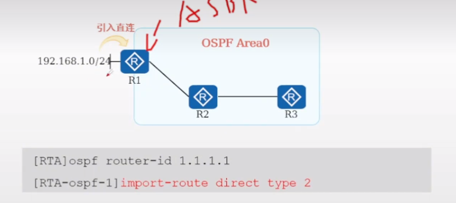
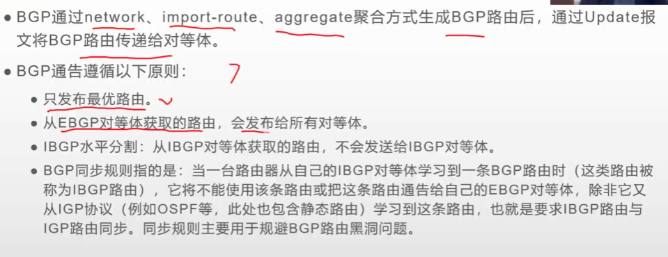
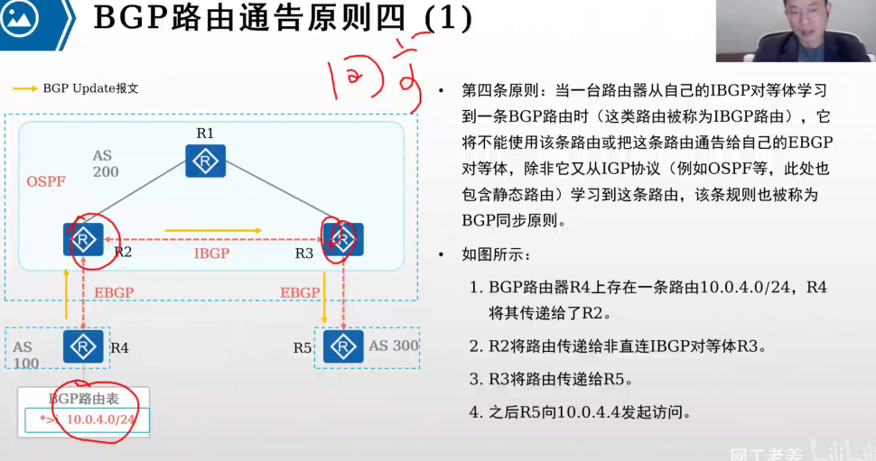
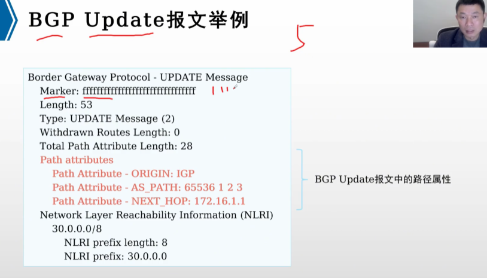
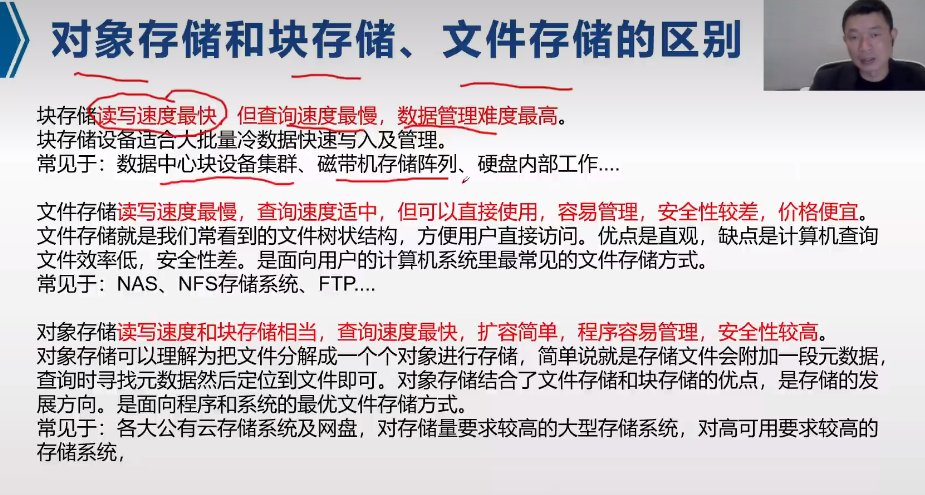

# 华为基础配置命令

## 视图

### system-view
### sysname
### return //直接返回用户视图
### quit //退出当前视图

## 配置文件

### display current-configuration
### display current-configuration brief
### save [ all ] [ configuration-file ]

## 交换机

### portswitch
### undo portswitch

# 子网划分

# VLAN

## 802.1Q帧

### vlan tag 4字节

## 接口的链路类型

### Access

### Trunk

### Hybrid

### QinQ

## PVID(Port Default VLAN ID) 缺省VLAN

- 配置pvid
- port hybrid pvid vlan 200

## VLAN标签的添加和剥离

## VLAN划分方式

- 接口
- 协议
- 子网
- MAC地址
- 策略（流策略）

默认优先级 策略 -> MAC地址 -> 子网 -> 协议 ->  接口

但最常用基于接口划分的方式

## VLAN配置

### VLAN创建

- 单个创建
  
- 批创建
  

### 配置Access接口

### 配置Trunk接口，并创建对应的允许通过列表

### VLAN间通信

#### 三层交换机配置Vlanif

#### 单臂路由

还需要在把连路由器的接口配置为Trunk端口，允许要所有要互通的VLAN通过

## VLAN聚合

### 关键配置命令

### ARP代理

## MUX VLAN

Multiplex VLAN

### 关键配置命令

## QinQ

- 大二层，公用VLAN,私有VLAN， 一般运营商配置

### 关键配置命令

## VLAN内二层隔离

### 端口隔离

### port-isolate enable

# 生成树协议

## 组播MAC地址

第八位是1代表组播，0代表单播

## 种类

* STP
  * 802.1D
* RSTP
  * 802.1W
* MSTP
  * 802.1S

## BPDU报文

- Root Identifier 当前根桥的BID
  - 默认情况与Bridge Identifier相同
  - 初始情况都认为自己是根
- Root Path Cost  到达根桥的根路径开销
- Bridge Identifier 桥ID长度为8个字节，由两部分组成: 一字节8比特
  * 2个字节的桥优先级 pow(2,16)/2 = 32768 默认优先级 ， 4096的倍数
  * 6个字节的桥MAC地址 6 x 8 = 48 位

* Port Identifier 发送该BPDU的端口ID 2字节
  * 优先级 默认 pow(2,8)/2 = 128
  * 端口号

## STP根桥，根端口，和指定端口的选举原则

都是比小，越小越优

1. 根网桥的选举规则 **所有交换机选择一个根交换机**
   1. 比优先级，越小越优先
   2. 比MAC地址，越小越优先
2. 根端口 PR 的选举规则 **每个非根交换机选择一个根端口**
   1. 选择根路径开销 Root Path Cost RPC, 最低的端口
   2. 如果相等，选择对端桥ID最低的端口
   3. 如果相等，选择对端端口ID最低的端口
   4. 如果相等，端口ID
3. 指定端口 也就是 DR 的选举规则 每个二层链路选一个指定端口
   1. 根路径开销
   2. 如果相等，本端桥ID
   3. 如果相等，本端口ID
4. 其余端口全部堵塞

根桥上面的所有端口的是指定端口

## STP

### 配置

## RSTP

### 配置

## MSTP

### 配置

PVID就是1，Trunk口允许了1

all

## 在交换机上的一些注意配置

边缘端口配置

- stp bpdu-protection

启用BPDU保护的端口在接收到BPDU数据包时，会自动关闭（进入errdisable状态）。
这样做是为了防止那些不应该发送BPDU数据包的设备引发网络问题。

# 静态路由

## 路由信息获取方式

## IP路由表

### 路由Flags

路由标记，标记当前网络节点的状态。

其中R是relay的首字母，说明是迭代路由，会根据路由下一跳的IP地址获取出接口。配置静态路由时如果你只指定下一跳IP地址，而不指定出接口，那么就是迭代路由，需要根据下一跳IP地址的路由获取出接口。

D是download的首字母，表示该路由下发到FIB表。

### 样式

| Destination/Mask | Proto  | Pre | Cost | Flags | NextHop   | Interface   |
| ---------------- | ------ | --- | ---- | ----- | --------- | ----------- |
| 10.0.1.0/24      | O_ASE  | 150 | 1    | D     | 10.0.35.3 | Serial2/0/0 |
| 10.0.2.0/24      | OSPF   | 10  | 9764 | D     | 10.0.35.3 | Serial2/0/0 |
| 10.0.3.0/24      | OSPF   | 10  | 4882 | D     | 10.0.35.3 | Serial2/0/0 |
| 10.0.5.0/24      | Direct | 0   | 0    | D     | 10.0.5.5  | LoopBack0   |
| 10.0.5.5/32      | Direct | 0   | 0    | D     | 127.0.0.1 | LoopBack0   |
| 10.0.5.255/32    | Direct | 0   | 0    | D     | 127.0.0.1 | LoopBack0   |
| 10.0.23.0/24     | OSPF   | 10  | 9764 | D     | 10.0.35.3 | Serial2/0/0 |

### 如果接口为NULL0表示黑洞路由，丢弃

## 路由表添加

### 优先过程

1. 一条路由条目
2. 如果网段掩码不同Destination/Mask，加入路由表
3. 如果相等，看优先级Pre，优先级高的加入（pre更小的）
4. 如果相等，看度量值，Cost,开销小的加入路由表

### 常见路由协议优先级

1. Direct 0
2. OSPF 10
3. IS-IS 15
4. Static 60
5. RIP 100
6. OSPF ASE 150 **OSPF ASE（External routes injected by Autonomous System External）** 指的是从外部自治系统注入的外部路由. 因为外部路由通常不如内部路由可靠和稳定。
7. OSPF NSSA 150 **OSPF NSSA（Not-So-Stubby Area）**是一种特殊的OSPF区域类型，允许有限的外部路由注入。
8. IBGP 255 **IBGP（Internal Border Gateway Protocol）**用于同一自治系统内部的BGP对等体之间。
9. EBGP 255 **EBGP（External Border Gateway Protocol）**用于不同自治系统之间的BGP对等体之间。

## 路由表使用

1. 最长网络前缀匹配原则
   1. 如果目的网络相等，优先使用网络前缀长的
2. 路由表检索采用二叉树检索
   1. 使用路由条目 unique prefix 来构造二叉树
3. 两种特殊路由
   1. 主机路由 匹配32位
   2. 默认路由 匹配0位

## 路由转发流程

### 图示

### 注意

1. 每个路由器只会维护自己的路由表
2. 但是有一些技术比如SDN能全局分发路由表
   1. SDK Sortware Defined Networking

## 静态路由 由管理员手动配置的路由

### 配置

1. 关联下一跳ip的方式 ip route-static ip-address {masl | mask-length} nexthop-address
2. 关联出接口方式 ip route-static ip-address {masl | mask-length} interface-type interface-number
3. 同时指定 ip route-static ip-address {masl | mask-length} interface-type interface-number [nexthop-address]

## 缺省路由 静态路由

- 源/掩码 0.0.0.0/0

## 路由递归/路由迭代

## 等价路由

## 浮动路由

- 添加多条源ip相同的路由但是优先级不同，下一跳不同的路由到路由表
- 当前面优先级高的路由失效时候
- 下面的路由能浮上来使用，作为备份路由使用

# ACL

## ACL概述

- ALC是有一系列permit或者deny语句组成的，有序规则的列表
- ACL是一个匹配工具，能够对报文进行匹配和划分

## ACL应用

- 匹配ip流量
- 在traffic-filter中被调用
- 在NAT中被调用
- 路由策略
- 防火墙
- Qos
- 其他..

## ACL组成

- 编号
  - acl number 2000  //number 可以省略
  - acl 2000
  - acl 3001
- 动作
  - acl 2000
    - rule 5 permit
    - rul2 10 deny
- 匹配项
  - acl 2000
    - rule 5 permit source 192.168.1.0 0.0.0.255
- rule 一条 acl 可以包含多个 rule

## 反掩码与通配符掩码（wildcard）

- 反掩码是子网掩码取反，0或1连续
- 通配符掩码是可以不连续，0代表强匹配，1代表任意匹配
  - 比如0.0.0.254（11111110）

## ACL的分类和标识

好的，我来帮助你创建两个Markdown表格来讲解基于ACL规则定义方式的分类和基于ACL标识方法的分类。以下是表格内容：

### 基于ACL规则定义方式的分类

| 分类          | 编号范围  | 规则定义描述                                                                                                                                                     |
| ------------- | --------- | ---------------------------------------------------------------------------------------------------------------------------------------------------------------- |
| 基本ACL       | 2000~2999 | 仅使用报文的源IP地址、分片信息和生效时间段来定义规则。                                                                                                           |
| 高级ACL       | 3000~3999 | 可使用IPv4报文的源IP地址、目的IP地址、IP协议类型、ICMP类型、TCP源/目的端口号、UDP源/目的端口号、生效时间段等来定义规则。                                         |
| 二层ACL       | 4000~4999 | 使用报文的以太网帧头信息来定义规则，如根据源MAC地址、目的MAC地址、二层协议类型等。                                                                               |
| 用户自定义ACL | 5000~5999 | 使用报文头、偏移位置、字符串匹配码和用户自定义字符串来定义规则。                                                                                                 |
| 用户ACL       | 6000~6999 | 既可使用IPv4报文的源IP地址或目的IP地址，也可使用目的的UCL（User Control List）组，或IP协议类型、ICMP类型、TCP源端口/目的端口、UDP源端口/目的端口号等来定义规则。 |

### 基于ACL标识方法的分类

| 分类      | 规则定义描述                                                |
| --------- | ----------------------------------------------------------- |
| 数字型ACL | 传统的ACL标识方法。创建ACL时，指定一个唯一的数字标识该ACL。 |
| 命名型ACL | 通过名称代替编号来标识ACL。                                 |

## 基本ACL和高级ACL

- 基本ACL
  - 编号范围 2000-2999
  - acl number 2000  // 回车会进入对应acl配置视图
    - rule 5 deny source 10.1.1.1 0 // 按步长5创建是为了防备后续维护和插入
    - rule 10 deny source 10.1.1.2 0
    - rule 5 premit source 10.1.1.2 0.0.0.255
- 高级acl
  - 基本编号 3000-3999
  - acl number 3001
    - rule 5 permit ip source 10.1.1.0 0.0.0.255 destination 10.1.3.0 0.0.0.225
    - rule 10 permit tcp source 10.1.2.0 0.0.0.255 destination 10.1.3.0 0.0.0.255 destination-port eq 21

## 拓展访问控制列表的配置命令

- 通配符掩码可以写成 any
- 任意ip源 可以写成 0.0.0.0
- tcp/udp
  - source-port
  - destination-port
- icmp //Internet Control Message Protocol 网际控制报文协议
  - icmp-type
  - icmp-code

## operator 对应匹配端口的操作符号

- eq
  - eq www
- gt
  - gt 6000
- lt
- neq //不等于
- range // 范围
  - range 20 34

## ACL的匹配顺序和匹配结果

### 图示

### acl匹配模式/匹配顺序 默认是config

- acl 2000 match-order auto
- config 严格按照顺序匹配
- auto 深度优先

## time-range

# DHCP

## 简介

- Dynamic Host Configuration Protocol

## dhcp message type

- discovery
  - 当一个设备（如计算机或手机）第一次连接到网络时，它还没有IP地址，需要通过DHCP服务器获取一个。
- offer
  - 网络中的DHCP服务器收到DHCP Discovery消息后，回应客户端提供一个可用的IP地址。
- request
  - 客户端从收到的DHCP Offer消息中选择一个最合适的（通常是第一个收到的），并发送一个DHCP Request消息给相应的DHCP服务器。
  - 这条消息用来请求确认和分配具体的IP地址。
- ack
  - DHCP服务器在收到DHCP Request消息后，验证所请求的IP地址是否可用（没有被其他设备使用），然后发送一个DHCP Ack消息给客户端。
  - 这条消息确认IP地址及其他网络参数的分配，客户端可以使用这些信息进行网络配置。
- nack
  - 如果DHCP服务器不能分配请求的IP地址（例如，IP地址已经被其他设备使用或请求的配置无效），服务器会发送一个DHCP Nack消息给客户端。
  - 这条消息表示请求被拒绝，客户端需要重新发送DHCP Discovery消息。
- decline
  - 如果客户端在接收到DHCP Offer消息或DHCP Ack消息后，检测到提供的IP地址已经在网络上被使用（例如通过ARP检测），客户端会发送一个DHCP Decline消息给服务器。
  - 这表示客户端拒绝使用该IP地址，服务器需要提供一个新的IP地址。
- inform
  - 当客户端已经有一个手动配置的IP地址并且不需要动态分配IP地址，但希望从DHCP服务器获取其他配置信息时，会发送一个DHCP Inform消息。
  - DHCP服务器接收到该消息后，提供相关的网络配置信息而不分配IP地址。

## dhcp role

- dhcp server
- dhcp clinet
- dhcp relay

## dhcp options

- option 1 设置子网掩码选项
- option 3 设置网工地址选项
- option 6
- option 50
- option 51
- option 53 dhcp message type
- option 54 设置服务器标识
- option 58 设置续租T1时间，一般是租期时间50%
- option 59 设置续租T2时间，一般是租期时间87.5%

## ip pool

- 系统视图
  - system view
- 创建地址池并进入地址池配置视图
  - ip pool poolname
- 配置地址池的网段
  - network network-address {mask | mask-length}
  - network 192.168.3.0 255.255.255.0
- dns
  - dns-list dns-server1 [dns-server2...dns-server8]
  - dns-list 10.10.10.2
- 网关
  - gateway-list gateway1 [gateway2...gateway8]
  - gateway-list 192.168.3.254
- 租期
  - lease day 2 hour 0 minute 0
  - lease unlimited
- mac地址绑定
  - static-bind ip-address ip-address mac-address mac-address
  - static-bind ip-address 192.168.3.2 mac-address dcd2-4a2c-3b2c option-template template1
- 保留ip/排除ip
  - excluded-ip-address ip-address
  - excluded-ip-address 192.168.3.211

## dhcp select

- 使能接口采用全局地址池的dhcp服务器功能
  - dhcp select global
- 使能接口采用接口地址池的dhcp服务器功能
  - dhcp select interface
- 使能接口的dhcp中继功能
  - dhcp select relay
- 在对应VLAN接口上使能dhcp
  - interface vlanif 10 //进入vlanif10接口视图
    - dhcp select global //使能接口采用全局地址池的dhcp服务器功能
    - dhcp select interface //使能接口采用接口地址池的dhcp服务器功能

## dhcp server 特别配置

- 保留ip(排除分配的ip)
  - dhcp server excluded-ip-address 10.1.1.2
- 配置dns
  - dhcp server dns-list 10.1.1.2
- 网关
  - dhcp server gateway-list 10.1.1.1
- dhcp服务器域名
  - dhcp server domain-name huawei.com
- mac地址绑定固定ip
  - dhcp server static-bind ip-address 10.1.1.100 mac-address 286e-d488-b684
- 设置ip租期时长
  - dhcp server lease day 2 hour 0 minute 0

## dhcp snooping

### **防止非DHCP用户攻击导致合法用户无法正常使用网络**

**攻击原理**

在DHCP网络中，静态获取IP地址的用户（非DHCP用户）对网络可能存在多种攻击，譬如仿冒DHCP Server、构造虚假DHCP Request报文等。这将为合法DHCP用户正常使用网络带来了一定的安全隐患。

**解决方法**

为了有效的防止非DHCP用户攻击，可开启设备根据DHCP Snooping绑定表生成接口的静态MAC表项功能。

设备将根据接口下所有的DHCP用户对应的DHCP Snooping绑定表项自动执行命令生成这些用户的静态MAC表项，并同时关闭接口学习动态MAC表项的能力。此时，只有源MAC与静态MAC表项匹配的报文才能够通过该接口，否则报文会被丢弃。因此对于该接口下的非DHCP用户，只有管理员手动配置了此类用户的静态MAC表项其报文才能通过，否则报文将被丢弃。

动态MAC表项是设备自动学习并生成的，静态MAC表项则是根据命令配置而成的。MAC表项中包含用户的MAC、所属[VLAN](https://link.zhihu.com/?target=https%3A//info.support.huawei.com/info-finder/encyclopedia/zh/VLAN.html)、连接的接口号等信息，设备可根据MAC表项对报文进行二层转发。

## DHCP 策略VLAN

# VRRP

## vrrp基本概述

* 虚拟路由冗余协议（Virtual Router Redundancy Protocol）
* 备份网关，实现网关冗余
* 版本vrrpv2（常用）,vrrpv3.
* 只有一种报文，advertisement报文
* ip组播，224.0.0.18，目的mac地址 01-00-5e-00-00-12
* ip报文协议号112

## 组播ip和组播mac

## ip报文常用协议号（8位）

* 1 icmp
* 2 igmp
* 6 tcp
* 17 udp
* 112 vrrp
* 89 ospf

## vrrp基本结构

* vrrp vrid  //唯一标识一个备份组
* virtual ip
* virtual mac //与vrid相关
* master //备份组中的主要路由器
* backup //备份组中的冗余路由器

## vrrp状态机

* initializ
  * priority 255 （虚拟ip与接口ip相同, 优先级0-255）的路由器立刻切换为master
  * priority != 255 切换到backup
* master
  * 对方优先级比自己低
  * ip 地址大的一方
  * master 那边的通告过期了
* backup

## 交换机器mac表学习过程

1. 什么是交换机的MAC地址表

   * 交换机的MAC地址表就像一个通讯录，记录了哪些设备（根据MAC地址）连接到了哪个端口。
   * 这样交换机可以知道数据该发到哪个端口去。
2. 交换机是怎么学习到这些MAC地址的

   1. 初始状态 ：一开始，交换机的MAC地址表是空的。
   2. 接收数据帧 ：当交换机接收到数据帧时，会看一下帧的来源MAC地址，并记下这个MAC地址是通过哪个端口来的。
   3. 更新表 ：交换机会把这个信息（MAC地址和端口）加到MAC地址表中。
3. 数据帧的转发

   1. 已知MAC地址 ：如果交换机知道目标MAC地址在哪个端口，就直接把数据帧发到那个端口。
   2. 未知MAC地址 ：如果交换机不知道目标MAC地址在哪个端口，它就会把数据帧广播到所有端口，等目标设备回应后再更新MAC地址表。
4. MAC地址表的老化

   1. 为了防止MAC地址表太大，交换机会设置一个时间限制。
   2. 如果某个MAC地址在一定时间内没有使用，交换机会把它从表中删除。

## free arp / Gratuitous arp

### Free ARP的定义

* 无偿ARP是一种ARP报文，它的特点是在广播中包含了发送设备的IP地址和MAC地址，目的是主动宣告这些信息，而不是为了响应其他设备的请求。

### Free ARP的主要用途

1. 防止IP地址冲突：

   - 设备启动时会发送Free ARP消息，检查网络中是否有其他设备使用相同的IP地址。如果有，则会检测到冲突，从而避免两个设备使用相同的IP地址。
2. 更新ARP缓存：

   - 当设备的IP地址或MAC地址发生变化时，它可以发送Free ARP消息通知网络中的其他设备更新它们的ARP缓存表，以避免发送错误的数据包。
3. 冗余设备协议（如VRRP)：

   - 在虚拟路由冗余协议（VRRP）等协议中，主设备发送Free ARP消息宣告它是当前的主设备，这样备份设备可以检测到主设备的状态。
4. 冗余和故障转移：

   - 在网络设备故障转移场景中，新接管IP地址的设备会发送Free ARP，以便其他设备更新其ARP缓存表，确保数据包能够正确转发到新的设备上。

### Free ARP的工作原理

Free ARP消息与普通ARP请求和应答的报文结构类似，但其关键区别在于：

- Free ARP消息是广播形式发送的（目的MAC地址为广播地址FF:FF:FF:FF:FF:FF）。
- 报文中源IP地址和目的IP地址都是发送设备的IP地址。

### Free ARP的报文结构

与标准ARP报文类似，Free ARP报文包括以下字段：

- 硬件类型：表示网络类型（以太网为1）。
- 协议类型：表示使用的协议（IPv4为0x0800）。
- 硬件地址长度：MAC地址长度（以太网为6）。
- 协议地址长度：IP地址长度（IPv4为4）。
- 操作码：表示ARP请求或应答（请求为1，应答为2），但在Free ARP中，通常使用ARP请求的操作码。
- 发送方MAC地址：发送设备的MAC地址。
- 发送方IP地址：发送设备的IP地址。
- 目标方MAC地址：广播地址FF:FF:FF:FF:FF:FF。
- 目标方IP地址：发送设备的IP地址。

## vrrp主备工作过程

* 选举出 master
* 发送free arp //自己问自己 源地址为虚拟mac address
* 状态维持

## vrrp负载分担工作过程

* 创建多个备份组
* 配置各个备份组的master
* 下层设备配置不同的网关（各个备份组的虚拟ip)

## vrrp主备切换过程

* backup收到master的通告报文超时，backup -> master 抢占
* 抢占可以设置抢占延时，以提高网络稳定性

## vrrp故障场景

## vrrp联动过程

* 利用vrrp的联动功能监视上行接口或链路故障，主动进行主备切换
* 一般情况下，只有master出问题或备份组内部的路由器相连的链路**(心跳链路**)出现问题时才能发现故障并进行主备切换，无法判断上行接口或链路故障

## vrrp配置实现

### 主备方式

* 接入接口
* 配置接口ip地址
* vrrp vrid 1 virutal-ip 10.0.0.10
* vrrp vrid 1 priority 120 //默认是100，所以配置为master
* vrrp vrid 1 preempt-mode timer delay 20 //抢占模式抢占延时
* vrrp vrid 1 track interface g0/0/0 reduce 30 //检测接口。如果故障，自己的优先级降低30 , 然后能将自己切换为backup

### 负载分担方式

# NAT

## 种类

* 源nat
* 目的nat
* 双向nat

## 静态nat

## 动态nat

## napt

## easy ip

# BFD

## 简介

* 双向转发检测机制（Bidirectional Forwarding Detection）
* udp 3784

## BFD报文结构

## BFD会话状态

- 
- down
- init
- up

## BFD echo

## bfd 联动

### 静态路由与bfd联动配置

* 
* 
* 
* 
* one-arm-echo //单臂回声
* 

### ospf与bfd联动配置

## NQA network quality analysis 网络质量分析

* 能实现检测Qos服务质量（Quality of Service）
* quality 质量 夸夸你，好质量
* quantity 数量 拿匡来装 多- 数量
* 

## ip-link技术

# 链路聚合和设备堆叠

## Eth-Trunk

## istack

## 级联

## 集群

# rip

## 简介

* 基于距离矢量，以跳数为度量值，最大跳数为15，16为不可达
* 有两个版本
  * v1只能宣告主类ip, 广播更新
  * v2支持cidr和vlsm，组播更新，组播地址 224.0.0.9
* 封装在udp, 端口号520
* 容易引发环路

## 三个计时器

* update timer 30s //更新
* age timer 180 //老化
* garbage collect timer //垃圾丢弃 120 学到到彻底删除至少要300s

## rip环路避免机制

* split horizon 水平分割

  * 从一个接口学到的路由，不会再从这个接口通告出去
  * 反向毒化的水平分割，
* 最大跳数
* 毒性反转
* 路由毒化与触发更新

  * 已经失效的路由会作为一条不可达路由主动通告出去

## undo summary

## summary always

## ripv2自动汇总

* summary always
* undo summary
* 

## ripv2手动汇总

* interface s0/0/0
* rip summary-address 10.0.0.0 255.255.128.0
* 

## ripv2下发默认路由

* 
* int s0/0/0
  * ip address 192.4.8.10 30
* int s0/0/01
  * ip address 10.0.12.4 24
* ip route-static 0.0.0.0 0 192.4.8.9
* rip 1
  * version 2
  * network 10.0.0.0
  * default-route originate
  * 

## ripv2认证

* 
* cipher / plain
* int s0/0/1
  * rip authentication-mode simple [cipher | plain] huawei123

# ospf

## 简介

* ospf 基于链路状态 lsdb
* 计算cost时候通过邻接表使用dijistra 算法算出自身与其他路由器的最短路径
* ospf的开销计算公式位带宽参考值/链路带宽

  * ospf
    * bandwidth-reference 10000 //可以修改带宽参考值
* ospf  默认是 area 0
* ospf router id选举

  * 手动指定route-id
  * 路由器上环回接口最大的IP地址被选为route-id，非活动接口的IP地址不可以被选为route-id
  * 如果设备存在多个逻辑接口地址（如环回口loo1口），则路由器使用逻辑接口中最大的IP地址作为Router ID
  * 路由器使用最高的 Router ID 作为自己的 Router ID
  * 路由器可以设置一个优先级，在 Router ID 相同的情况下，优先级高的路由器会成为路由器 ID
* dr/bdr/drother

  * 
* br/abr/asbr

  * br backbone router
  * abr area border router
  * asbr as boundary router //连接到其他as
* ospf 以abr路由器为边界，一个接口属于一个区域
* ospf要求两个邻居接口之间的类型相同

  * broadcast //广播
  * p2p //点到点
  * ma //多路访问
  * nbma // 非广播型多路访问
  * 

## ospf三大表

* 邻居表
  * display ospf peer [brief]
  * 
* lsdb
  * display ospf lsdb
  * 
* ospf路由表
  * 与路由器路由表不同
    * display ospf routing
    * 

## ospf协议报文类型

- hello
- dd dabase description
- lsr link state request
- lsu link statue update
- lsa link state ack

## 常见lsa类型

## ospf 区域

## ospf基本配置

* ospf router-id 1.1.1.1
  * area 0
    * network 192.168.1.0 0.0.0.255 //反掩码

## ospf 认证

* 
* ospf认证方式
  * 区域认证
  * 接口认证
* 查看配置时候密码显示方式
  * plain 明文
  * cipher 密文 //默认

## 缺省路由

* 
* default-route-advertise

## ospf引入外部路由

* 
* ospf router-id 1.1.1.1
  * import-route direct type 2
* 

## silent-interface

* 
* ospf
  * area 0
    * network 192.168.4.0 0.0.0.255
    * silent-interface GigabitEthernet 0/0/1

# bgp

## bgp简介

* tcp 179
* bgp speaker
* peer
* 触发更新和增量更新

## bgp 对等体关系

* ibgp peer
* ebgp peer

## bgp报文类型

* open
* update
* notification
* keepalive
* route-refresh
* 

## bgp状态机

* idel
* connect
* active
* opensent //tcp握手完成
* openconfirm
* established
* 

## bgp对等体表

* display bgp peer
* 

## bgp路由表

* display bgp routing-table
* 优选ip匹配顺序
  * prefval //越大越优
  * locprf //越大越优
  * as_path
  * 
* 

## bgp路由的产生

* network  //精确匹配 ，网络号必须存在igbp路由表存在
* import-route // 协议匹配，优先级比network低
  * 
* 支持生成聚合路由
  * aggregate 10.2.0.22 detail-suppressed //抑制弥隙
  * 

## bgp通告原则

### BGP 通告原则

1. **BGP通告路由的方式**：

   - 
   - **network**：通过配置network命令将路由通告到BGP。
   - **import-route**：导入其他路由协议（如OSPF、EIGRP）的路由到BGP。
   - **aggregate**：通过聚合多条路由生成一个更粗略的路由。
2. **BGP通告遵循的原则**：

* 
* 
* 

- **只发最优路由**：BGP只会通告其认为最优的路由。
- **从eBGP对等体获取的路由，会发送给所有对等体**：从eBGP邻居学到的路由会被传递给所有BGP对等体，无论是iBGP还是eBGP邻居。
- **iBGP水平分割**：**从iBGP对等体获取的路由，不会发送给其他iBGP对等体**。这个原则是为了防止路由环路的产生。
  - 

3. **BGP同步原则**：
   - 当一台路由器从自己的iBGP对等体学到一条BGP路由时，这条路由不能被直接通告给eBGP对等体，除非这条路由已经在IGP（如OSPF、EIGRP）中学习到并同步。
   - 这是为了确保在IGP和BGP之间的一致性，避免黑洞问题。
   - 
   - **华为默认关闭同步原则不推荐把bgp路由引入到ibgp内部 //内部压力大**

### 详细说明

- **eBGP对等体**：这是指不同自治系统（AS）之间的BGP对等体。通过eBGP对等体交换路由信息。
- **iBGP对等体**：这是指同一自治系统内的BGP对等体。iBGP对等体之间的路由信息交换受到更多限制，以防止路由环路。
- **IGP（内部网关协议）**：包括OSPF、EIGRP等，用于自治系统内部的路由选择和信息传递。

### BGP 同步与水平分割

- **同步（Synchronization）**：BGP在学习到一条路由后，需要在IGP中也有相应的路由，确保内部网络中的所有路由器都知道该路由。
- **水平分割（Split-Horizon）**：iBGP规则之一，即从一个iBGP对等体学习到的路由不会再传给其他iBGP对等体。这是为了防止路由环路的产生。

## bgp基本配置

* 启动bgp进程
  * bgp as-number
  * bgp 100
    * router-id ipv4-address
    * router-id loopbacl1 //一般用环回口地址
    * peer 10.12.0.02 as-number 100
  * [RA]route loop-dectect enable
* 配置bgp对等体
  * peer ipv4-address as-number 100
  * peer ipv4-address connect-interace loopback1
  * peer ipv4-address ebgp-max-hop [hop-count]
  * peer 10.0.1.1 next-hop-local //ebgp路由进入as时候，把下一跳改为自己
  * 
* 

## route loop-dectect enable

## ipv4-family unicast

## undo synchronization

## preference 255 100 230

## bgp路径属性

* 
* 
* 
* 公认
  * origin
    * 
    * 
  * as_path
    * 
    * 
    * 
  * next_hop
    * 
* 公认任意
  * local_preference //越大越优先
    * 
    * 
    * 
  * atomic_aggregate
* 可选过渡
  * community
    * 
* 可选非过渡
  * med
    * 
  * preferred-value (华为特有)
    * 

## bgp路由优先规则

- 

1. **优选Preferred-Value属性值最大的路由**：优先选择具有最高优先级（Preferred-Value）的路由。这是厂商特有的属性，通常用来手工设置特定路由的优先级。
2. **优选Local_Preference属性值最大的路由**：选择本地优先级（Local Preference）最高的路由。Local Preference是BGP内部路由选择的一个重要属性，用于在AS内部决定优先路由。
3. **本地生成的BGP路由优于从对等体学到的路由**：本地生成的路由（通过network、import-route等方式引入的路由）优先于从其他BGP对等体学到的路由。
4. **优选AS_Path属性值最短的路由**：选择经过自治系统（AS）数量最少的路由。这可以减少路由环路并优化路径选择。
5. **优选Origin属性值最小的路由**：Origin属性表示路由的起源，优先级顺序为IGP < EGP < Incomplete。IGP表示路由来自IGP协议，EGP表示路由来自EGP协议，Incomplete表示未知起源。
6. **优选MED属性值最小的路由**：Multi-Exit Discriminator（MED）用于在多个入口点之间选择优先路径，值越小优先级越高。
7. **优选从eBGP对等体学来的路由**：外部BGP（eBGP）路由优先于内部BGP（iBGP）路由，因为eBGP路由表示外部网络的更直接路径。
8. **优选Next_Hop距离最近的路由**：选择下一跳（Next Hop）距离最短的路由。
9. **优选Cluster_List属性值最短的路由**：Cluster List用于路由反射器环境中避免环路，值越短优先级越高。
10. **优选Router ID（Originator ID）最小的路由**：在所有其他条件相同的情况下，选择Router ID最小的路由。
11. **优选具有最小IP地址的对等体路由**：如果仍有多条路由可选，选择来自IP地址最小的BGP对等体的路由。

## 路由协议缺省优先级

# route-policy 路由策略

## route-policy路由控制概述

路由控制可以通过路由策略（Route-Policy）实现。路由策略的应用灵活而广泛，主要有以下几种方式：

1. **控制路由的发布**：通过路由策略对发布的路由进行过滤，只发布满足条件的路由。
2. **控制路由的接收**：通过路由策略对接收的路由进行过滤，只接收满足条件的路由。
3. **控制路由的引入**：通过路由策略控制从其他路由协议引入的路由条目，只有满足条件的路由才会被引入。

- 路由控制的具体操作
  1. 定义路由特征
     定义需要实施路由策略的路由特征，即定义一组匹配规则进行匹配。这些规则可以基于路由信息中的不同属性进行匹配，如目的地地址、Tag值等。
  2. 路由发布（Route Advertisement）
     通过路由策略对发布的路由进行控制，只发布满足策略条件的路由。
  3. 路由接收（Route Reception）
     通过路由策略对接收的路由进行控制，只接收满足策略条件的路由。
  4. 路由引入（Route Import）
     通过路由策略控制从其他路由协议引入的路由条目，只引入满足策略条件的路由。

## 匹配工具

### acl

- 
- 
- acl 默认允许

### ip-prefix (ip前缀列表)

- 
- ip ip-prefix test index 10 permit 192.168.1.0 22 greater-equal 24 less-equal 26
  - test 前缀列表名字
  - 10 条目序号
  - permit 匹配模式 / deny
  - ip网段和掩码
  - 掩码范围 24-26
- ip-prefix 的匹配机制
  - 
  - 顺序匹配
  - 唯一匹配 //匹配到一条就结束
  - 默认拒绝 //没有匹配到就全部拒绝，也就是说只有明确写了允许的才能匹配上
- 一些特殊用法
  - 

### acl与ip-prefix的区别

# PBR 基于策略的路由

# traffic-policy / MQC

## MQC 模块化Qos命令行

## 配置介绍

* 
* 创建流分类
  * traffic classifier xxx
    * if-match acl xxx
    * quit
* 创建流行为
  * traffic behavior xxx
    * deny //动作
    * quit
* 配置流策略
  * traffic policy xxx
    * classifier xxx behavior xxx //绑定某种流到某种行为
    * quit
* 在接口下面应用流策略
  * interface g0/0/1
    * traffic-policy xxx inbound | outbound

# traffic-filter

# 存储技术

## RAID

* raid 0
* raid 1
* raid 5
* raid 10
* 

## RAID 2.0

* 快速重构
* 磁盘负载均衡
* 磁盘利用率高
* 易拓展

## DAS direct attached storage

* scsi //small computer system interface

## NAS Network Attached Storage

* nfs //network file system
* cifs //通用互联网文件系统（Common Internet File Systems）
* 

## FC SAN 光纤通道存储区域网络 Fibre Channel storage area network

* HBA 卡 // 主机总线适配器(Host Bus Adapter)

## ip SAN

## ip san 与 fc san 对比

## dan，nas，san 对比

## 分布式存储组网

## 对象存储/块存储/文件存储

# WLAN

## WLAN的发展

- wifi7 802.11 bx 
- wifi6 802.11 ax 2.5g&5Ghz 9.6Gbps // 9.6Gbps = 9.6 * 10^9 bits per second / 8 = 1.2 GigaBytes per second (GB/s)
- wifi5 802.11 ac 5ghz

## wlan安全

- 802.11x认证
- mac认证
- portal认证

## 转发方式

- capwap转发/隧道转发
- 直接转发/本地转发

# firewall

# 网络安全

## 常见网络安全产品

- firewall
- waf(web application firewall)
- 防病毒网关(antivirtus gateway)
- 上网行为管理(internet behavior management)
- ips
- ids
- 网闸
- 4a系统
  - authentication
  - authorization
  - Accounting
- 蜜罐系统(Honeypot System)
- 姿势感知平台(Security Posture Assessment Platform)

## threat

- ddos Distributed Denial of Service
  - 种类
    - tcp flood
    - acl flood
    - udp flood
    - icmp flood
  - 应对
    - 购买流量清洗服务(Cloudflare..)
    - 使用高防cdn
    - 使用专业抗ddos的防火墙
    - 增加网络带宽
- 单包攻击
  - 种类
    - 扫描型攻击
    - 畸形报文
    - 特殊报文控制类攻击
  - 应对
    - 防火墙
    - ips
    - dpi(深度包探测)
- virus
  - 应对
    - 防病毒网关
    - 专业防火墙和防病毒应用
    - 及时更新操作系统和应用的安全补丁
- sql注入
  - 应对
    - waf
    - 参数化查询
    - 输入验证和过滤
    - 最小权限原则
- xss跨站脚本攻击
  - 应对
    - waf
    - 输入验证和过滤
    - 输出编码
    - 内容安全策略csp
- apt攻击 //高级持续攻击
  - 应对
    - 使用威胁情报，大数据分析
    - ips,恶意代码检测，主机应用保护
- 一句话木马
  - eval...
- 0day漏洞
- 私接路由器
  - 应对
    - dhcp snooping
- 伪造mac地址攻击网关
  - 应对
    - arp detection
- mac地址表攻击
  - 应对
    - port-security enable //端口安全 mac-number 1

## 加密与解密

### 商用密码算法体系 SM2,3,4,9

SM2 和 SM9 属于非对称密码算法

SM4 属于对称加密算法，用作分组密码，用途广泛，可用于大数据量的加密。

SM3 哈希算法，属于摘要算法。

| 算法 | 类型           | 用途                   | 备注                 |
| ---- | -------------- | ---------------------- | -------------------- |
| SM2  | 非对称密码算法 | 通常用于加密和数字签名 |                      |
| SM4  | 对称加密算法   | 分组密码，用途广泛     | 适用于大数据量的加密 |
| SM3  | 哈希算法       | 摘要算法               |                      |
| SM9  | 非对称密码算法 | 通常用于加密和数字签名 |                      |

# VPN

## VPN关键技术技术

### Tunnel
### 身份认证技术
### 加密技术
### 数据验证技术

## VPN分类

### 根据应用场景

- client-to-site vpn
- site-to-site vpn

### 根据vpn实现层次

- 应用层
  - ssl vpn
- 传输层
- 网络层
  - gre
  - ipsec
- 数据链路层
  - pptp
  - l2f
  - l2tp

