# 网络攻击

## 主动攻击

## 被动攻击

# 加密算法

## 对称加密算法

## 非对称加密算法

## 哈希加密算法

# 数字签名与数字证书

## 数字签名与验证过程

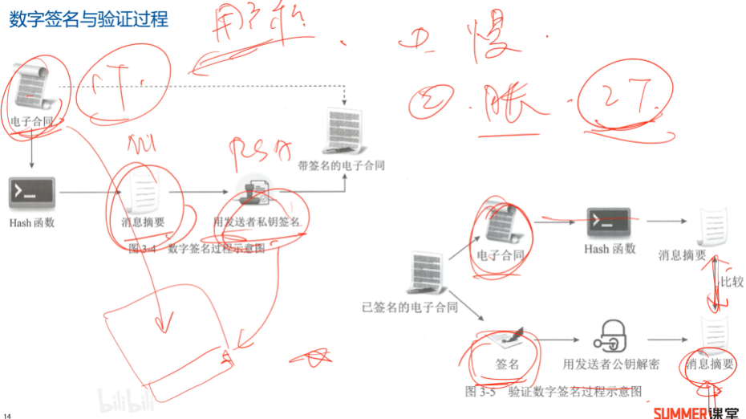

## 数字证书

### 数字证书示例

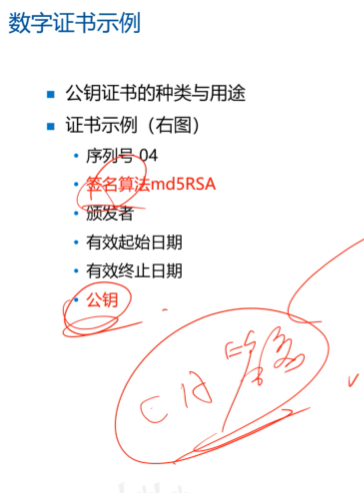

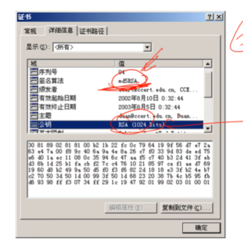

# PKI体系结构

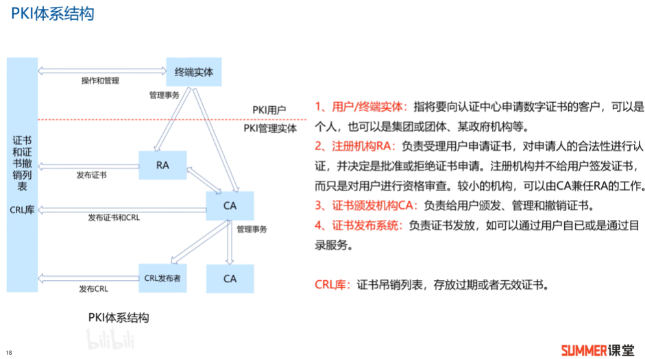

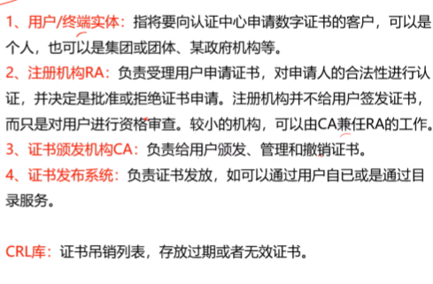

## Kerberos体系

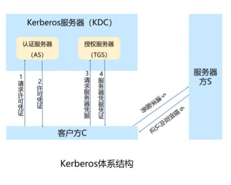

# 常见攻击与防范

## DDOS

分布式拒绝服务（DDoS攻击）指将多台计算机联合起来作为攻击平台，通过远程连接，利用恶意程序对一个或多个目标发起DDoS攻击，消耗目标服务器性能或网络带宽，从而造成服务器无法正常地提供服务。

本题目标地址遭到来自多个不同计算机的攻击，可以看出来遭受了DDoS攻击。

为了防止DDOS攻击，服务器可以采取一些措施来保护自己。例如，可以使用防火墙来限制非法请求的数量，并且可以使用流量清洗器来过滤掉大量假冒请求。此外，还可以使用负载均衡器来分散流量，以防止服务器负载过大。
可以使用流量指纹技术来识别假冒请求，并且可以使用深度包检查技术来检查数据包是否为恶意数据包。另外，还可以使用黑名单技术来阻止来自已知攻击者的请求。
如果发现服务器遭受DDOS攻击的情况严重，可能需要采取紧急措施。例如，可以暂时关闭服务器的外网访问，以防止攻击者继续发送请求。此外，还可以临时更换服务器的IP地址，以避免攻击者继续攻击。

### 防范

* 配置最小特权访问策略
* 购买流量清洗服务

* 停止不必要的服务端口
* 启用防火墙的防DDoS功能

* 部署IPS防护

## SQL注入攻击

### 防范

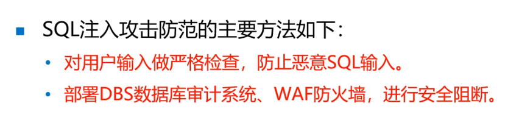

## XSS跨站脚本攻击

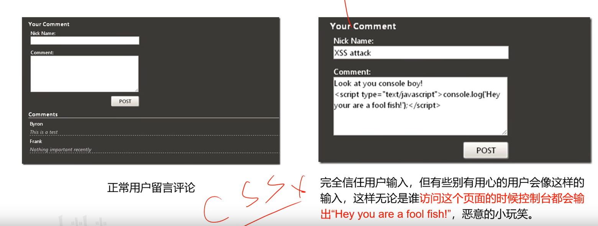

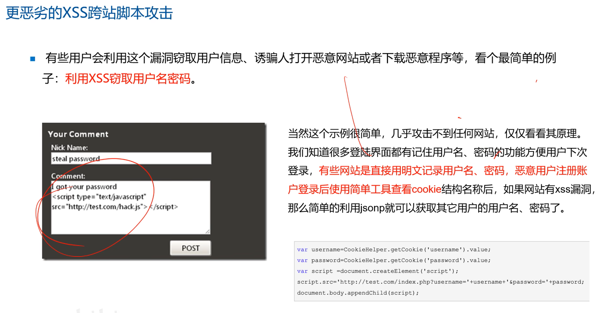

### 防范

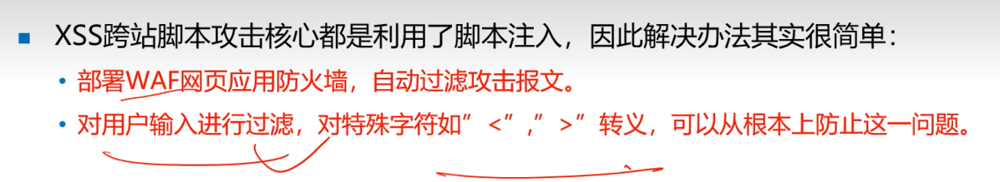

## ARP高级持续性威胁

高级持续性威胁（Advanced Persistent Threat，APT），又叫高级长期威胁，是一种复杂的、持续的网络攻击，包含三个要素：高级、长期、威胁。高级是指执行APT攻击需要比传统攻击更高的定制程度和复杂程度，需要花费大量时间和资源来研究确定系统内部的漏洞；长期是为了达到特定目的，过程中“放长线”，持续监控目标，对目标保有长期的访问权；威胁强调的是人为参与策划的攻击，攻击目标是高价值的组织，攻击一旦得手，往往会给攻击目标造成巨大的经济损失或政治影响，乃至于毁灭性打击。

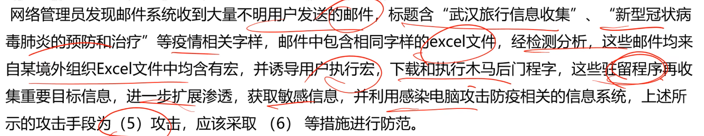

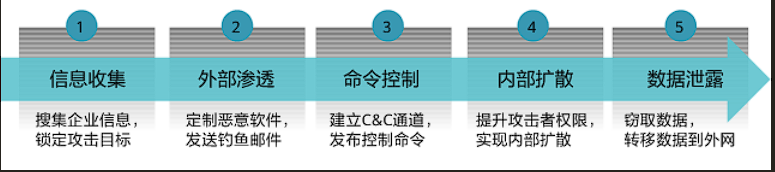

## 木马

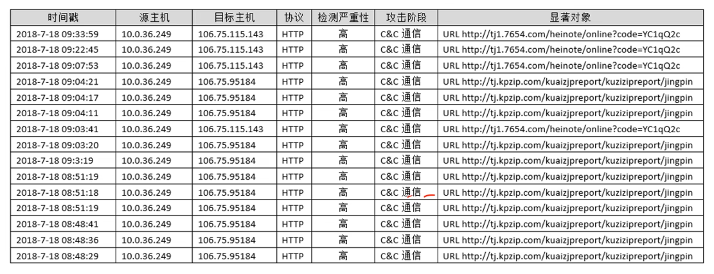

## 一句话木马

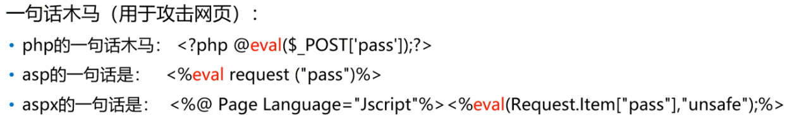

## 攻击特征码

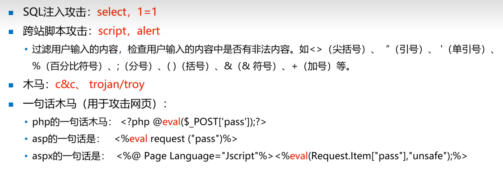

## 常见病毒类型

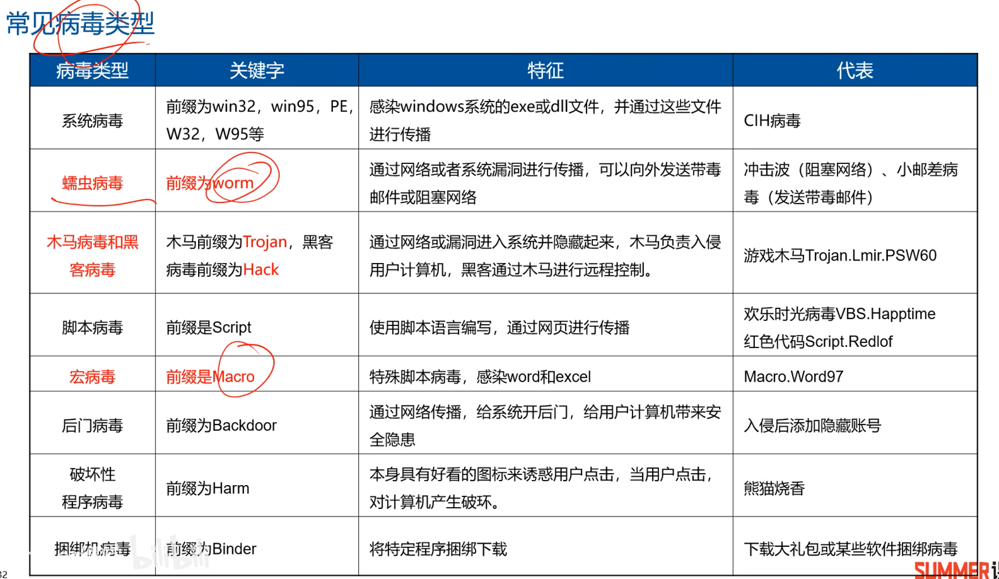

# 计算机等级保护标准

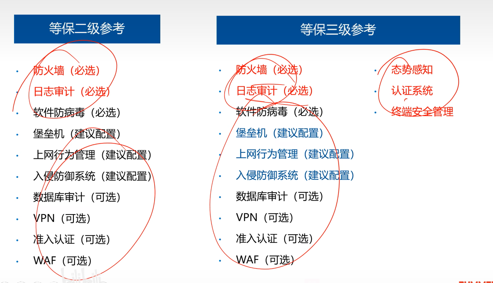
