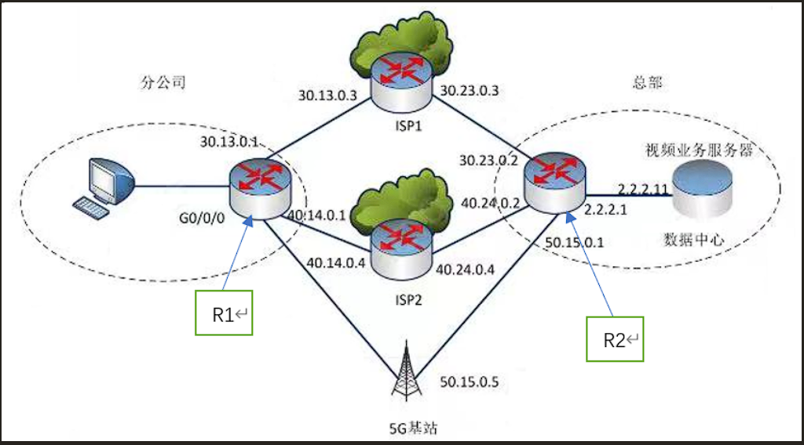
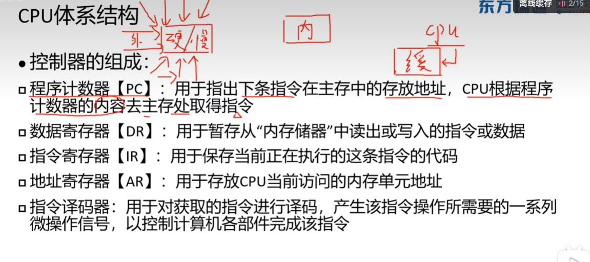
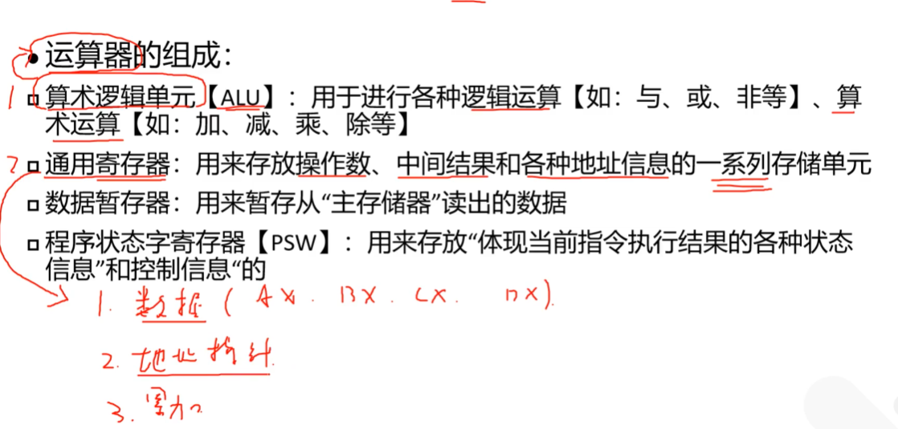
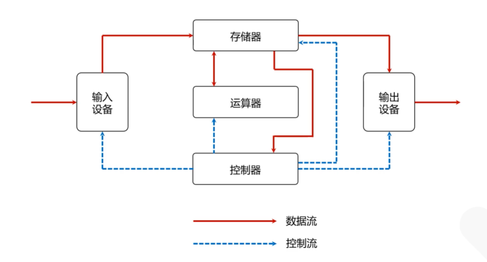
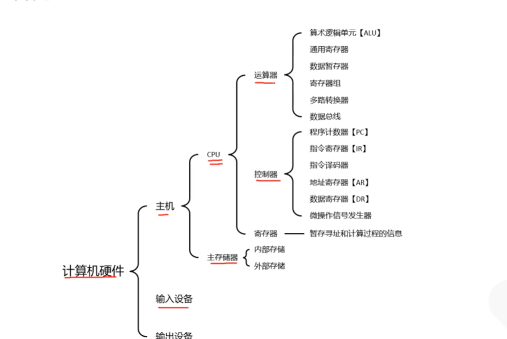
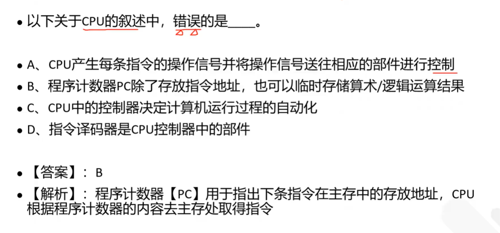
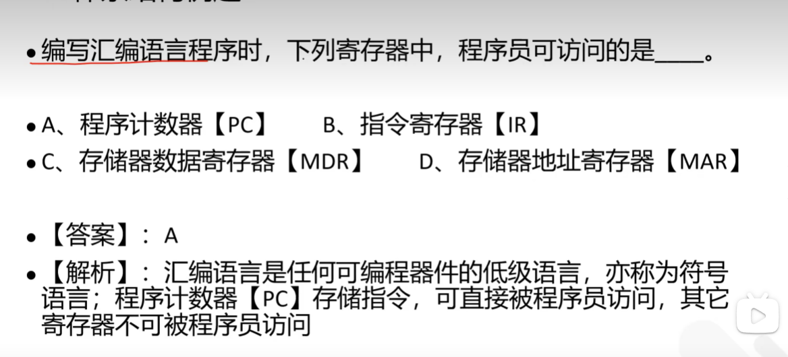
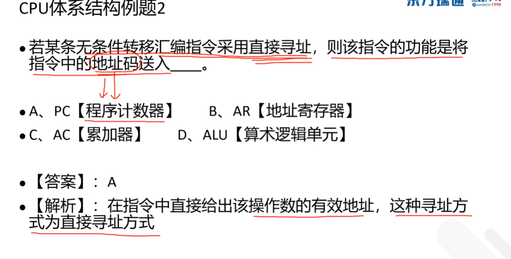
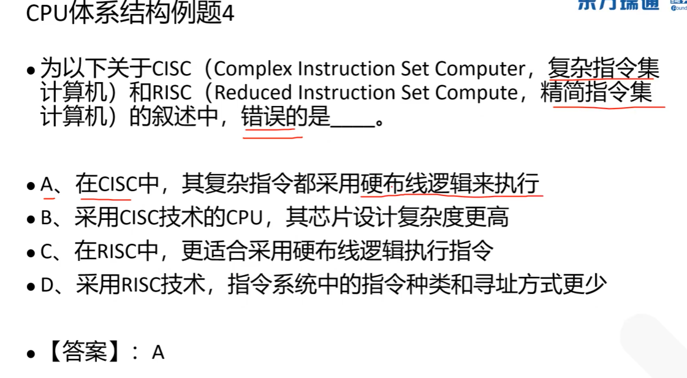

## broadcast-suppression

**broadcast-suppression**命令用来配置接口下允许通过的最大广播报文流量。

**undo broadcast-suppression**命令用来恢复接口下允许通过的最大广播报文流量为缺省值。

缺省情况下，接口下允许通过的最大广播报文流量按照百分比抑制，比例值为 10%。

### 例题

(2)网络试运行一段时间后，在二层网络中发现了大量的广播报文，影响网络的性能。

网络管理员在接入层交换机做了如下配置问题得以解决 ∶

```bash
[SW] interface gigabitethernet 0/0/3
[SW-GigabitEthernet0/0/3]broadcast-suppression 80
[SW-GigabitEthernet0/0/3]guit
```

请简述以上配置的功能。

## VRRP

**虚拟路由冗余协议（Virtual Router Redundancy Protocol）**

设备 1 和设备 2 之间运行 VRRP 协议，其中 linke 是 VRRP 心跳线，用于传输 VRRP 协议报文，若 linke 链路出现故障会导致设别 2（backup 状态）无法收到 Master 发送过来的 VRRP 报文，就认为 Master 设备出现了故障，从而进行设备角色的切换。

### 与双机热备不一样

虚拟路由冗余协议（VRRP）和双机热备份都是用于提高网络可靠性的重要技术，但它们在实际应用中有一些关键的区别。

首先，VRRP 是一种容错协议，它保证了当链路中的路由器出现故障时，备份路由器能够自动替代故障路由器进行工作，从而确保网络通信的连续性和可靠性。在一个 VRRP 组中，所有的主备路由器都有相同的虚拟路由器标识（VRID），并且由一个 Master 路由器承担流量转发的工作，其他的路由器则作为 Backup 路由器处于待命状态。

另一方面，双机热备份是一种更常见的备份策略，主要用于防止由于主机或服务器故障引起的业务中断。在双机热备方案中，通常有两台机器同时运行相同的应用程序，当一台机器出现故障时，另一台机器能迅速接管它的工作，因此这种方案确保了业务的连续性。

## MTBF

MTBF，全称 Mean Time Between Failures，是一个关键的可靠性指标，专门用于衡量产品，尤其是电器产品的可靠性。

- 这个指标以**小时**为单位

反映了产品保持正常工作的能力，也是体现产品质量的重要参数。当产品的寿命服从指数分布时，其故障率的倒数就叫做平均故障间隔时间，也就是 MTBF。简单来说，MTBF 越大，说明产品故障少，可靠性高。

另一方面，为了提高网络的可靠性，一种常用的方法是采用关键链路冗余技术。

这包括了

- 接口备份
- 接口监控组
- VRRP
- 双机热备份

等策略。

在双机备份中，当网络链路故障发生时，系统会监控网络接口状态来触发主备链路切换，以确保网络流量不会超载，从而保障业务连通性。

而虚拟路由冗余协议（VRRP）则是一种路由协议，主要用于解决局域网中静态网关单点失效问题，可以确保数据流量的平稳切换和网络连通性，尤其在边缘网络中被广泛使用。

为了实现更高的可靠性和可用性，核心交换机通常会应用一些冗余技术，包括冗余电源、冗余风扇和冗余模块等。

例如，当一个电源模块故障时，其他模块可以自动接管，确保交换机的稳定运行。通过这些冗余技术，我们可以显著降低网络中断的风险。

同时，堆叠技术也被广泛应用于核心交换机中，通过将多个交换机物理连接成一个逻辑单元，以增强系统的处理能力和管理便利性。

## IPSEC VPN

要保证数据安全的前提下，则需要使用 VPN 技术来保障通过公共的因特网访问总部网络自的数据传输安全。

由于分支机构要使用客户端方式访问，所以一般使用 SSL VPN 方式，客户端安装 SSL VPN 客户端软件进行登录验证从而建立 VPN；

防火墙和总部之间一般使用 IPSEC VPN，和总部建立 IPSEC 隧道，同时也要允许 10.11.229.0 网段访问互联网。

## DDOS

DDos 即分布式拒绝服务攻击: 指借助于客户/服务器技术，将多个计算机联合起来作为攻击平台，对一个或多个目标发动 DDoS 攻击,从而成倍地提高拒绝服务攻击的威力。

由于其隐蔽性和分布性很难被识别和防御，DDoS 攻击技术发展十分迅速。这种攻击规模大、危害性强。包括 ACKflood, SYN Flood, ICMP flood, UDP flood 等。

## DHCP Snooping

用户获得的地址非规划分配的地址 IP 地址，可判断网络中有其他非法 DHCP 服务器，而最常见的原因是用户私接路由器，并将路由器的 LAN 口接入公司网络线路，导致路由器自带的 DHCP 向公司内网分配 P 地址。

在接入交换机上启用 DHCP Snooping 功能，将接入交换机的上行接口设置为 DHCP trust 接口属性，其他接口设置为 untrunst 接口（只有 trust 接口才会接收 DHCP 响应报文）。

## ARP detection

`ARP detection` 功能主要应用于接入设备上，对于合法用户的 ARP 报文进行正常转发，否则直接丢弃，从而防止仿冒用户，仿冒网关的攻击。

交换机上开启 ARP detection 功能后会对于 ARP 非信任端口要进行用户合法性检查，以防止仿冒用户的攻击。

用户合法性检查是根据 ARP 报文中源 IP 地址和源 MAC 地址检查用户是否是所属 VLAN 所在端口上的合法用户，包括基于 IP Source Guard 静态绑定表现的检查，基于 DHCP Snooping 安全表现的检查等。

## Port-security

`Port-security enable` 命令用来使能端口安全功能，Port-security max-mac-num 命令用来配置端口安全 MAC 地址学习限制数。

## 策略路由

图为某公司的总部和分公司网络拓扑，分公司和总部数据中心通过 ISP1 的网络和 ISP2 的网络互连。

并且连接 5G 出口作为应急链路，分公司和总部数据中心交互的业务有语音、视频、FTP 和 HTTP 四种。

要求通过配置策略路由实现分公司访问业务分流。配置网络质量分析(NQA)与静态路由联动实现链路冗余。

其中,语音和视频以 ISP1 为主链路、ISP2 为备份； FTP 和 HTTP 以 ISP2 为主链路,ISP1 为备份。



### ACL

通过在 R1 上配置策略路由，以实现分公司访问总部的流量可根据业务类型分组到 L1 和 L2 两条链路并形成主备关系，首先完成 ACL 相关配置。
配置 R1 的 ACL 来定义流
首先定义视频业务流 ACL 2000

```
[R1] acl 2000
[R1-acl-basic-2000] rule1 permit destination (1) 0.0.255.255
[R1-acl-basic-2000] quit
```

定义 Web.业务流 ACL 3000

```
[R1] acl 3000
[R1-acl-adv-3000]rule 1 permit tcp destination any destination-port
```

（2）0.0.255.255

```
[R1-acl-basic-3000]0 quit
```

(1) 2.2.0.0

(2) eq 80 //操作符号不要忘记写

gt/lt/neq/range (还有这些操作符)

### 流分类, 流行为, 流策略

完成 R1 策略路由剩余相关配置。
1、创建流分类，匹配相关 ACL 定义的流

```
[R1] traffic classifer video
[R1-cassfervideo] if-match acl 2000
[R1-classifier-video] quit
[R1] traffic classifer web
[R1-classifer-web] if-match acl 3000
[Rl-classifer-web] quit
```

2、创建流行为并配置重定向

```
[R1] traffic behavior b1
[R1-behavor-b1] rediret ip-nexthop（3）
[R1-behavior-b1] quit
[R1] traffic behavior b2
[R1-behavior-b2] redirect ip-nexthop（4）
[R1-behavior-b2] quit
```

3、创建流策略,并在接口上应用。

```
[R1] traffic policy p1
[R1-trafficpolicy-p1) classiffer video behavior b1
[R1-trafficpolicy-p1) classiffer web behavior （5）
[R1-trafficpolicy-p1] quit
[R1] interface GigabitEthernet0/0/0
[R1-GigabitEthernet]traffic-policy 1 (6)
[R1-GigabitEthernet]quit
```

(3) 30.13.0.3 //重定向到 ISP1

(4) 40.14.0.4 // 重定向到 ISP2

(5) b2 //traffic policy p1 为 web 流分类

(6) inbound //GigabitEthernet0/0/0 为流的入口方向

### NQA 链路探测

在总部网络,通过配置静态路由与 NQA 联动,实现 R2 对主链路的 ICMP 监控,如果发现主链路断开，自动切换到备份链路。

在 R2 上完成如下配置：

1、开启 NQA,配置 ICMP 类型的 NQA 测试例，检测 R2 到 ISP1 和 ISP2 网关的链路连通状态 ISP1 链路探测:

[R2] nqa test-instance admin isp1 //配置名为 admin isp1 的 NQA 测试例
……其他配置省略

ISP2 链路探测:

```
[R2] nqa test-instance admin isp2
[R2-nqa-admin-isp2] test-type icmp
[R2-nqa-admin-isp2] destination-address ipv4 (7) //配置 NQA 测试目的地址
[R2-nqa-admin-isp2] frequency 10 //配置 NQA 两次测试之间间隔 10 秒
[R2-nqa-admin-isp2] probe-count 2 //配置 NQA 测试探针数目为 2
[R2-nga-admin-isp2] start now
```

2、配置静态路由

```
[R2]ip route-static 30.0.0.0 255.0.0.0（8）track nqa admin isp1
[R2]ip route-static 40.0.0.0 255.0.0.0 40.24.0.4 track naa admin isp2
[R2]ip route-static 0.0.0.0 0.0.0.0 40.24.0.4 preference 100 track nga admin isp2
[R2]ip route-static 0.0.0.0 0.0.0.0 (9) preference 110 track nqa admin isp1
[R2]ip route-static 0.0.0.0 0.0.0.0（10）preference 120
```

(7) 40.14.0.1 // ISP2 的最终目的, 与 R1 相连, 如果是 40.24.0.4 则无法判断 ISP2 到 R1 的链接是否出现问题

(8) 30.23.0.3 //下一跳

(9)30.23.0.3 //下一跳

(10) 50.15.0.5 //5G 链路，作为应急链路 (优先级比 ISP1, ISP2 低)









