# 总览

# 关于路由

## 什么是路由

当路由器(或者其他三层设备)收到一个或者多个IP数据包时, 会查看IP头部中的目的IP地址, 并在路由表中进行查找, 在匹配到最优的路由后, 将IP数据报扔给该路由器的所指出出口, 或者下一跳.

## 转发表

### 转发表样式

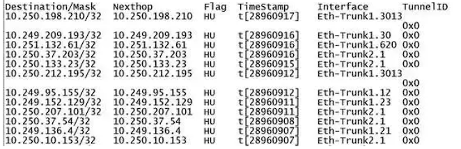

### 转发表五元组

(源IP地址, 目的IP地址, 源端口号, 目的端口号, 协议号)

五元组指的是源IP地址、目的IP地址、源端口号、目的端口号和协议号，这是因为这些元素共同定义了数据包在网络中的路径和行为。以下是详细的解释：

1. **源IP地址**：源IP地址标识了数据包的来源。它是数据包的源地址，帮助确定数据包从哪里发出。
2. **目的IP地址**：目的IP地址标识了数据包的目标。它是数据包的目标地址，帮助确定数据包应该送到哪里。
3. **源端口号**：源端口号标识了数据包的发送方端口。在计算机通信中，一个计算机上的不同应用程序可能使用不同的端口来发送数据，源端口号帮助确定数据包的来源应用程序。
4. **目的端口号**：目的端口号标识了数据包的目标应用程序。它帮助确定数据包应该交付给哪个应用程序。
5. **协议号**：协议号指定了数据包使用的通信协议。常见的协议包括TCP、UDP、ICMP等。不同的协议可能需要不同的处理方式。

这五个元素一起构成了数据包的头部信息，也被称为五元组，因为它们一起定义了数据包在网络中的路由和处理方式。网络设备，如路由器和防火墙，可以根据五元组信息来决定数据包的下一步操作，例如将其路由到正确的目标或应用程序。因此，这五个元素是生成快速转发表的关键信息。

**物理接口和MAC地址通常不包括在五元组中，因为它们是数据链路层的特性，用于在局域网内部进行通信，而不是在广域网上路由和处理数据包。**

**五元组通常足以在网络中进行路由和转发数据包。**

## 路由表

### 路由Flags

路由标记，标记当前网络节点的状态。

其中R是relay的首字母，说明是迭代路由，会根据路由下一跳的IP地址获取出接口。配置静态路由时如果你只指定下一跳IP地址，而不指定出接口，那么就是迭代路由，需要根据下一跳IP地址的路由获取出接口。

D是download的首字母，表示该路由下发到FIB表。

### 路由表样式

```bash
<R5>display ip routing-table
Route Flags: R - relay, D - download to fib
------------------------------------------------------------------------------
Routing Tables: Public
         Destinations : 23       Routes : 23   
```

| Destination/Mask   | Proto  | Pre | Cost | Flags | NextHop   | Interface   |
| ------------------ | ------ | --- | ---- | ----- | --------- | ----------- |
| 10.0.1.0/24        | O_ASE  | 150 | 1    | D     | 10.0.35.3 | Serial2/0/0 |
| 10.0.2.0/24        | OSPF   | 10  | 9764 | D     | 10.0.35.3 | Serial2/0/0 |
| 10.0.3.0/24        | OSPF   | 10  | 4882 | D     | 10.0.35.3 | Serial2/0/0 |
| 10.0.5.0/24        | Direct | 0   | 0    | D     | 10.0.5.5  | LoopBack0   |
| 10.0.5.5/32        | Direct | 0   | 0    | D     | 127.0.0.1 | LoopBack0   |
| 10.0.5.255/32      | Direct | 0   | 0    | D     | 127.0.0.1 | LoopBack0   |
| 10.0.23.0/24       | OSPF   | 10  | 9764 | D     | 10.0.35.3 | Serial2/0/0 |
| 10.0.35.0/24       | Direct | 0   | 0    | D     | 10.0.35.5 | Serial2/0/0 |
| 10.0.35.3/32       | Direct | 0   | 0    | D     | 10.0.35.3 | Serial2/0/0 |
| 10.0.35.5/32       | Direct | 0   | 0    | D     | 127.0.0.1 | Serial2/0/0 |
| 10.0.35.255/32     | Direct | 0   | 0    | D     | 127.0.0.1 | Serial2/0/0 |
| 10.0.124.0/24      | OSPF   | 10  | 9774 | D     | 10.0.35.3 | Serial2/0/0 |
| 10.1.0.0/24        | Direct | 0   | 0    | D     | 10.1.0.1  | LoopBack1   |
| 10.1.0.1/32        | Direct | 0   | 0    | D     | 127.0.0.1 | LoopBack1   |
| 10.1.0.255/32      | Direct | 0   | 0    | D     | 127.0.0.1 | LoopBack1   |
| 10.1.1.0/24        | Direct | 0   | 0    | D     | 10.1.1.1  | LoopBack2   |
| 10.1.1.1/32        | Direct | 0   | 0    | D     | 127.0.0.1 | LoopBack2   |
| 10.1.1.255/32      | Direct | 0   | 0    | D     | 127.0.0.1 | LoopBack2   |
| 10.2.0.0/23        | O_ASE  | 150 | 2    | D     | 10.0.35.3 | Serial2/0/0 |
| 127.0.0.0/8        | Direct | 0   | 0    | D     | 127.0.0.1 | InLoopBack0 |
| 127.0.0.1/32       | Direct | 0   | 0    | D     | 127.0.0.1 | InLoopBack0 |
| 127.255.255.255/32 | Direct | 0   | 0    | D     | 127.0.0.1 | InLoopBack0 |
| 255.255.255.255/32 | Direct | 0   | 0    | D     | 127.0.0.1 | InLoopBack0 |

## 路由协议优先级

| 路由协议或者路由种类 | 优先级 |
| -------------------- | ------ |
| DIRECT               | 0      |
| OSPF                 | 10     |
| IS-IS                | 15     |
| STATIC               | 60     |
| RIP                  | 100    |
| OSPF ASE             | 150    |
| OSPF NSSA            | 150    |
| IBGP                 | 255    |
| EBGP                 | 255    |

## 路由协议比较

### 配置命令

| 路由协议 | 在华为路由器配置命令                                                                                                                                                                                                                                                          |
| -------- | ----------------------------------------------------------------------------------------------------------------------------------------------------------------------------------------------------------------------------------------------------------------------------- |
| RIP      | 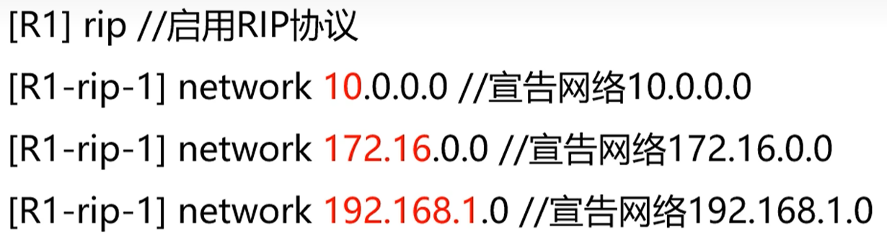<br />宣告的是主类地址, A,B,C                                                                                                                                                                                           |
| OSPF     | 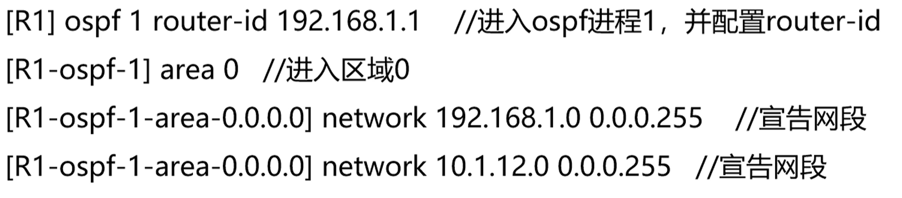<br />使用反掩码子网地址                                                                                                                                                                                                |
| BGP      | 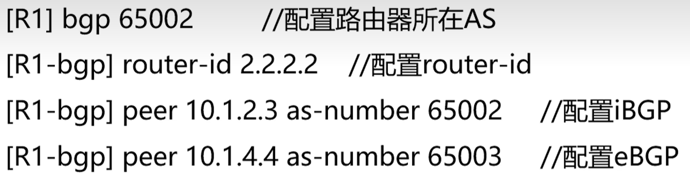                                                                                                                                                                                                                        |
| ISIS     |                                                                                                                                                                                                                                                                               |
| IBGP     |                                                                                                                                                                                                                                                                               |
| EBGP     |                                                                                                                                                                                                                                                                               |
| STATIC   | ip route-static 192.168.12.0 24 192.168.23.1<br />ip route-static 0.0.0.0 0.0.0.0 192.168.12.1<br /><br />ip route-static 10.147.201.0 255.255.255.0 10.147.203.254 <br />//告诉路由器去10.147.201.0 掩码是255.255.255.0 这个网段的数据包要通过10.147.230.254这个地址送出去。 |

### 比较

---

| 路由协议 | 算法原理 | 度量         | 特点                         | 优点               | 缺点                             | 使用范围           | 注意之处     |
| -------- | -------- | ------------ | ---------------------------- | ------------------ | -------------------------------- | ------------------ | ------------ |
| RIP      | 距离矢量 | 跳数, 最大15 | 适用于小型网络               | 简单、易部署       | 慢收敛、有环路问题               | 小型网络           | 防止路由环路 |
| OSPF     | 链路状态 | 成本         | 内部网关协议，适用于大型网络 | 快速收敛、支持VLSM | 配置复杂、消耗带宽               | 大型复杂网络       | 区分多路径   |
| BGP      | 路径矢量 | AS路径长度   | 互联网核心协议，用于跨域路由 | 高度可定制、弹性   | 配置复杂、慢收敛                 | 全球互联网         | 防止路由泄漏 |
| IS-IS    | 链路状态 | 成本         | 适用于大型ISP网络            | 快速收敛、支持IPv6 | 配置复杂、专有                   | 大型ISP网络        | 使用SPF算法  |
| IBGP     | 路径矢量 | AS路径长度   | 内部BGP，用于AS内部路由      | 灵活、支持策略     | 手动配置、扩展性有限             | 单一AS内部         | 防止路由环路 |
| EBGP     | 路径矢量 | AS路径长度   | 外部BGP，用于AS间路由        | 灵活、支持策略     | 配置复杂、慢收敛                 | 不同AS间           | 防止路由泄漏 |
| STATIC   | 静态路由 | 手动指定     | 手动配置的静态路由           | 简单、可控         | 不适用于大型网络、不自动适应变化 | 小型网络、特殊用途 | 手动维护     |

## 路由协议的封装和工作层

| 协议 | 层次         | 封装协议 | 端口号/协议号       |
| ---- | ------------ | -------- | ------------------- |
| RIP  | 4 运输层     | UDP      | 520                 |
| OSPF | 3 网络层     | IP       | 89 (IP报首部协议号) |
| BGP  | 4 运输层     | TCP      | 179                 |
| ISIS | 2 数据链路层 | -        | -                   |

## 特殊组播地址

**IPv4 特殊组播地址：**

| IPv4 地址   | 描述                   | 用途/协议                      |
| ----------- | ---------------------- | ------------------------------ |
| 224.0.0.1   | 所有主机组播地址       | 向所有主机发送组播数据包       |
| 224.0.0.2   | 所有路由器组播地址     | 向所有路由器发送组播数据包     |
| 224.0.0.5   | 所有OSPF路由器组播地址 | OSPF协议                       |
| 224.0.0.6   | 所有OSPF DR组播地址    | OSPF协议中的设计者路由器（DR） |
| 224.0.0.9   | 所有RIP路由器组播地址  | RIP协议                        |
| 224.0.0.10  | IGMP版本1组播地址      | IGMP版本1                      |
| 224.0.0.13  | 所有PIM路由器组播地址  | PIM协议                        |
| 224.0.0.22  | IGMP版本2组播地址      | IGMP版本2                      |
| 224.0.0.251 | mDNS地址               | Zeroconf中的服务发现           |
| 224.0.1.1   | NTP组播地址            | 网络时间协议                   |

**IPv6 特殊组播地址：**

| IPv6 地址 | 描述                    | 用途/协议                      |
| --------- | ----------------------- | ------------------------------ |
| FF01::1   | 所有节点组播地址        | 向所有节点发送组播数据包       |
| FF02::1   | 所有节点组播地址        | IPv6版本的所有节点组播地址     |
| FF02::2   | 所有路由器组播地址      | 向所有路由器发送组播数据包     |
| FF02::9   | 所有RIP路由器组播地址   | IPv6版本的RIP协议              |
| FF02::A   | 所有EIGRP路由器组播地址 | IPv6版本的EIGRP协议            |
| FF02::D   | MLD组播地址             | 多播监听器发现                 |
| FF02::16  | MLDv2组播地址           | MLD协议的第二版本              |
| FF02::FB  | mDNS地址                | IPv6版本的Zeroconf中的服务发现 |

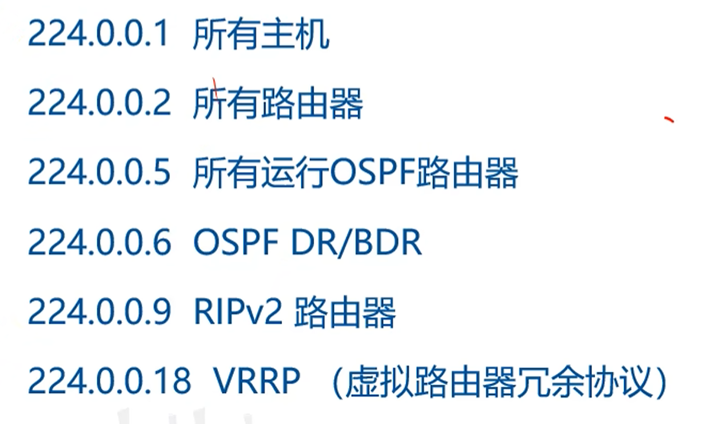

## 静态路由和默认路由比较

| 静态路由 |  |
| -------- | ------------------------------------------------------------------------------------------------------------ |
| 默认路由 |                                                        |

# 动态路由协议

## 分类

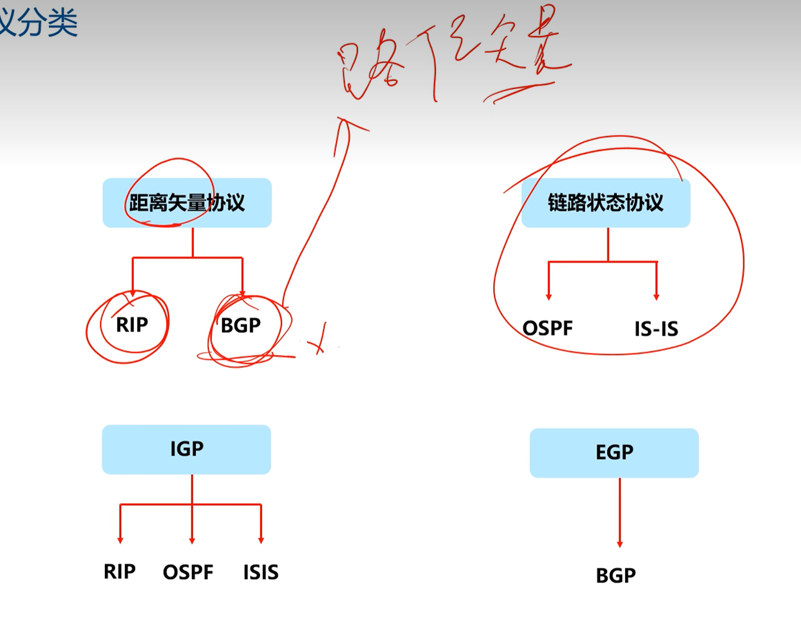

## RIP

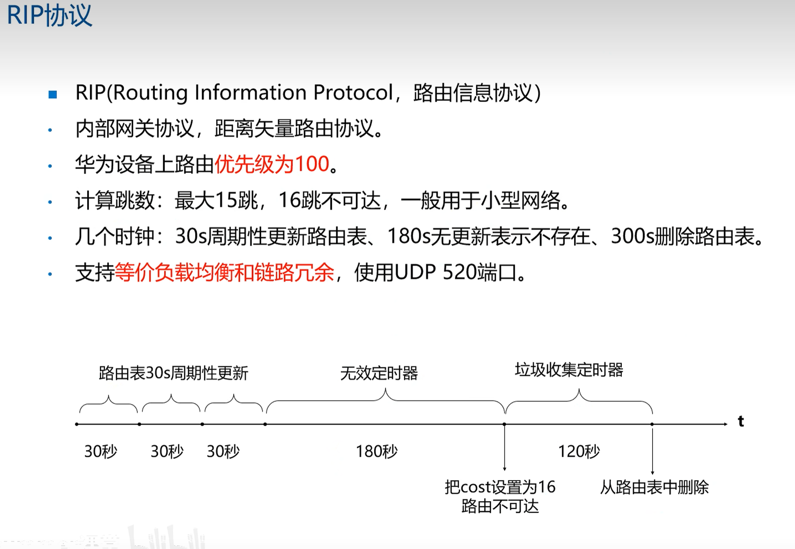

### RIP版本比较


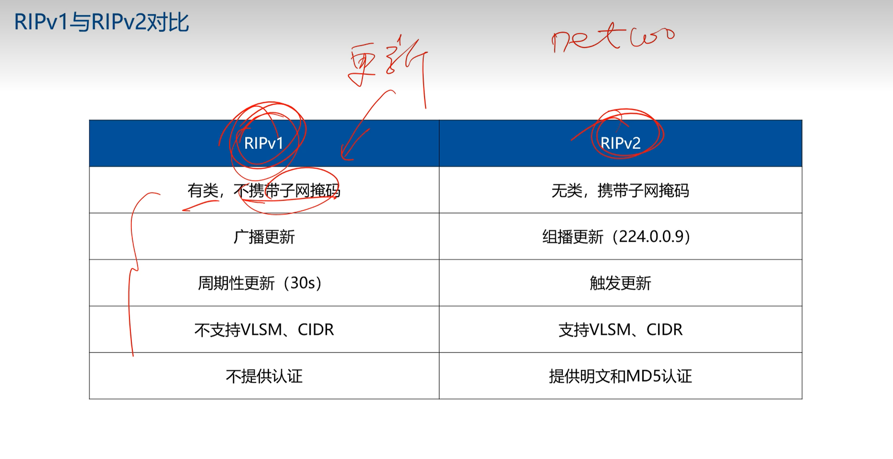

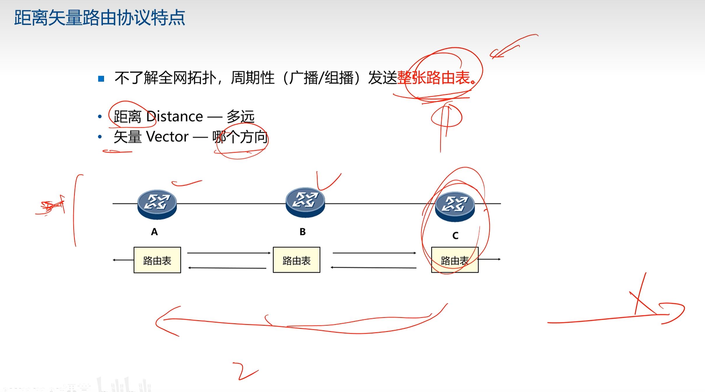


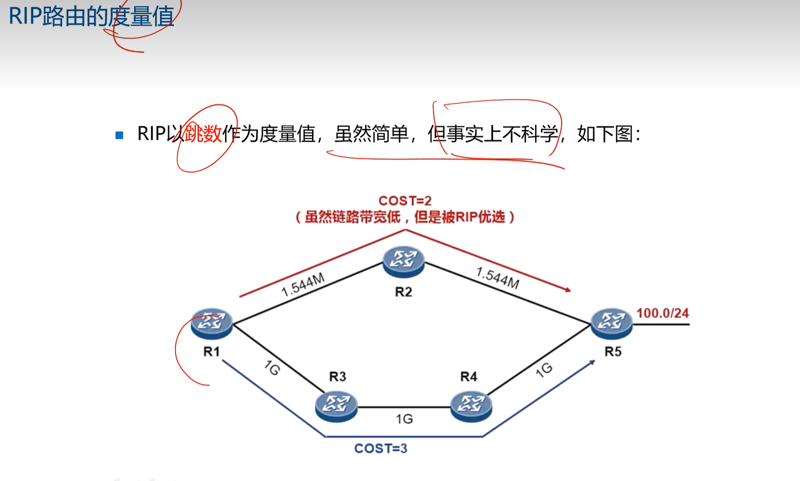

路由方向与流量方向不同, 下面是路由学习方向

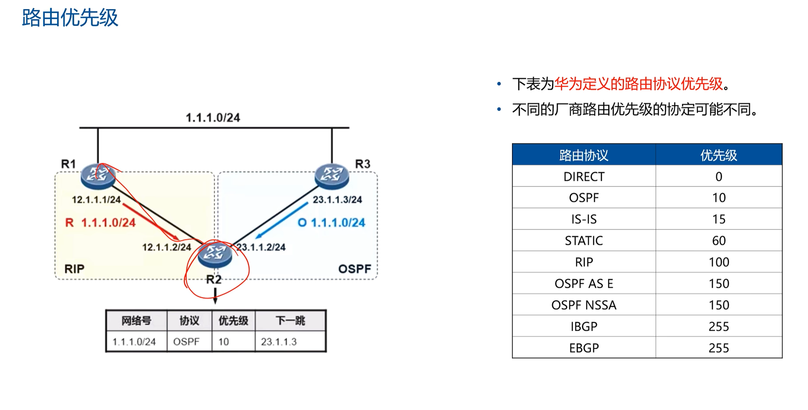

TTL 8 位 最大 255

### RIP防环机制

| 问题描述                                                                         | 解决机制                           |
| -------------------------------------------------------------------------------- | ---------------------------------- |
| 若采用RIP协议，其网络内部所经过的链路数不能超过15，这使得RIP协议不适于大型网络。 | ① 定义最大度量以防止计数至无穷大； |
|                                                                                  | ② 抑制计时器；                     |
|                                                                                  | ③ 水平分割；                       |
|                                                                                  | ④ 路由毒化或毒性反转；             |
|                                                                                  | ⑤ 触发更新。                       |

这个表格以清晰的方式列出了问题描述以及解决机制的对应关系。每个问题描述下面有多个解决机制，使用了Markdown的多级列表来表示。

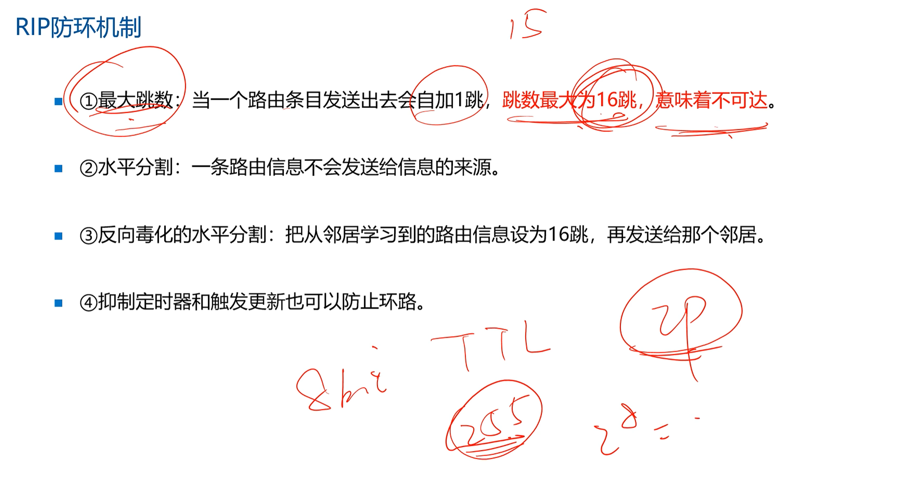

## OSPF

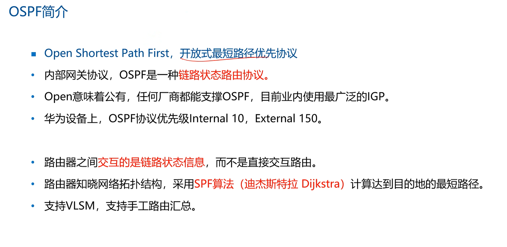


OSPF, RIP 不支持自动路由汇总CIDR

手动路由汇总, 优先级大于自动汇总大于宣告,大于import route


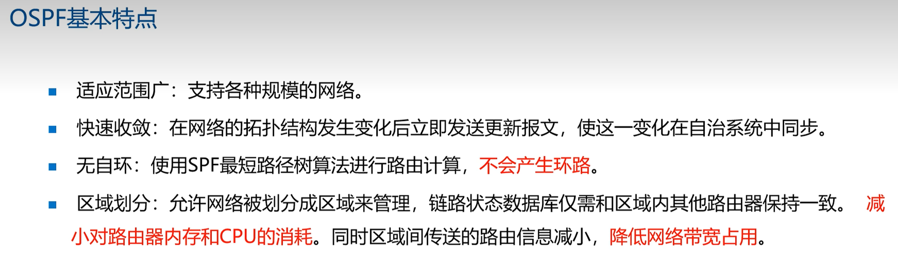

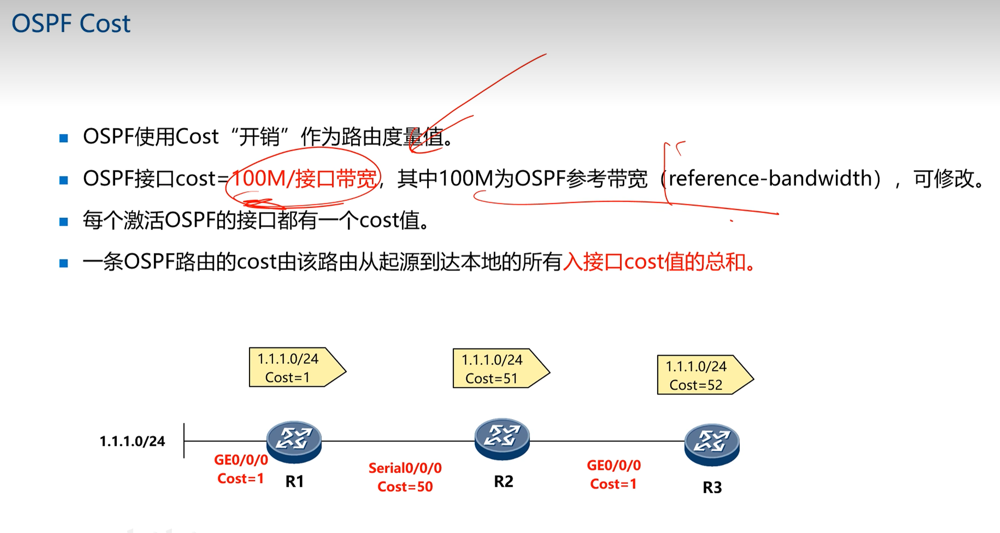

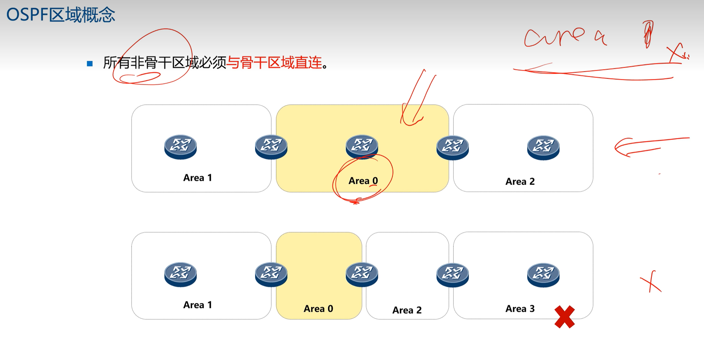

### OSPF路由器角色

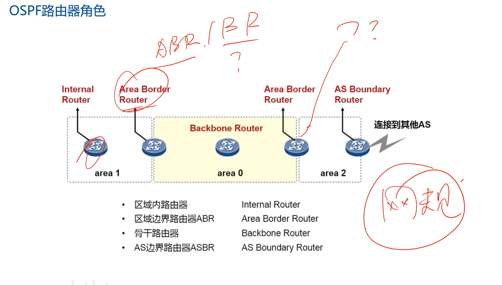

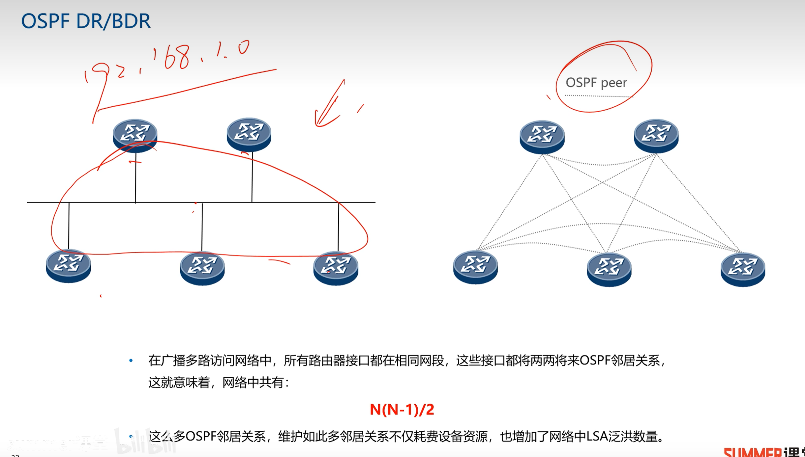

优先级相等, IP地址越大越优先

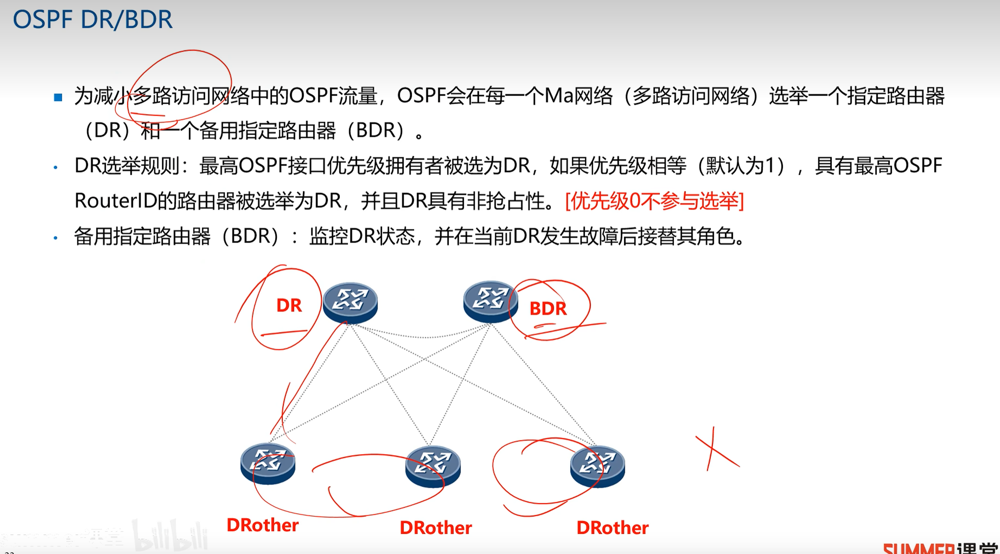

在OSPF（Open Shortest Path First）协议中，DR代表"Designated Router"（指定路由器），它是一种用于优化OSPF网络拓扑的路由器选举机制。

OSPF协议是一种链路状态路由协议，用于构建和维护路由表。在一个OSPF网络中，当有多个路由器相连时，如果每个路由器都与每个其他路由器建立邻居关系，那么路由信息交换将变得非常复杂和低效。为了解决这个问题，OSPF引入了DR和BDR（Backup Designated Router）的概念。

指定路由器（DR）的主要作用是充当网络中的代表，负责与其他路由器建立邻居关系并维护路由信息。而备份指定路由器（BDR）则在DR不可用时接管其角色，以确保网络的连通性。

当多个OSPF路由器在同一个网络段（例如，一个以太网段）上相连时，它们会通过选举来选择DR和BDR。通常，路由器的优先级（Priority）和路由器的ID（Router ID）用于确定哪台路由器将成为DR和BDR。具有较高优先级的路由器通常更有可能被选为DR。

DR的存在减少了OSPF邻居关系的数量，从而减少了路由信息交换的复杂性，提高了网络的稳定性和性能。在一个OSPF网络中，每个子网段通常只有一个DR和一个BDR，而其他路由器则成为普通的OSPF路由器，它们与DR和BDR建立邻居关系，将路由信息发送给DR，然后由DR传播到整个网络。这种设计有助于优化OSPF网络的运行。

### OSPF几种报文

以下是OSPF路由协议的几种报文：

| **报文类型**             | **描述**                                                                                                                                                |
| ------------------------ | ------------------------------------------------------------------------------------------------------------------------------------------------------- |
| Hello                    | 用于发现、维护邻居关系。在广播和NBMA类型的网络中选举指定路由器DR（Designated Router）和备份指定路由器BDR（Backup Designated Router）。                  |
| DD(Datebase Description) | 两台路由器进行LSDB数据库同步时，用DD报文来描述自己的LSDB。DD报文的内容包括LSDB中每一条LSA的头部。                                                       |
| LSR(Link State Request)  | 两台路由器互相交换过DD报文之后，知道对端的路由器有哪些LSA是本地LSDB所缺少的，这时需要发送LSR报文向对方请求缺少的LSA，LSR只包含了所需要的LSA的摘要信息。 |
| LSU(Link State Upadte)   | 用来向对端路由器发送所需要的LSA。                                                                                                                       |
| LSAck                    | 用来对接收到的LSU报文进行确认。                                                                                                                         |

### route-id选举规则

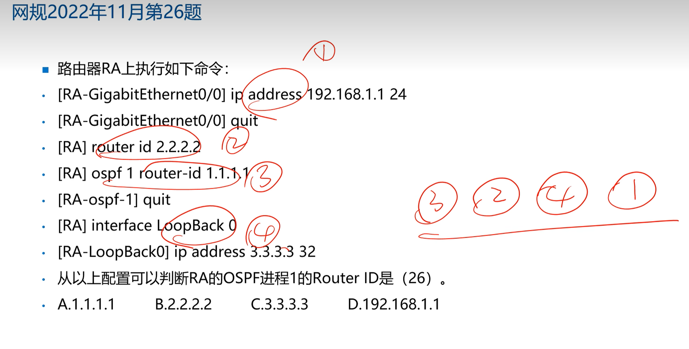


### OSPF总结

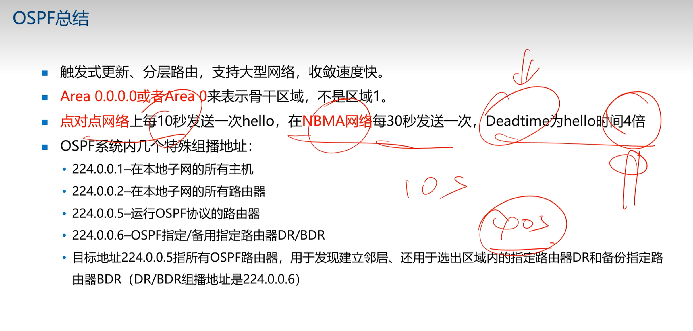

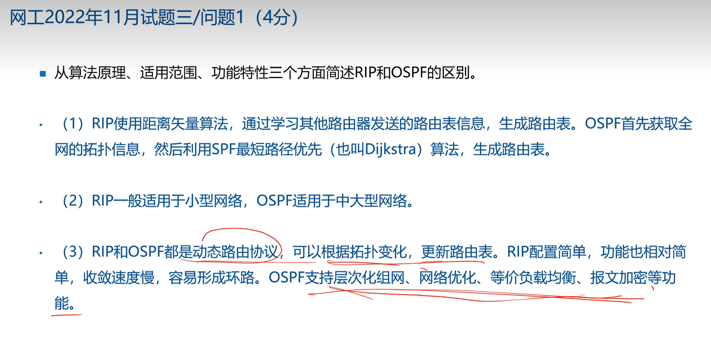

## BGP 与 IS-IS(运营商用得多)

## BGP基础

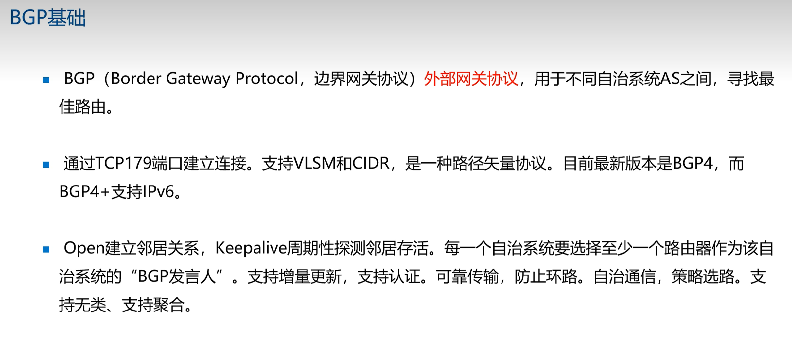

## 支持IPv6路由协议

* BGP+
* RIPNG
* OSPF v3


## BGP四个报文

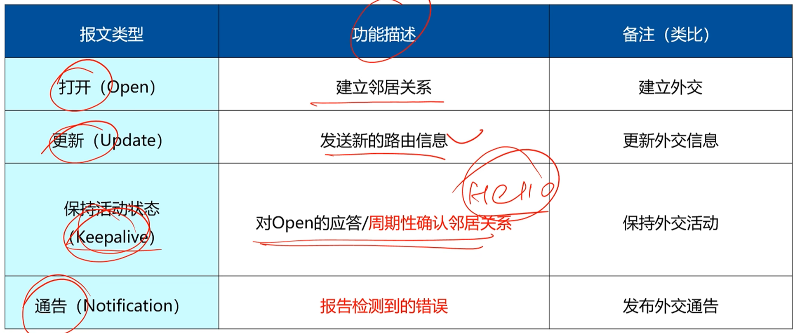

### IS-IS 简介

IS-IS路由协议的全称是Intermediate System to Intermediate System，

它是一种内部网关路由协议，通常用于在计算机网络中传输路由信息和管理网络中的路由表。

IS-IS协议最初是为OSI（开放系统互联）模型设计的，但它也可以用于IP网络。

它是一个链路状态路由协议，类似于OSPF（开放最短路径优先协议），用于确定最佳路由路径并维护网络拓扑。

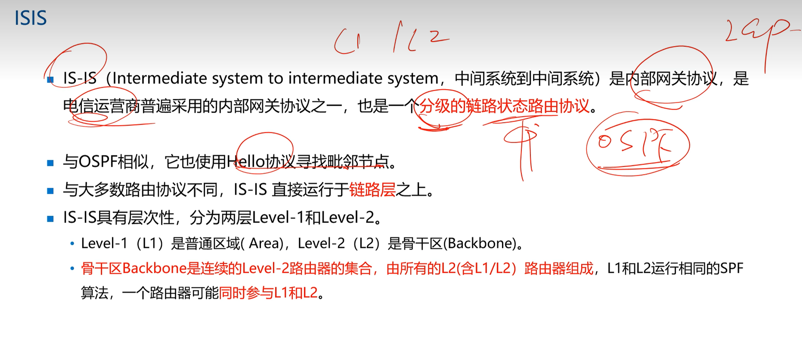

一个路由器只能属于一个区域, 不同于OSPF

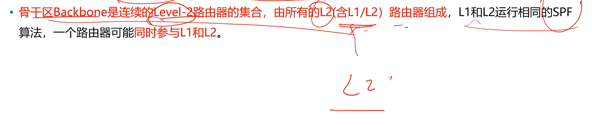

### IS-IS 区域结构图

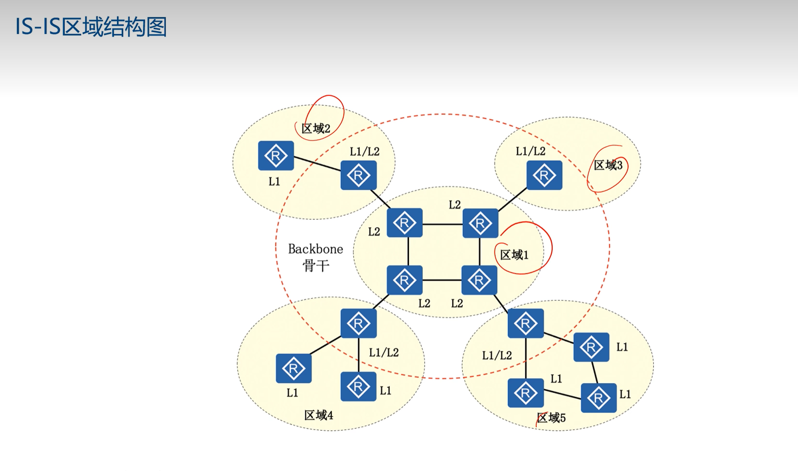
