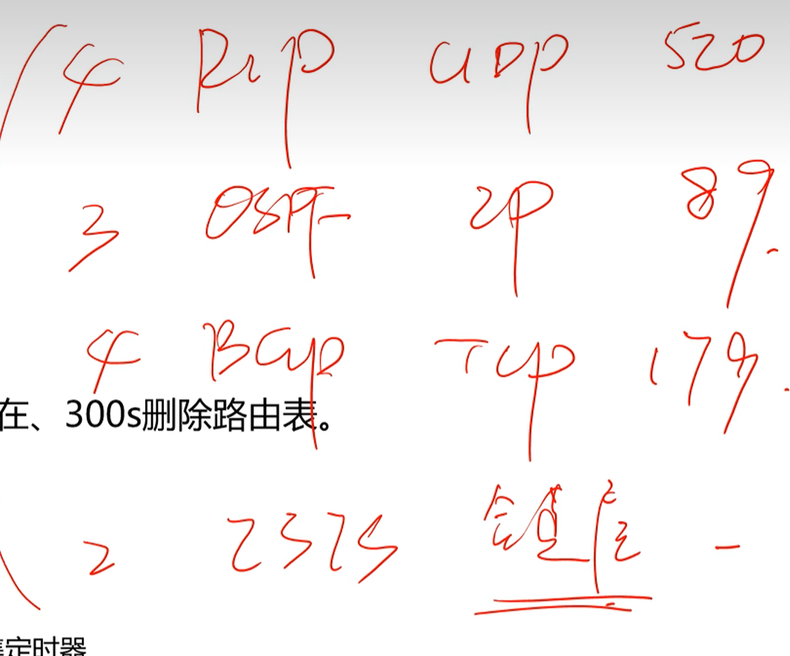

# 总览

# 关于路由

## 什么是路由

当路由器(或者其他三层设备)收到一个或者多个IP数据包时, 会查看IP头部中的目的IP地址, 并在路由表中进行查找, 在匹配到最优的路由后, 将IP数据报扔给该路由器的所指出出口, 或者下一跳.

## 路由表

```bash
<R5>display ip routing-table
Route Flags: R - relay, D - download to fib
------------------------------------------------------------------------------
Routing Tables: Public
         Destinations : 23       Routes : 23   
```

| Destination/Mask   | Proto  | Pre | Cost | Flags | NextHop   | Interface   |
| ------------------ | ------ | --- | ---- | ----- | --------- | ----------- |
| 10.0.1.0/24        | O_ASE  | 150 | 1    | D     | 10.0.35.3 | Serial2/0/0 |
| 10.0.2.0/24        | OSPF   | 10  | 9764 | D     | 10.0.35.3 | Serial2/0/0 |
| 10.0.3.0/24        | OSPF   | 10  | 4882 | D     | 10.0.35.3 | Serial2/0/0 |
| 10.0.5.0/24        | Direct | 0   | 0    | D     | 10.0.5.5  | LoopBack0   |
| 10.0.5.5/32        | Direct | 0   | 0    | D     | 127.0.0.1 | LoopBack0   |
| 10.0.5.255/32      | Direct | 0   | 0    | D     | 127.0.0.1 | LoopBack0   |
| 10.0.23.0/24       | OSPF   | 10  | 9764 | D     | 10.0.35.3 | Serial2/0/0 |
| 10.0.35.0/24       | Direct | 0   | 0    | D     | 10.0.35.5 | Serial2/0/0 |
| 10.0.35.3/32       | Direct | 0   | 0    | D     | 10.0.35.3 | Serial2/0/0 |
| 10.0.35.5/32       | Direct | 0   | 0    | D     | 127.0.0.1 | Serial2/0/0 |
| 10.0.35.255/32     | Direct | 0   | 0    | D     | 127.0.0.1 | Serial2/0/0 |
| 10.0.124.0/24      | OSPF   | 10  | 9774 | D     | 10.0.35.3 | Serial2/0/0 |
| 10.1.0.0/24        | Direct | 0   | 0    | D     | 10.1.0.1  | LoopBack1   |
| 10.1.0.1/32        | Direct | 0   | 0    | D     | 127.0.0.1 | LoopBack1   |
| 10.1.0.255/32      | Direct | 0   | 0    | D     | 127.0.0.1 | LoopBack1   |
| 10.1.1.0/24        | Direct | 0   | 0    | D     | 10.1.1.1  | LoopBack2   |
| 10.1.1.1/32        | Direct | 0   | 0    | D     | 127.0.0.1 | LoopBack2   |
| 10.1.1.255/32      | Direct | 0   | 0    | D     | 127.0.0.1 | LoopBack2   |
| 10.2.0.0/23        | O_ASE  | 150 | 2    | D     | 10.0.35.3 | Serial2/0/0 |
| 127.0.0.0/8        | Direct | 0   | 0    | D     | 127.0.0.1 | InLoopBack0 |
| 127.0.0.1/32       | Direct | 0   | 0    | D     | 127.0.0.1 | InLoopBack0 |
| 127.255.255.255/32 | Direct | 0   | 0    | D     | 127.0.0.1 | InLoopBack0 |
| 255.255.255.255/32 | Direct | 0   | 0    | D     | 127.0.0.1 | InLoopBack0 |

## 路由协议优先级

| 路由协议或者路由种类 | 优先级 |
| -------------------- | ------ |
| DIRECT               | 0      |
| OSPF                 | 10     |
| IS-IS                | 15     |
| STATIC               | 60     |
| RIP                  | 100    |
| OSPF ASE             | 150    |
| OSPF NSSA            | 150    |
| IBGP                 | 255    |
| EBGP                 | 255    |

## 路由协议比较

| 路由协议 | 华为配置命令示例                                                                               |
| -------- | ---------------------------------------------------------------------------------------------- |
| RIP      |                                                                                                |
| OSPF     |                                                                                                |
| BGP      |                                                                                                |
| ISIS     |                                                                                                |
| IBGP     |                                                                                                |
| EBGP     |                                                                                                |
| STATIC   | ip route-static 192.168.12.0 24 192.168.23.1<br />ip route-static 0.0.0.0 0.0.0.0 192.168.12.1 |

---

| 路由协议 | 算法原理 | 度量         | 特点                         | 优点               | 缺点                             | 使用范围           | 注意之处     |
| -------- | -------- | ------------ | ---------------------------- | ------------------ | -------------------------------- | ------------------ | ------------ |
| RIP      | 距离矢量 | 跳数, 最大15 | 适用于小型网络               | 简单、易部署       | 慢收敛、有环路问题               | 小型网络           | 防止路由环路 |
| OSPF     | 链路状态 | 成本         | 内部网关协议，适用于大型网络 | 快速收敛、支持VLSM | 配置复杂、消耗带宽               | 大型复杂网络       | 区分多路径   |
| BGP      | 路径矢量 | AS路径长度   | 互联网核心协议，用于跨域路由 | 高度可定制、弹性   | 配置复杂、慢收敛                 | 全球互联网         | 防止路由泄漏 |
| IS-IS    | 链路状态 | 成本         | 适用于大型ISP网络            | 快速收敛、支持IPv6 | 配置复杂、专有                   | 大型ISP网络        | 使用SPF算法  |
| IBGP     | 路径矢量 | AS路径长度   | 内部BGP，用于AS内部路由      | 灵活、支持策略     | 手动配置、扩展性有限             | 单一AS内部         | 防止路由环路 |
| EBGP     | 路径矢量 | AS路径长度   | 外部BGP，用于AS间路由        | 灵活、支持策略     | 配置复杂、慢收敛                 | 不同AS间           | 防止路由泄漏 |
| STATIC   | 静态路由 | 手动指定     | 手动配置的静态路由           | 简单、可控         | 不适用于大型网络、不自动适应变化 | 小型网络、特殊用途 | 手动维护     |

# 静态路由和默认路由

| 静态路由 |  |
| -------- | ------------------------------------------------------------------------------------------------------------ |
| 默认路由 |                                                        |

# 动态路由协议

## 分类


## RIP





路由方向与流量方向不同, 下面是路由学习方向


TTL 8 位 最大 255


 

## OSPF


OSPF, RIP 不支持自动路由汇总CIDR

手动路由汇总, 优先级大于自动汇总大于宣告,大于import route


## BGP


## ISIS
